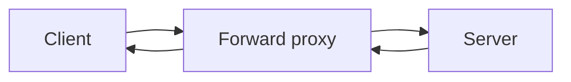
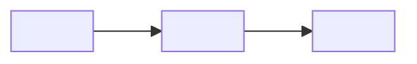

# Article guide

How every article on **Drafted, by Dev** is written and built: the voice, the story format, the site's visual language (Imaxt), and every rule the build enforces.

This guide is written for two readers: **Dev**, as a checklist before publishing, and **Claude**, so a drafting session with only this file can produce a post that sounds like Dev and builds on the first try.

## Contents

- [Instructions for Claude](#instructions-for-claude)
- **Part A. Voice** · [1. The voice](#1-the-voice) · [2. Story craft](#2-story-craft)
- **Part B. The format** · [3. Story with a spine of facts](#3-story-with-a-spine-of-facts) · [4. True story or constructed story](#4-true-story-or-constructed-story) · [5. Never overwhelm the reader](#5-never-overwhelm-the-reader)
- **Part C. Imaxt** · [6. Principles](#6-imaxt-principles) · [7. The blocks](#7-the-blocks) · [8. Tones](#8-tones) · [9. Covers](#9-covers) · [10. Diagrams](#10-diagrams) · [11. Code](#11-code) · [12. Patterns that work](#12-patterns-that-work)
- **Part D. Rules** · [13. Files and URLs](#13-files-and-urls) · [14. Front matter](#14-front-matter) · [15. Series](#15-series) · [16. MDX gotchas](#16-mdx-gotchas) · [17. Accessibility](#17-accessibility) · [18. Performance and security](#18-performance-and-security) · [19. Feeds and search](#19-feeds-and-search) · [20. Privacy and honesty](#20-privacy-and-honesty) · [21. Editorial](#21-editorial)
- **Part E. Templates** · [22. Skeletons](#22-skeletons) · [23. Worked example](#23-worked-example) · [24. Before you publish](#24-before-you-publish) · [25. When the build fails](#25-when-the-build-fails)

---

## Instructions for Claude

Read this whole file before drafting. Then:

1. **Ask first, draft second.** Before writing, get from Dev: the one idea of the article, whether it is a **True story** or a **Constructed story** (section 4), the beats (the moments, in order), and any real facts to include. If a True-story article has no real moments from Dev, stop and ask. Never fill the gap with invented memories.
2. **Story beats before fact moments.** Write the story in Dev's voice first (section 1). Only then place fact moments (section 3), each one answering a question the preceding beat raised.
3. **Never invent facts.** In both modes every factual claim must be true and checkable. In a True story, never invent events, quotes or people. If a claim needs a source, say so in your reply to Dev and keep the post clean (MDX does not allow HTML comments, so leave no markers in the file).
4. **Protect people.** No real person's name, workplace or private detail unless Dev has said it is fine (section 20).
5. **Output a complete `.mdx` file** with valid front matter, the mode label as the first body element, and only blocks documented in Part C. Use `draft: true`.
6. **Run the checks** (`pnpm check && pnpm build`, then `pnpm check:dist`) when you can, and report the result honestly. Walk through the checklist in section 24 and say which items you could not verify.
7. **Do not touch voice for effect.** If a sentence sounds like marketing, rewrite it plainly. When unsure, choose the plainer word.

---

# Part A. Voice

## 1. The voice

Everything below is taken from Dev's own writing, the essay *Symptoms That You Should Pursue Coding*. Each rule has a quoted line as evidence. If a rule and a quote ever disagree, the quote wins.

### The fingerprints

| Trait | What it looks like | Evidence |
| --- | --- | --- |
| **Opens inside a moment, not a thesis.** | A concrete time, place or belief, in plain words. | "There was a time when I was quite certain about what I was going to become." |
| **Looks back and reinterprets.** | "Looking back" turns an old event into a clue. | "Looking back, though, I realize I had a plan for my future without really knowing what I was naturally curious about." |
| **Admits what he did not know.** | Honest about the gap between then and now, no flexing. | "The funny thing is that I didn't know much." · "I didn't know it then, but that was probably the first real spark." |
| **A bridge sentence ends a section.** | A short line that tilts the reader into the next idea. | "That took a while to discover, and strangely enough, the first clue came from a classroom." |
| **The inner question, in italics.** | The thought as it happened, in quotation marks and italics. | *"Wait, so this is how programming works?"* |
| **Contrast that lands.** | Two clauses, one correction. | "It wasn't a question I needed answered; it was a question I **wanted** answered." |
| **Small, honest scenes.** | A specific, slightly funny detail beats a general claim. | "I danced. Literally. Then I went around showing people." |
| **Deflates his own drama.** | Undercuts the big claim with the true, small one. | "It was just a lab exercise. Nothing revolutionary had been built, nobody was going to use the program, and there was no startup waiting to acquire it. But I didn't care." |
| **One bold line per section.** | The takeaway, set in bold, short enough to quote. | "**Knowledge was turning into creation.**" · "**I was slowly becoming one.**" |
| **Turns to "you" at the end of a beat.** | A gentle instruction, never an order. | "If that moment gives you disproportionate happiness, pay attention." |
| **Plain words, short technical vocabulary.** | Technical terms appear when they carry meaning, defined by feeling first. | "a few tags, some text, a little structure, and suddenly I could create something that looked like a webpage." |
| **Indian-English texture, kept.** | A natural turn of phrase is a feature, not an error. | "There is a weightage to all of this." |
| **Rhythm: long, then short.** | A medium sentence builds, a short one lands. | "I wasn't consciously trying to become a software developer. **I was slowly becoming one.**" |
| **Closes on the series idea.** | The last lines name what the whole series is for. | "You become one when you start following your curiosity far enough that you eventually **build something with it**." |

### Section headings

Headings are second-person symptoms or plain statements, in Title Case, and each reads as a sentence the reader could say about themselves:

- "You Don't Just Use Technology. You Wonder About It."
- "You Start Building Before You Know Enough to Build"
- "You Celebrate When the Bug Finally Dies"
- "Technology Slowly Stops Feeling Like Work"

On this site headings double as the **Contents** list in the article's left rail, so each one must make sense on its own and be scannable. Use `##` for sections and `###` for sub-parts (section 17).

### Sentence rules

1. **First person, past tense for the story, present tense for the reflection.** "I found the bug" (then) · "That is the kind of curiosity that keeps pulling people deeper" (now).
2. **Medium sentences, with a short one every few lines.** Most sentences run 15 to 30 words. A sentence of 3 to 8 words lands the point. Never three short ones in a row.
3. **One idea per paragraph, 2 to 5 sentences.**
4. **Colons and semicolons are welcome, em dashes sparingly** (at most two in a section). Never use a dash where a full stop is cleaner.
5. **Rhetorical questions come in runs of two to four**, then an answer. ("How was the page created? How did one page connect to another? What happened when I clicked something?")
6. **Bold is for the single takeaway sentence of a section** and for the one word that carries a contrast (**wanted**). Never bold for emphasis in every paragraph. Italics are for the inner voice.
7. **Say the small true thing.** "I spent hours trying to make pages work together" beats "I was passionate about building."
8. **Contractions are natural** (didn't, wasn't, isn't), as in the essay.
9. **Numbers and units:** write what was measured and what it was measured against ("p95 query time, 5 ms"). If you do not know, say so.

### Technical posts: same voice, more precise

When a post explains a technical idea, keep the voice and add precision:

- Define a term **the first time it appears**, in the same sentence, in plain words. ("Idempotent means doing it twice has the same effect as doing it once.")
- Prefer **one specific claim** over three vague ones. ("Each stage retries on its own" beats "the system is highly resilient.")
- Say what you tested and what you did not. "I tried this on my laptop only" is a good sentence.
- Say "I don't know" or "I'm not sure" when true. Never fill a gap with confidence.
- Use the analogy **before** the term (the substitute teacher's doors came before the word *inheritance* meant anything), then give the real term.

### Words and phrases to avoid

Marketing and filler: *game-changer, unlock, supercharge, leverage (as a verb), dive deep / deep dive (in a heading), in today's fast-paced world, it goes without saying, ultimate guide, 10x, seamless, robust (unless you mean it), cutting-edge, world-class, simply (before something hard), just (before something hard), obviously, trivial.* Also avoid stock openings such as "In this article we will…" and stock closings such as "I hope you enjoyed…". Use the story to open and the series idea to close.

### Before and after

| Instead of | Write |
| --- | --- |
| "Programming sparked my passion in school." | "Then one day, a substitute teacher came into our class and started explaining **inheritance**." |
| "Debugging is very rewarding." | "I found the bug, fixed it, ran the program again, and it worked. I danced. Literally." |
| "Curiosity is the key trait of great developers." | "Nobody asked you to know this. It isn't on an exam or part of your assignment. You just want to know." |
| "Let's dive deep into reverse proxies!" | "A reverse proxy is the machine your request actually reaches first. Let me show you what it does with it." |
| "Our robust pipeline guarantees reliability." | "If a job dies halfway, it restarts from the last checkpoint instead of from the beginning." |

---

## 2. Story craft

A story here means a **scene with a feeling**, not a plot with a villain.

1. **Cold open.** Start in a moment ("There was a time…", "One day, a substitute teacher came in…", "It was 2 a.m. and the server was still down"). No definitions, no thesis.
2. **Scene before explanation.** Let the reader see a door, a screen, a classroom, before anything is explained. The idea arrives because the scene asked for it.
3. **Stakes stay small and true.** A lab exercise, a broken page, a confusing meeting. The pull of the piece comes from honesty, not drama.
4. **One question per beat.** Every beat should leave the reader with one question (*"Wait, so this is how programming works?"*). The fact moment answers that question and no other.
5. **Dialogue is rare and short.** Use it only to carry a feeling, in quotation marks. In a True story, never write dialogue you cannot stand behind; paraphrase instead ("he said something like…").
6. **Time may be compressed, only if you say so.** "Over the next few weeks" is fine. Merging three real events into one scene is not, unless the article says it did.
7. **Endings turn to the reader.** The last beat names a pattern, then points at "you" ("If that moment gives you disproportionate happiness, pay attention").
8. **Length of a beat:** 120 to 250 words of story, then at most one fact moment of one to three sentences and one visual (section 5).

---

# Part B. The format

## 3. Story with a spine of facts

Dev's signature format is a **personal story that quietly teaches real, non-fiction ideas**. The story is the surface. The facts are the spine. They are never merged: invented feeling never passes as fact, and facts never hide inside the story's invention. Yet the reader experiences one piece.

### The two layers

| | **Story layer** | **Fact layer** |
| --- | --- | --- |
| **What it is** | Scenes, memories, feelings, reflection | One true idea per moment, explained simply |
| **Voice** | First person, past tense, warm | Same voice, present tense, precise |
| **How it looks** | Plain prose in the article's serif | Prose first, then **one** small designed block (an Imaxt block or a diagram) |
| **Allowed to be invented?** | Only in a Constructed story, and labelled | Never. Every claim is true and checkable |
| **Rule of thumb** | "What did it feel like?" | "What is actually going on?" |

The facts are **not** fenced into a separate section or a loud "FACT" label. They appear as small designed moments, right where the story asks for them.

### Anatomy of an article

1. **Mode label** (first body element, section 4).
2. **Cold open** (a moment, 80 to 150 words).
3. **The question** (one or two sentences naming what the article is really about, without a thesis statement).
4. **Four to seven beats**, each a `##` section:
   1. **Story** (120 to 250 words).
   2. **Fact moment** (optional; one to three sentences, then one block). Appears only if the story raised a question the facts can answer.
   3. **Reflection line** (one sentence of "looking back"), ending in a **bold takeaway** at most once per section.
5. **The turn** ("So, should you…?"): a short section that speaks to "you", lists the pattern in one sentence, and says what to pay attention to.
6. **The close**: names the series idea, in two to four short lines.
7. Optional: a one-line teaser of the next part. (The site already adds *Previous* and *Up next* cards under every series post, so do not write a link list.)

### Fact moments

- **A fact moment always follows a story beat that created its question.** The substitute teacher explains **inheritance** → the reader now wants to see inheritance → a `Compare` shows it in two sides.
- **Never two fact moments back to back.** Put at least one story paragraph between them.
- **At most one fact moment per beat and at most five per article.** Many of the best beats have none.
- **Facts come in the story's own words first, the block second.** The block repeats the idea visually; it must not introduce a new one.
- **One block per moment.** If a moment seems to need three blocks, it is two moments, or too much.
- **Pick the block by the shape of the idea** (section 12): a before/after is a `Compare`, a sequence is `Steps` or a diagram, a number is a `Stat`, a thing that changes over time is a `Timeline`.

### Dev's reading experience goal

A reader should be able to ignore every block and still follow the story, and ignore the story's feelings and still find the facts clearly. Test it: read the article aloud, skipping the blocks. Then read only the blocks and their lead-in sentences. Both should make sense.

---

## 4. True story or constructed story

Every article declares which kind it is. The reader should never have to guess.

| | **True story** | **Constructed story** |
| --- | --- | --- |
| **Source** | Real events in Dev's life or work | Invented people, scenes and places, built to carry a true idea |
| **Allowed** | Compression of time (if stated), paraphrase, omission | Invented names, dialogue and scenes |
| **Not allowed** | Invented events, invented quotes presented as real, composite people unless stated | Presenting the scene as something that really happened; false facts inside the scene |
| **Facts inside** | True and checkable | True and checkable (the story is invented, the technology is not) |
| **Label** | `True story` | `Constructed story` |

### The label (required, every article)

The first element of the body is a `Sidenote` carrying the label and one plain sentence. It is part of the design, not a disclaimer to hide.

```mdx
<Sidenote label="True story">This really happened to me. Where I compressed time, I say so.</Sidenote>
```

```mdx
<Sidenote label="Constructed story">The people and the night are invented. The technology in it is real.</Sidenote>
```

Also add the same words as a **tag** in the front matter (`True story` or `Constructed story`) so the Topics pages group articles by mode.

### Pieces that are not stories

A welcome page, an announcement or a plan is not a story, and should not pretend to be one. Label it honestly instead:

| Piece | Label | The one sentence says |
| --- | --- | --- |
| Welcome page, announcement, explainer with no narrative | `Note` | what the piece is ("This is a welcome note, not a story.") |
| A map of something not built yet (like the Dev Universe overview) | `Plan` | that it is a plan and which parts are only ideas ("Much of it is still an idea, and I say so where that is the case.") |

Use the same word as the tag (`Note` or `Plan`). Everything else in this guide still applies: facts must be true, and nothing is dressed up as finished that is not.

### Honesty rules for both modes

1. No invented statistics. If a number is a placeholder, label it **Mock data** (`<Sidenote label="Mock data">…</Sidenote>`).
2. No real person's name, employer or private detail without Dev's explicit say-so. Prefer "a teacher", "a colleague".
3. Quotes: if it is in quotation marks and the article is a True story, it is something that was actually said, or it is marked as paraphrase.
4. Do not claim a result you did not see. "I think", "as far as I could tell" and "I did not test this" are fine sentences.
5. A constructed scene must not be a disguised real person. If a reader could recognise a real individual, it is not constructed. Change it.

---

## 5. Never overwhelm the reader

Technical detail is spice. The reader came for the story.

| Limit | Value |
| --- | --- |
| Fact moments per beat | **1 at most** |
| Fact moments per article | **5 at most** (3 is typical) |
| Sentences before the block | **1 to 3** |
| New technical terms per beat | **2 at most**, each defined where it first appears |
| Blocks on screen at once | **1 loud block** (Statement, Stat, PullQuote, Scrolly, Marquee, CurvedText) |
| `wide` or `bleed` blocks per article | **1 at most** |
| Nodes in one diagram | **8 at most** |
| Code in a `CodeWalk` | **12 lines at most** |

**Where does the deeper detail go?** If a fact deserves more depth than the beat can hold, put it in a `Sidenote` (short, skippable) or save it for a later post in the series. Never grow the beat.

**Reading time** is computed from the word count at about 220 words a minute. Targets: personal story **6 to 9 minutes** (about 1,300 to 2,000 words); technical story **8 to 12 minutes** (about 1,800 to 2,600 words). Longer is allowed only if every section earns its place.

---

# Part C. Imaxt

Imaxt is the site's visual language: **typography and layout instead of images**. Posts use no photographs or illustrations. A figure is built from type, colour, structure and a diagram. Every block lives in `src/components/imaxt/`, is available in any `.mdx` post **without an import**, and is shown live, with its source, on the hidden page `/imaxt/` (the Lab). When in doubt, copy from the Lab.

## 6. Imaxt principles

1. **A block has a job.** If you cannot say in a sentence what the block does for the reader, delete it.
2. **One idea per block.** A block repeats and shows an idea already said in prose. It does not add a second idea.
3. **Restraint.** One loud block per screen. At most one `wide` or `bleed` block per article. No two interactive blocks in a row.
4. **Words first.** Every block follows at least one sentence of prose that introduces it. Never place two blocks next to each other.
5. **No images.** Posts do not use photographs, screenshots, GIFs, logos or illustrations (section 18). Use type, structure and diagrams.
6. **Meaning never lives in colour alone.** Every block prints its numbers and labels as text.
7. **Motion is optional.** Count-ups, marquees and spinning stamps stop for readers who prefer reduced motion, and the final value is always in the HTML. Do not depend on motion to convey anything.
8. **Essays stay quiet.** In a personal story use prose, `Statement`, `PullQuote`, `Sidenote`, and at most a `Timeline` or one diagram. Save `Scrolly`, `Marquee`, `CurvedText` and `Heatmap` for technical posts or one deliberate flourish.

## 7. The blocks

All 19 blocks. Each card gives the job, the props, a copy-ready snippet, when to use it, when not to, and how it behaves for accessibility and in feeds.

**How to write them in MDX.**
- Short text goes inline inside the tag on one line. Markdown inside works (`**bold**`, `*italic*`).
- If a block holds paragraphs, lists or code, leave a blank line between the tag and the content.
- Array and object props use curly braces: `items={[ … ]}`. Strings use quotes.
- Tone names are listed in section 8.
- `wide` and `bleed` are boolean flags (write the bare word).

### Statement
**Job:** one sentence set large, the thought the reader should carry. Use it for the hook, a turning point, or a bold takeaway.

| Prop | Values | Default |
| --- | --- | --- |
| `tone` | `mint` `lilac` `sky` `rose` `accent` `ink` | none (plain) |
| `align` | `left` `center` | `left` |
| `wide` | flag | off |
| `bleed` | flag (full-width) | off |

```mdx
<Statement>One font file can be **many typefaces**. The trick is the *axes*.</Statement>

<Statement tone="mint" align="center">Boring is *dependable*.</Statement>
```

- **Use when:** the sentence is the point of the section; at the open of a technical post; at the turn of an essay.
- **Do not use when:** the sentence is routine, or when it would be the second loud block on screen. Max one per screen, two or three per article.
- **A11y / feeds:** plain text, full contrast in all tones. Kept as text in feeds.
- **Story role:** the *reflection line* or the *hook*. Never a fact moment by itself.

### Stat and StatRow
**Job:** a number that matters, with its label. `StatRow` lines up two to four stats.

| `Stat` prop | Values |
| --- | --- |
| `value` | string or number (a numeric value counts up once on scroll) |
| `unit` | e.g. `ms`, `%`, `×` |
| `label` | what the number measures (required) |
| `note` | a short qualifier (optional) |
| `tone` | any tone |

```mdx
<StatRow>
  <Stat value="5" unit="ms" label="p95 query time" tone="mint" />
  <Stat value="10×" label="fewer calls" tone="sky" />
  <Stat value="0" label="images in this post" />
</StatRow>
```

- **Use when:** a real, sourced number is the fact. A single `Stat` can sit alone.
- **Do not use when:** the number is invented (label it **Mock data**), or has no unit or label.
- **A11y / feeds:** the final value is in the HTML; the count-up is skipped for reduced motion. Feeds keep the text.
- **Story role:** a fact moment ("how big, how fast, how many").

### PullQuote
**Job:** a sentence lifted out in large italic type, optionally attributed.

| Prop | Values |
| --- | --- |
| `by` | attribution text, shown with a dash (optional) |
| `wide` | flag |

```mdx
<PullQuote by="Design rule">The best API is the one you can describe in a single paragraph.</PullQuote>
```

- **Use when:** a line from the story deserves a second look, or a real quotation (with attribution).
- **Do not use when:** it would repeat the previous sentence word for word, or the quote is not real (never put invented words in someone's mouth in a True story).
- **A11y / feeds:** a real `blockquote` in a `figure`. Kept in feeds.
- **Story role:** reflection line or the inner voice.

### Compare and Side
**Job:** two sides of an idea, before and after, old and new. `Side kind="before"` is the plain side, `kind="after"` is the highlighted side.

| `Side` prop | Values | Default |
| --- | --- | --- |
| `kind` | `before` `after` | `after` |
| `label` | short heading | none |
| `tone` | any tone | accent for `after` |

```mdx
<Compare>
  <Side kind="before" label="Before">Three pipelines, three sets of bugs</Side>
  <Side label="After">One small API, one set of bugs</Side>
</Compare>
```

- **Use when:** the fact is a **contrast** (copy the same code everywhere vs inherit it once).
- **Do not use when:** there is no real contrast, or when you would need more than two sides (use `Steps` or a diagram).
- **A11y / feeds:** a labelled group; keep each side to a line or two. Kept as text in feeds.
- **Story role:** the most reliable fact moment: a scene shows a problem, `Compare` shows the fix.

### Steps and Step
**Job:** an ordered sequence, numbered automatically.

| `Step` prop | Values |
| --- | --- |
| `title` | short step name (required) |

```mdx
<Steps>
  <Step title="Chunk">Split each document into pieces.</Step>
  <Step title="Embed">Turn every chunk into a vector.</Step>
  <Step title="Write">Store it under a stable id.</Step>
</Steps>
```

- **Use when:** the order matters (3 to 6 steps).
- **Do not use when:** the steps are not really a sequence (use `Compare` or prose), or there are more than six (split the idea).
- **A11y / feeds:** a real ordered list. Kept in feeds.
- **Story role:** a fact moment ("what happens when you click a link").

### Timeline and Event
**Job:** things in time order, each with a date or label. Good for a journey.

| `Event` prop | Values |
| --- | --- |
| `date` | the label shown (a real date, `Step 1`, `Year 2`) |
| `title` | the headline of the event |

```mdx
<Timeline>
  <Event date="Class 9" title="A substitute teacher">Inheritance finally made sense.</Event>
  <Event date="A few months later" title="Localhost">My first page appeared on my own screen.</Event>
  <Event date="Later" title="Lab exercise">I fixed a bug and danced.</Event>
</Timeline>
```

- **Use when:** the order and the passing of time are the point (a personal journey, a protocol round-trip).
- **Do not use when:** the items are parallel (use `Compare`), or the dates would be invented in a True story.
- **A11y / feeds:** a real ordered list. Kept in feeds.
- **Story role:** a recap of the story layer, or a fact moment for time-based facts.

### Bars
**Job:** compare a few measured values as horizontal bars, with printed numbers.

| Prop | Values | Default |
| --- | --- | --- |
| `items` | `[{ label, value }]` | required |
| `max` | the value that fills the bar | the largest value |
| `unit` | e.g. `%`, `ms` | none |
| `tone` | any tone | accent |

```mdx
<Bars unit="%" max={100} tone="accent" items={[
  { label: "Model A", value: 72 },
  { label: "Model B", value: 81 },
  { label: "Model C", value: 64 },
]} />
```

- **Use when:** three to six comparable measurements.
- **Do not use when:** the data is invented (label **Mock data**), the values are not comparable, or there is only one value (use `Stat`).
- **A11y / feeds:** the value is printed beside each bar; bars are decorative. Kept as a list in feeds.
- **Story role:** a fact moment for "which is bigger".

### Heatmap
**Job:** a small grid where cell shade shows the value; every cell also prints its number.

| Prop | Values |
| --- | --- |
| `rows`, `cols` | arrays of labels |
| `data` | `number[][]`, rows by columns |
| `caption` | required, describes the table |
| `unit` | optional |
| `min`, `max` | values mapped to the lightest and darkest shade |
| `wide` | flag |

```mdx
<Heatmap
  caption="Common modes, one digit per audience"
  rows={["600", "640", "644", "755"]}
  cols={["Owner", "Group", "Others"]}
  data={[[6, 0, 0], [6, 4, 0], [6, 4, 4], [7, 5, 5]]}
  min={0}
  max={7}
/>
```

- **Use when:** the fact is a pattern across two dimensions.
- **Do not use when:** the grid is bigger than about 6 × 6, or one dimension is meaningless.
- **A11y / feeds:** a real table with a caption and printed numbers; shading is capped to keep text contrast. Kept as a table in feeds.
- **Story role:** a fact moment in a technical story.

### Sidenote
**Job:** a short aside, set apart with an accent bar and a small label. It is how this guide labels the **mode** (`True story` / `Constructed story`) and **mock data**.

| Prop | Values | Default |
| --- | --- | --- |
| `label` | short label | `Note` |

```mdx
<Sidenote label="Note">Idempotent means doing it twice has the same effect as doing it once.</Sidenote>
```

Common labels: `True story`, `Constructed story`, `Mock data`, `Note`, `Definition`, `Going deeper`.

- **Use when:** a definition, a caveat, or the depth you want to keep out of the main flow. Keep to one to three sentences.
- **Do not use when:** the aside is essential (put it in the prose), or you would stack two in a row.
- **A11y / feeds:** an `aside`; text. Kept in feeds.
- **Story role:** the label that tells the reader what kind of story this is, or a skippable fact.

### CodeWalk
**Job:** a code block with a step-by-step walkthrough; clicking a step highlights the lines it talks about.

| Prop | Values |
| --- | --- |
| `steps` | `[{ lines, title, text? }]` where `lines` is `"1"` or `"2-4"` (1-based) |
| `wide` | flag |

````mdx
<CodeWalk steps={[
  { lines: "1", title: "Stable id", text: "Same chunk, same id." },
  { lines: "2-3", title: "Upsert", text: "Replaces instead of duplicating." },
]}>

```ts
const id = `${doc.id}:${chunk.index}`;
await index.upsert({ id, vector });
await checkpoint.save(id);
```

</CodeWalk>
````

- **Use when:** each line group has a reason worth explaining. Keep the code to 12 lines or fewer, with a blank line before and after the fence.
- **Do not use when:** the code is boilerplate, or the story has not yet explained why it matters.
- **A11y / feeds:** without JavaScript every line stays fully visible; steps are buttons. In feeds the code and the step text remain as text.
- **Story role:** a fact moment ("the exact lines that do the work").

### Marquee
**Job:** a band of large words sliding across, for rhythm between sections.

| Prop | Values | Default |
| --- | --- | --- |
| `words` | `string[]` | required |
| `tone` | any tone | accent |
| `bleed` | flag | off |
| `seconds` | loop duration | 34 |

```mdx
<Marquee words={["Embed", "Filter", "Rank", "Repeat"]} tone="accent" />
```

- **Use when:** once, as a punctuation mark between parts of a technical post.
- **Do not use when:** in a personal essay, or when the words carry information (the words are read as one comma-separated label).
- **A11y / feeds:** exposed as a single image with the words as its label; stops under reduced motion. Left out of feeds (its words are decoration).
- **Story role:** none. It is rhythm only.

### CurvedText
**Job:** type bent along an arc, wave or circle, for a stamp or a flourish.

| Prop | Values | Default |
| --- | --- | --- |
| `text` | the words | required |
| `shape` | `arc` `wave` `circle` | `arc` |
| `mark` | one glyph in the middle of a circle | none |
| `tone` | any tone | none |
| `spin` | flag (rotate a circle) | off |
| `decorative` | flag (hide from screen readers) | off |

```mdx
<CurvedText text="Drag the sliders" shape="arc" />

<CurvedText text="Drafted" shape="circle" mark="D" tone="mint" spin decorative />
```

- **Use when:** as a closing stamp or a one-off flourish. Add `decorative` when the text repeats nearby content.
- **Do not use when:** the words matter and are not repeated (curved text is slower to read), or more than once per article.
- **A11y / feeds:** an SVG with an accessible name; not carried into feeds.
- **Story role:** none. A signature.

### Scrolly and Beat
**Job:** an animated, pinned statement beside the prose that swaps as each beat scrolls into view. On narrow screens, and without JavaScript, every beat shows its own heading inline.

| Prop | Values | Default |
| --- | --- | --- |
| `Scrolly` `tone` | any tone | `sky` |
| `Beat` `stage` | the big word shown pinned (required) | |
| `Beat` `sub` | small label such as `step 1` | none |

```mdx
<Scrolly tone="sky">
  <Beat stage="Chunk" sub="step 1">Split each document into pieces that make sense on their own.</Beat>
  <Beat stage="Embed" sub="step 2">Turn every chunk into a vector. Batch the calls and retry the failures.</Beat>
  <Beat stage="Write" sub="step 3">Store the vector and its metadata under a stable id.</Beat>
</Scrolly>
```

- **Use when:** a technical process with three to five stages deserves a moment.
- **Do not use when:** in an essay, with fewer than three beats, or with long beat text (keep each beat to one or two sentences).
- **A11y / feeds:** the pinned stage is hidden from screen readers (the inline heading carries the meaning). Feeds keep each beat's text.
- **Story role:** a fact moment for a process, in technical posts only.

### TypeLab
**Job:** an interactive font playground (a small React island that loads only when scrolled into view).

| Prop | Values |
| --- | --- |
| `sample` | the sample sentence |
| `family` | `archivo` `fraunces` `source-serif` |

```mdx
<TypeLab sample="Same letters, different voice" />
```

- **Use when:** the post is about typography. It is a demonstration, not decoration.
- **Do not use when:** the post is not about type; or more than once.
- **A11y / feeds:** controls are real buttons and labelled inputs. In feeds it is replaced by a "read it on the site" link.
- **Story role:** a fact moment you can play with.

## 8. Tones

Tones are six colour moods: `mint`, `lilac`, `sky`, `rose`, `accent` (the emerald brand colour), `ink` (near-black).

- **Pair a post with its series.** A series has a tone (set in its `index.md`). Use the same tone family for blocks inside that series so the series feels like one object. Stand-alone posts use `accent` or no tone.
- **Use tone to group, not to decorate.** Two related blocks share a tone; unrelated ones do not.
- **Every tone passes contrast in light and dark.** Do not override colours. If a combination looks off, change the tone, not the CSS.
- **Never rely on colour alone.** Every block prints its label and number.

## 9. Covers

Every post has a **typographic cover**, built from type in the post's series colour. It appears in the article hero and as the share image.

```yaml
cover:
  kind: word        # word | stat | quote | stack
  text: "Restart"   # at most 70 characters
  sub: "safely, every time"  # optional, at most 40 characters
```

| `kind` | Looks like | Best for |
| --- | --- | --- |
| `word` | One giant word | A single concept ("Restart", "Curious") |
| `stat` | One giant number | A post about a measured fact ("640") |
| `quote` | A quoted line | A personal story whose line is the point |
| `stack` | The title stacked in big lines (the default if `cover` is omitted) | Anything else |

Choose by the story: a **personal story** usually takes a `quote` cover (its best line) or a `word`; a **technical story** takes `stat`, `word` or `stack`. Keep `text` short enough to read at a glance. Do not use image covers: they are possible in the schema but not used on this site.

## 10. Diagrams

Write a diagram as a `mermaid` fenced code block in any `.md` or `.mdx` post. It is drawn to SVG **at build time** (no client JavaScript), skinned to the Imaxt look, and rendered once per theme so it is correct in light and dark.

````mdx

````

**Rules (the build fails without the first):**
1. Every diagram needs `accTitle:` and `accDescr:` lines. They become the accessible name and description. Write the description as a sentence that explains what happens, not "a diagram of…".
2. Add `caption="…"` after the language for a visible caption. Add `wide` to make it wider.
3. At most **eight nodes**. If you need more, split the idea or use `Steps`.
4. Use diagrams for **how something works** (flow, sequence, state, structure), not for numbers (use `Bars`) or time (use `Timeline`).
5. Types that work well: `flowchart LR/TD`, `sequenceDiagram`, `stateDiagram-v2`.
6. In feeds, a diagram becomes its caption and description. Make sure they are meaningful on their own.

## 11. Code

- Use fenced code with a language (`ts`, `sh`, `python`). Code is highlighted at build time with a dark theme.
- Keep examples short and runnable. Show the one thing the post is about.
- Use `CodeWalk` when each line group needs explaining; use a plain fence for anything else.
- **Never include real secrets**: API keys, passwords, tokens, private URLs, real emails. Use `YOUR_KEY` and `example.com`.
- Shell prompts: do not include `$` so the code can be copied.

## 12. Patterns that work

| Pattern | Use it for | Sequence |
| --- | --- | --- |
| **Scene → Compare** | A concept with a before and after | The scene shows the pain; one sentence names the idea; `Compare`. |
| **Scene → Steps** | "What actually happens when…" | The scene asks the question; one sentence; `Steps` (3 to 6). |
| **Scene → diagram** | How a system moves | The scene asks how; the diagram answers with a caption. |
| **Numbers → StatRow** | A result worth believing | One sentence of context; two to three real stats. |
| **Journey → Timeline** | A personal arc or a protocol | Prose summary; `Timeline` as a recap. |
| **Aha → Statement** | A turning point | A paragraph of build-up; the one-sentence realisation set large. |
| **Code reveal → CodeWalk** | The exact lines that matter | The story explains why; `CodeWalk` shows where. |
| **Closing stamp** | The end of a series post | A `CurvedText` circle with the series mark, `decorative`. |

---

# Part D. Rules

## 13. Files and URLs

| Kind | File | URL |
| --- | --- | --- |
| Stand-alone post | `src/content/posts/<slug>.md` or `.mdx` | `/<slug>/` |
| Series | `src/content/series/<series>/index.md` | `/<series>/` |
| Series post | `src/content/series/<series>/<post>.md` or `.mdx` | `/<series>/<post>/` |

- **Slugs** are the file name: lowercase letters, digits and hyphens only (`^[a-z0-9-]+$`), up to 120 characters. Make them short and descriptive (`hnsw-in-fifteen-minutes`). Private comments only work for slugs of this shape, so the rule is real, not a style preference.
- A top-level slug is **a post or a series, never both**. The build fails on a collision.
- **Reserved slugs** cannot be used: `about`, `imaxt`, `projects`, `blog`, `series`, `tags`, `search`, `login`, `register`, `reset`, `profile`, `inbox`, `admin`, `security`, `privacy`, `api`, `archive`, `topics`, `rss`, `rss.xml`, `atom.xml`, `feed.json`, `feed.xsl`, `sitemap`, `404`, `_astro`, `images`, `fonts`, `icons`, `favicon.svg`, `robots.txt`.
- Use `.mdx` when a post uses any Imaxt block; use `.md` for plain prose and code.
- A series post whose series `index.md` is missing or a draft is **not published**.

## 14. Front matter

Validated at build time (`src/content.config.ts`). A wrong field fails the build with the file and the field named.

```yaml
---
title: "Symptoms That You Should Pursue Coding"
description: "A substitute teacher, a first webpage and a bug I celebrated: how curiosity quietly pointed me at code."
date: 2026-10-04
updated: 2026-10-10        # optional; shown to search engines as the last-modified date
author: Dev                # optional, defaults to Dev
tags: [Curious to Coder, True story]
draft: true                # true hides it from production; flip to false to publish
featured: false            # the newest featured post becomes the Home lead story
cover:
  kind: quote
  text: "Curious enough to keep reading"
  sub: "Curious to Coder"
order: 1                   # series posts only: position in the series
---
```

| Field | Required | Rule |
| --- | --- | --- |
| `title` | yes | A sentence a reader would click, up to about 70 characters. Concrete, not clickbait. |
| `description` | yes | **200 characters or fewer.** It is the subtitle, the search snippet, the share text and the feed summary. Write it like a good first sentence, not a summary. |
| `date` | yes | `YYYY-MM-DD`. Posts are sorted newest first. |
| `updated` | no | Set when you change a published post materially, and say so at the end of the post. |
| `author` | no | Defaults to `Dev`. |
| `tags` | no | A list. Title Case, reuse existing tags (check `/topics/`), two to four per post. Include the **mode tag** (`True story` or `Constructed story`). |
| `draft` | no | Keep `true` until the checklist in section 24 is done. |
| `featured` | no | Only for the post you want as the Home lead. |
| `cover` | no | See section 9. |
| `canonical` | no | A URL, only if the post was first published elsewhere. |
| `order` | series posts | A whole number from 1. Posts sort by `order`, then `date`. |

## 15. Series

A series is an ordered set of posts with its own landing page and reading progress.

`src/content/series/<series>/index.md`:

```yaml
---
title: "Curious to Coder"
description: "Finding the curiosity that already exists in you, and following it far enough to build something."
tone: "lilac"        # mint | lilac | sky | rose (omit to derive one from the slug)
pattern: "rings"     # dots | rings | grid | stripes | check (omit to derive one)
draft: false
---
```

- **The opener's job:** make the promise and name the series idea. It is usually a story that proves the idea. (Dev's essay is the opener of *Curious to Coder*: it ends "Welcome to **Curious to Coder**".)
- **Each middle post:** one story, one idea. Do not rely on readers having read the previous post; add a one-sentence recap.
- **The finale's job:** close the loop. Return to the opener's image or question, and say what the reader can now do.
- **Order** with `order: 1, 2, 3…`. The site adds *Previous* and *Up next* cards and a progress bar; do not write your own link list.
- **A series post must not repeat the series title in its own title.** The series name is shown above it.
- A series' tone gives its posts and covers a shared colour; use the same tone in blocks (section 8).

## 16. MDX gotchas

MDX is Markdown with components, and it is stricter than Markdown.

| You write | What breaks | Do this instead |
| --- | --- | --- |
| `{` or `}` in plain prose | Read as a JavaScript expression | Escape: `\{` and `\}`, or put it in `` `code` `` |
| `<` in plain prose (`a < b`) | Read as the start of a tag | Write `&lt;`, or put it in `` `code` `` |
| `<!-- comment -->` | MDX does not support HTML comments | Use `{/* comment */}`, or leave it out |
| Markdown inside a block that has no blank lines | Not parsed as Markdown | Put a blank line after the opening tag and before the closing tag |
| A block opened and not closed | Build error | Match every `<Tag>` with `</Tag>` (or self-close `<Tag />`) |
| A prop with a JS value in quotes (`max="100"`) | It becomes a string | Use braces for numbers and arrays (`max={100}`) |
| Importing a component | Not needed | Imaxt blocks are already available |
| A line starting with a number and a dot, or `*`, in the middle of prose | Becomes a list | Reword, or escape the first character |
| An `#` heading in the body | A second page title, wrecks the heading order | Use `##` and `###` only |

## 17. Accessibility

CI scans every key page with axe (WCAG 2.1 A and AA) in light and dark, and fails on serious or critical issues.

1. **Headings.** The post title is the page's only `h1`. Use `##` for sections, `###` for sub-parts, and never skip a level. Sections show in the **Contents** rail, so write them to make sense alone.
2. **Diagrams** need `accTitle` and `accDescr` (section 10).
3. **Links** have meaningful text ("the Firebase docs", not "click here"). Internal links are relative (`/building-drafted/rss-is-enough/`).
4. **Colour** is never the only carrier of meaning. Tones are tested for contrast; do not hard-code colours.
5. **Motion** respects reduced-motion settings. Do not describe a block only by its animation.
6. **Tables** (and `Heatmap`) have a caption.
7. **Language.** Plain words and short sentences are an accessibility feature too.

## 18. Performance and security

The site sends a strict **Content-Security-Policy**, and CI loads pages in a real browser and fails on any violation.

**Never put these in a post:**
- Images of any kind, including remote images and screenshots (the policy allows only the site's own assets, and the site is designed without images).
- `<iframe>`, YouTube or other embeds, social widgets, tracking pixels, analytics snippets. Link out instead: `[Watch the talk](https://…)`.
- `<script>`, inline `style` blocks, or event attributes (`onclick`). Only the site's own islands run (for example `TypeLab`).
- External fonts or stylesheets.

**Budgets enforced in CI (Lighthouse):** performance 90, accessibility 95, SEO 95 on Home and the heaviest posts. A post with many blocks is fine; a post that pulls anything from another site is not.

## 19. Feeds and search

Posts appear in RSS, Atom and JSON Feed with their **full text**, cleaned for readers.

- Text, lists, tables, `Statement`, `Stat`, `Compare`, `Steps`, `Timeline`, `Bars`, `Heatmap`, `Sidenote`, code and `CodeWalk` code are kept.
- **Diagrams** become their caption plus description, so write both well.
- **Interactive blocks** (`TypeLab`, `Scrolly`) lose their interactivity; the post then ends with "This post has interactive parts that need the site" and a link.
- `description` is used as the feed summary, the meta description and the share text.
- The **share image** (1200 × 630) is rendered from the cover at build time.
- Posts get `Article` and `BreadcrumbList` structured data, a sitemap entry (with `updated` as last-modified) and a search entry. Add `data-pagefind-ignore` only to something you want out of search.
- Feeds exist for all posts, each series (`/<series>/rss.xml`) and each topic (`/topics/<tag>/rss.xml`). A post appears in a topic feed through its tags, which is why tags matter.

## 20. Privacy and honesty

1. **Comments are private conversations** between one reader and Dev. Never quote, screenshot or paraphrase a reader's message in a post without their clear permission, and never identify them.
2. **Other people.** No real name, employer, school, city or distinguishing detail of someone else without their permission. Prefer "a teacher", "a friend", "a colleague".
3. **No secrets.** Never include keys, tokens, passwords, internal URLs, or anyone's email address.
4. **Sources.** A number or claim that is not from Dev's own work needs a link or a plain "I read this in…". Never invent a source.
5. **Mock data** is labelled **Mock data**, always.
6. **Corrections.** If a published fact was wrong, fix it, set `updated`, and add a final line ("Updated 10 Oct: I had the port wrong in the example"). Do not silently rewrite.
7. **Drafting help.** Whether to mention that an article was drafted with AI help is Dev's decision. The default is no disclosure line; if Dev wants one, add it as a `Sidenote label="Note"` at the end.

## 21. Editorial

- **One idea per article.** If the title needs "and", it is two articles.
- **Titles:** concrete, up to about 70 characters, no clickbait, no colon-subtitles unless they help. Sentence case or Title Case, but consistent.
- **Descriptions:** 200 characters or fewer; name the scene or the question, not the topic.
- **The first screen decides.** The opening scene and the first heading are what the reader sees first. Make them the best lines.
- **Links:** internal links relative and descriptive; external links only where they add something, with the link text saying where it goes.
- **Dates and updates:** `date` is the publication date; `updated` changes only for material edits.
- **Length** (section 5): personal story 6 to 9 minutes, technical story 8 to 12.
- **Read it aloud.** If a sentence is hard to say, it is hard to read.

---

# Part E. Templates

## 22. Skeletons

Copy a skeleton, replace the angle-bracketed parts, keep the structure. Each starts with `draft: true`.

### A. True story (stand-alone)

`src/content/posts/<slug>.mdx`

````mdx
---
title: "<A sentence the reader would click>"
description: "<The scene or the question, in 200 characters or fewer.>"
date: 2026-10-04
tags: [<Topic>, True story]
draft: true
featured: false
cover:
  kind: quote
  text: "<The best line, 70 characters or fewer>"
---

<Sidenote label="True story">This really happened to me. Where I compressed time, I say so.</Sidenote>

<The cold open: a moment, a place, a belief, in plain words. 80 to 150 words.>

<The question: one or two sentences about what this is really about, without a thesis statement.>

## <Beat 1 heading, a symptom in second person or a plain statement>

<Story: 120 to 250 words. A scene with a feeling.>

<One sentence that names the idea the scene raised.>

<Compare>
  <Side kind="before" label="<Before>"><one line></Side>
  <Side label="<After>"><one line></Side>
</Compare>

<One reflection line that begins with "Looking back".> **<One bold takeaway sentence.>**

## <Beat 2 heading>

<Story: 120 to 250 words. No fact moment in this beat; not every beat needs one.>

If <the feeling from the scene> sounds familiar, pay attention.

## <Beat 3 heading>

<Story.>

<One sentence that names the idea.>

<Steps>
  <Step title="<One>"><short></Step>
  <Step title="<Two>"><short></Step>
  <Step title="<Three>"><short></Step>
</Steps>

## <The turn: "So, should you…?" or similar>

<The pattern in one sentence. Then what to pay attention to.> **<The line you want them to keep.>**

<The close: two to four short lines naming the series idea.>
````

### B. Constructed story (stand-alone)

`src/content/posts/<slug>.mdx`

````mdx
---
title: "<A sentence the reader would click>"
description: "<The scene or the question, in 200 characters or fewer.>"
date: 2026-10-04
tags: [<Topic>, Constructed story]
draft: true
featured: false
cover:
  kind: word
  text: "<One word>"
  sub: "<optional, 40 characters or fewer>"
---

<Sidenote label="Constructed story">The people and the night are invented. The technology in it is real.</Sidenote>

<The cold open: an invented moment, in plain words. Name nobody real.>

## <Beat 1 heading>

<Story: the invented scene, 120 to 250 words. Small stakes, one question.>

<One true sentence that explains the idea the scene needed. Define the term here.>



<One reflection line.> **<One bold takeaway sentence.>**

## <Beat 2 heading>

<Story.>

## <The turn>

<What is true outside the story. Anything the reader should check, link, or try, in the real world.> **<The line to keep.>**
````

### C. Series opener

`src/content/series/<series>/index.md`

```yaml
---
title: "<Series title>"
description: "<What the series is for, in 200 characters or fewer.>"
tone: "<mint | lilac | sky | rose>"
pattern: "<dots | rings | grid | stripes | check>"
---
```

`src/content/series/<series>/<opener>.mdx` (a true or constructed story as above, with `order: 1`, ending as follows):

````mdx
## <The turn>

<The pattern, in one sentence, then what to pay attention to.>

<The welcome line: say "Welcome to", then the series title in bold, then what the series is and is not about, in three short sentences.>

<CurvedText text="<Series title>" shape="circle" mark="<one letter>" tone="<series tone>" spin decorative />
````

### D. A later series post

````mdx
---
title: "<Title>"
description: "<200 characters or fewer>"
date: 2026-10-11
order: 2
tags: [<Topic>, <True story | Constructed story>]
draft: true
cover:
  kind: stack
  text: "<Title, trimmed>"
---

<Sidenote label="<True story | Constructed story>"><One plain sentence.></Sidenote>

<Open in a moment. One sentence that recaps the previous post, for readers who skipped it.>

## <Beat>

<Story, fact moment, reflection, as in the skeletons above.>
````

## 23. Worked example

Dev's essay *Symptoms That You Should Pursue Coding* is a **True story** and the opener of *Curious to Coder*. Here is how it maps onto the format, beat by beat. Dev's own words are kept; the table shows where facts naturally arrive and which block carries them. It is a demonstration of the method, not a rewrite.

| Beat (heading) | Story layer | Fact moment | Block | Note |
| --- | --- | --- | --- | --- |
| *(Cold open)* | The IPS plan: "There was a time when I was quite certain…" | none | none | The label `True story` goes first. |
| **The First Spark** | The substitute teacher explains **inheritance** with doors and movement. | Inheritance: a child class gets what its parent already has, instead of copying the code. | `Compare`: *Before:* "Copy the same code into every class." *After:* "Inherit it once from a parent." | The scene created the question; the block answers it. |
| **You Don't Just Use Technology. You Wonder About It.** | "How was the page created?…" then the first HTML page on localhost. | What happens when you click a link: the browser asks a server for a page, gets HTML back, and draws it. | `Steps` with three steps: *Ask, Answer, Draw.* | The "I could make something" line stays as the bold takeaway. |
| **You Start Building Before You Know Enough to Build** | `clrscr`, `getch`, pages connecting. | none | none | **Knowledge was turning into creation.** carries it; no block needed. |
| **You See a Product and Immediately Think You Could Make It Better** | The meal-tracking app. | none | `PullQuote`: "What could exist instead." | The question in the essay becomes the quote. |
| **You Celebrate When the Bug Finally Dies** | The lab exercise, the dance. | none | none | Pure story; the feeling is the point. |
| **Technology Slowly Stops Feeling Like Work** | Watching tech videos for fun. | none | none | |
| **You Get Annoyed by Things That Could Be Automated** | "Why am I doing this manually?" | none | `Statement`: *Why am I doing this manually?* | A hook set large, not a fact. |
| **You Start Asking Questions Nobody Asked You to Ask** | The microphone in the meeting. | How a voice travels: a microphone turns sound into an electrical signal, a computer turns that into data, the network carries it, and a speaker turns it back into sound. | Mermaid `flowchart LR` with five nodes and `accTitle`/`accDescr`. | One fact the story literally asks for. |
| **So, Should You Pursue Coding?** | The turn to "you". | none | none | The bold line: **Your curiosity might be pointing somewhere.** |
| **Who Is a Coder?** and **Curious to Coder** | The definition, then "Welcome to Curious to Coder." | none | `CurvedText` circle stamp, `decorative`. | Closes on the series idea. |

**What the count shows:** nine beats, only **three** fact moments (inheritance, the click, the microphone), never back to back. That is the target density. The essay's `#` headings become `##`, and the italic inner questions stay exactly as written.

## 24. Before you publish

Tick every box. Claude: say which you could not verify.

**Voice**
- [ ] Opens inside a moment, not a thesis.
- [ ] Every section has a small true detail, an honest "I didn't know" or "looking back", and (where it fits) a bold takeaway.
- [ ] No banned words (section 1). No "In this article…". Closes on the series idea.
- [ ] Read it aloud; every hard-to-say sentence is rewritten.

**Format**
- [ ] The **mode label** `Sidenote` (`True story`, `Constructed story`, `Note` or `Plan`) is the first body element, and the same word is a tag in the front matter.
- [ ] Four to seven beats; at most five fact moments; none back to back.
- [ ] Each fact moment answers a question the story just raised, in the story's words first.
- [ ] No more than two new terms per beat, each defined where it first appears.
- [ ] At most one loud block per screen; at most one `wide`/`bleed`.
- [ ] In a True story, nothing invented; in a Constructed story, nothing real is disguised; every fact is true and checkable.

**Front matter and files**
- [ ] File is in the right folder; slug is valid and not reserved; `.mdx` if blocks are used.
- [ ] `description` is 200 characters or fewer; `cover.text` is 70 or fewer; `cover.sub` is 40 or fewer.
- [ ] `tags` are reused, Title Case, include the mode tag. Series posts have `order`.

**Safety and accessibility**
- [ ] Every diagram has `accTitle` and `accDescr`; every table or `Heatmap` has a caption.
- [ ] Headings use `##` and `###` only, in order.
- [ ] No images, iframes, scripts, external assets, secrets, or other people's private details. Mock data is labelled.

**Build**
- [ ] `pnpm check && pnpm build` passes.
- [ ] `pnpm check:dist` passes (links, feeds, policy, accessibility, Lighthouse), after `pnpm build`.
- [ ] Preview the page: contents rail makes sense, covers read well, diagrams show in light and dark, the mode label is first.
- [ ] Set `draft: false`, open a pull request, add the `build` label, wait for green, merge, and watch the deploy.
- [ ] After deploy, check the post, its series page and `/rss.xml`.

## 25. When the build fails

| You see | Cause | Fix |
| --- | --- | --- |
| `"<slug>" is a reserved route and cannot be used as a slug` | The file name is in the reserved list | Rename the file (section 13) |
| `Slug "<x>" is used by both a series and a standalone post` | A post and a series share a name | Rename one |
| Front matter error naming `description` | Over 200 characters | Shorten it |
| Front matter error naming `cover.text` or `cover.sub` | Over 70 or 40 characters | Shorten it |
| Front matter error on `date` | Not a valid date | Use `YYYY-MM-DD` |
| `Expected a closing tag for <Tag>` | A block is not closed | Close it or self-close it |
| `Could not parse expression with acorn` | A stray `{`, `}` or `<` in prose | Escape it (section 16) |
| A diagram fails to build | Missing `accTitle` or `accDescr`, or invalid Mermaid | Add both lines; check the syntax |
| An unknown component error | A misspelt block name | Use the exact names in section 7 |
| A series post is missing from the site | Its series `index.md` is missing or `draft: true` | Add or publish the series |
| `pnpm check:csp` fails | A post pulls something from another site, or has an inline script | Remove it; link out instead (section 18) |
| `pnpm check:feeds` fails | A broken link, or markup that cannot appear in a feed | Fix the link; avoid inline widgets outside the Imaxt blocks |
| `pnpm check:a11y` fails | Contrast, heading order or a missing name | Use tones, fix the heading level, add the label |
| `pnpm check:links` fails | An internal link or `#anchor` does not exist | Fix the link, or the heading it points to |

## Keeping this guide true

When a block, a front-matter field or a rule changes, update this guide in the same pull request. The sources of truth are `src/components/imaxt/` (blocks), `src/content.config.ts` (front matter), `src/lib/content.ts` (reserved slugs), `src/plugins/rehype-imaxt-diagram.mjs` (diagrams) and the live Lab at `/imaxt/`.
