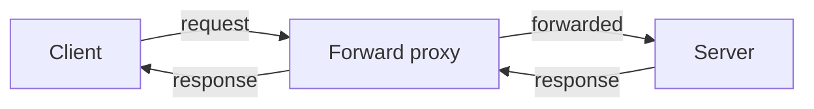

A forward proxy sits in front of clients. Requests go to the proxy, and the proxy talks to the internet on their behalf.

## Why use one

- control which sites clients can reach
- cache common responses
- hide client addresses from the servers they contact
