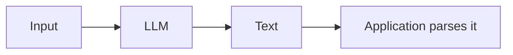
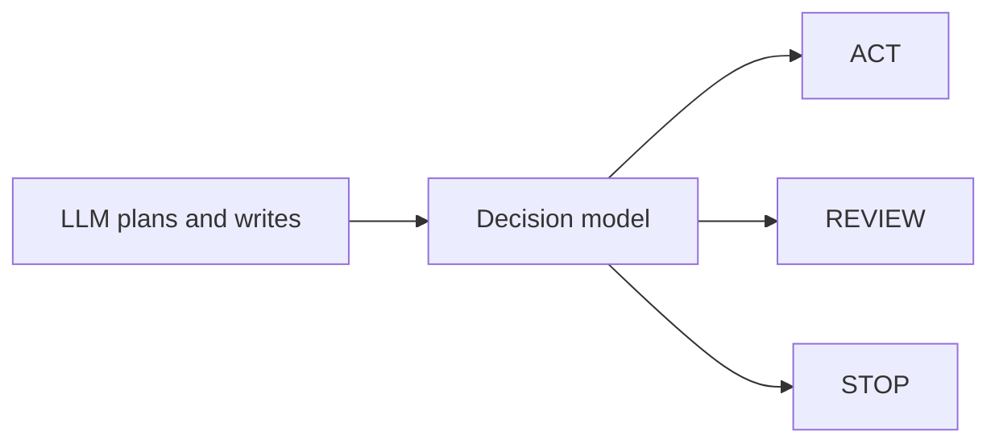
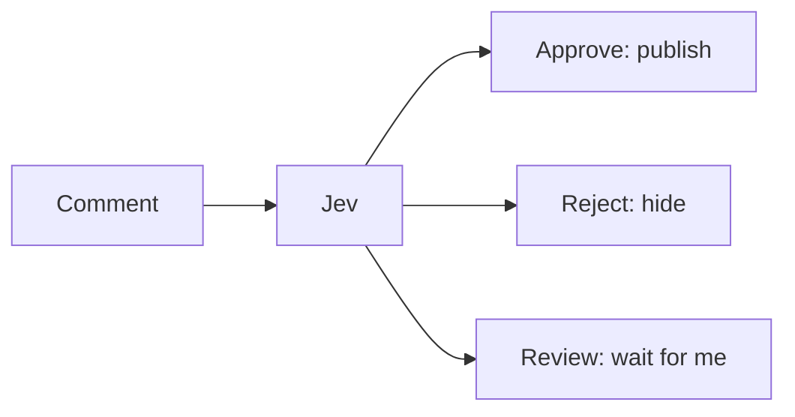

<Statement>Software rarely needs prose. **It needs decisions.**</Statement>

For years the main way to use AI in an application has been one shape:



That shape built chatbots, coding assistants, agents and search. But look at what the application usually wants at the end of it. Should this comment be published? Should this transaction be blocked? Which agent handles this request? Does this tool call need a human to approve it?

The answer is a word from a short list, and the sentence in the middle was only ever a way to get there. Asking a model to write a paragraph or a JSON object, then parsing it, can be slower, dearer and less predictable than the job needs.

A new kind of model goes after exactly this. They are called **decision models**, or **System One models**.

## What a Decision Model Is

A generative model is handed context and writes tokens. A decision model is handed context **and the list of allowed answers**, and returns one of them.


The application defines the possible outcomes **before** the model runs. That one change is the heart of the idea. TypeSafe AI, which introduced the first of these, describes them as producing typed, probabilistic decisions from unstructured state instead of generated text ([TypeSafe AI](https://typesafe.ai/blog/introducing-system-one-models-and-jev)).

### The three primitives

According to TypeSafe, Jev (announced on 15 September 2026) offers three ways to ask:

<Steps>
  <Step title="Choice">Pick one option from a list you provide: `PASS`, `FAIL` or `REVIEW`.</Step>
  <Step title="Score">Rate something against an ordered rubric, such as 1 (poor) to 4 (excellent).</Step>
  <Step title="Noul">A probabilistic yes or no: "Is this request malicious?" returns a probability, for example 0.94 for yes.</Step>
</Steps>

In every case the developer defines the answer space. The model does not invent it.

## Why "System One"

The name comes from Daniel Kahneman's split between fast, automatic thinking (System 1) and slow, deliberate thinking (System 2). TypeSafe chose it because these models are meant for quick, repeated decisions, not long reasoning.

<Compare>
  <Side kind="before" label="A general LLM">Generates text, open-ended, one token after another. You read the answer and parse it. Suited to reasoning, writing and planning.</Side>
  <Side label="A decision model">Returns a typed result from a bounded list, which the application uses directly. Suited to high-volume routing, gating and moderation.</Side>
</Compare>

This does not replace LLMs. It suggests the two sit in different places in the same system.

## Is This Just Classification?

The first objection is fair. Classifiers have existed for decades: BERT, fine-tuned encoders, ordinary machine learning, or an LLM asked for JSON. Independent testing backs the objection up in part: one benchmark found that small trained classifiers can beat decision models when a task has enough labelled training data ([arXiv 2610.00346](https://arxiv.org/abs/2610.00346)).

So "AI can classify things" is not the case for a new category. The stronger argument is narrower:

<Statement>A general decision model takes the **decision schema at inference time**, so a new label space needs no new training run.</Statement>

A conventional classifier is trained for `spam` or `not spam`. A decision model can be handed `spam`, `promotion`, `abuse`, `harassment` and `safe` in the next request, and the labels become part of the call. That is what makes it programmable.

## "It Cannot Hallucinate" Needs Care

TypeSafe claims Jev cannot hallucinate in the usual generative sense, because it does not write free-form text. That is true as far as it goes, and it needs one more sentence.

A model that cannot write a made-up explanation can still **choose the wrong answer**. Take the comment *"I disagree with your argument"* with the options `PASS`, `FAIL` and `REVIEW`. If the model returns `FAIL` at 0.97, nothing was invented, and a human moderator would still say `PASS`. It is a wrong decision delivered with confidence.

<Sidenote label="Going deeper">An independent security evaluation of System One models found that calibration can look good on average while particular kinds of attack or unfamiliar inputs still produce high-confidence errors ([arXiv 2609.33401](https://arxiv.org/abs/2609.33401)).</Sidenote>

So the accurate claim is: a decision model removes one class of generative failure (free-form output, and the parsing that follows it). **It does not remove model error.** The same goes for the probability it returns. Whether 0.97 really means "right about 97% of the time" on your own traffic is something you have to measure.

## How Fast It Moved

Everything below is from the sources listed at the end. I could not check each one independently, so read the numbers as reported.

<Timeline>
  <Event date="15 September 2026" title="Jev">TypeSafe AI comes out of stealth with its first System One model.</Event>
  <Event date="Late September" title="Others appear">Open and commercial alternatives follow, among them GLiNER2.5-Decide and Liquid AI's d1. Many copy Jev's interface rather than its training method, which is not public.</Event>
  <Event date="29 September" title="Independent test and OpenAI">Researchers publish an evaluation of Jev, and OpenAI introduces a Decisions API at DevDay 2026, described as focusing a model on a set of user-defined questions with finite, predefined answers.</Event>
  <Event date="1 October" title="Cloudflare Clef">Cloudflare releases Clef and Clef-flash, open-weight under Apache 2.0, on Workers AI, with a Jev-style API.</Event>
</Timeline>

The independent evaluation covered 37 datasets and more than 346,000 requests, across classification, routing, moderation, legal clauses and rubric scoring. It reported that Jev beat the Qwen model it was compared with on 27 of the 37, and that it weakened on low-resource languages, noisy labels and fine-grained rubric judgements ([arXiv 2609.37647](https://arxiv.org/abs/2609.37647)).

<StatRow>
  <Stat value="37" label="datasets in the independent Jev evaluation" tone="lilac" />
  <Stat value="27" label="of those 37 where Jev beat the compared Qwen model" tone="mint" />
</StatRow>

Cloudflare's own median latencies, which are vendor-reported, show why the category matters for cost and speed ([Cloudflare](https://developers.cloudflare.com/changelog/post/2026-10-01-clef-workers-ai/)):

<StatRow>
  <Stat value="38.8" unit="ms" label="Clef-flash (9B)" note="vendor-reported" tone="sky" />
  <Stat value="209.3" unit="ms" label="Clef (27B)" note="vendor-reported" tone="mint" />
  <Stat value="524.1" unit="ms" label="Jev" note="vendor-reported" tone="rose" />
</StatRow>

Whatever the exact figures turn out to be, one of the largest AI companies and an infrastructure company have both put decision-making in front of developers as its own primitive.

## Where a Decision Model Fits

The useful picture is a fast control layer next to the reasoning model.



The LLM reasons, plans and writes. The decision model answers the narrow questions in between: should I act, which tool, is this safe, does a person need to approve. The same pattern covers routing a request to billing, technical or sales, checking a generated reply before it goes out, and authorising an agent's action.

The cost argument follows. A site that receives 10,000 comments a day does not need 10,000 explanations of why each one is fine. It needs `PASS`. **Do not use a language generator when the application only needs a decision.**

## What I Built at Drafted

I tried this on Drafted itself. When the site had public comments, I wired Jev in as the moderator. The comment was the state, and the three outcomes were fixed by the application:



The model returned probabilities. The rules about what to do with them stayed in my code:

```ts
export const APPROVE_AT = 0.85;
export const REJECT_AT = 0.9;

// Publish only when clearly fine, hide only when clearly bad,
// otherwise leave it for the author to look at.
export function decide(probabilities: Record<string, number>) {
  if ((probabilities.approve ?? 0) >= APPROVE_AT) return 'approve';
  if ((probabilities.reject ?? 0) >= REJECT_AT) return 'reject';
  return 'review';
}
```

Two things made it a good fit. The question was bounded, so there was no parsing and nothing to talk its way past: the model chooses among options, it does not follow instructions hidden in a comment. And the **software owned the consequences**. The model decided which state a comment entered; the application decided what each state meant, and anything unexpected fell back to `review`.

I have since removed it. I changed Drafted so that messages are private between the reader and me, and with no public thread there was nothing left to moderate. The code is gone, but the lesson stayed: the useful part was the bounded set of outcomes and the thresholds I chose, more than the model behind them.

## Five Fair Questions

<Sidenote label="Is it new?">Classifiers, BERT, structured-output LLMs and fine-tuned encoders all exist. The newness is architectural and in the product: the label space arrives with the request.</Sidenote>

<Sidenote label="Are the probabilities calibrated?">A 0.97 reads as authority. Whether it matches reality on your traffic is an open question you test, per class and per kind of input.</Sidenote>

<Sidenote label="Are vendor benchmarks enough?">They are a start. Datasets, prompts, thresholds, hardware and label spaces all move the result, so independent benchmarks matter.</Sidenote>

<Sidenote label="What if the answer is not on the list?">If the right outcome is `CONTEXT_REQUIRED` or `USER_APPEAL` and your list has only `PASS`, `FAIL` and `REVIEW`, the model cannot pick it. It is only as expressive as the decision space a person designed.</Sidenote>

<Sidenote label="Is no hallucination the same as no error?">No. See above: a confident wrong choice is still a wrong choice, and with automation it acts.</Sidenote>

## What I Expect Next

This part is my view, not a report. If the idea holds, the primitives will grow past choice, score and yes or no, toward things like route, rank, approve, escalate, gate and stop. An agent then stops being "an LLM plus tools" and becomes a system with a place for perception, memory, reasoning, **decision**, policy, execution, verification and a human to escalate to. The decision model sits between reasoning and execution, and that is a valuable place to be.

<Statement tone="mint">LLMs taught machines to speak. **Decision models may teach software how to decide.**</Statement>

## Sources

- [TypeSafe AI: Introducing System One Models and Jev](https://typesafe.ai/blog/introducing-system-one-models-and-jev)
- [OpenAI: DevDay 2026 recap and the Decisions API](https://t.co/Y0GaZz1HKL)
- [Cloudflare: Introducing Clef, our open-source decision models](https://blog.cloudflare.com/clef-decision-models/) and its [Workers AI changelog](https://developers.cloudflare.com/changelog/post/2026-10-01-clef-workers-ai/)
- [Independent evaluation of Jev (arXiv 2609.37647)](https://arxiv.org/abs/2609.37647)
- [Independent security evaluation of System One models (arXiv 2609.33401)](https://arxiv.org/abs/2609.33401)
- [Decision-gate benchmark (arXiv 2610.00346)](https://arxiv.org/abs/2610.00346)
- [Tracker of System One model alternatives](https://systemonemodels.org/examples/alternatives/)
