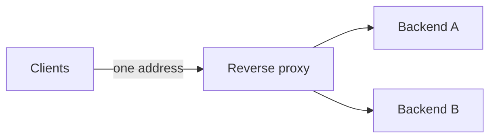

A reverse proxy sits in front of servers. Clients talk to it as if it were the server, and it forwards requests to the right backend.

## What it gives you

- one public address for many services
- TLS in one place
- load balancing and caching
