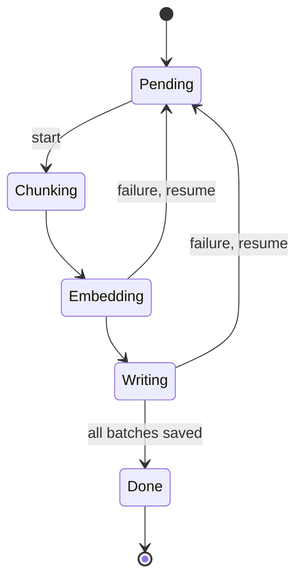

Ingestion is where retrieval systems quietly break. Documents arrive in odd shapes, jobs die halfway, and the same file gets processed twice.

## Four stages, one rule

<Scrolly tone="sky">
  <Beat stage="Chunk" sub="step 1">Split each document into pieces that make sense on their own.</Beat>
  <Beat stage="Embed" sub="step 2">Turn every chunk into a vector. Batch the calls and retry the failures.</Beat>
  <Beat stage="Write" sub="step 3">Store the vector and its metadata under a stable id.</Beat>
  <Beat stage="Checkpoint" sub="step 4">Record how far you got, so a stopped job resumes instead of starting over.</Beat>
</Scrolly>

## Write idempotently

Give every chunk a stable id derived from its source and position. Writing the same chunk twice then replaces it instead of duplicating it. Click through the steps to see which lines do the work.

<CodeWalk steps={[
  { lines: "1", title: "Stable id", text: "Source plus position: the same chunk always gets the same id." },
  { lines: "2", title: "Upsert", text: "Replaces instead of duplicating, so retries are safe." },
  { lines: "3-4", title: "Checkpoint", text: "Saved after every batch; a restart continues from here." },
]}>

```ts
const id = `${doc.id}:${chunk.index}`;
await index.upsert({ id, vector, metadata });
await checkpoint.save({ doc: doc.id, next: chunk.index + 1 });
// a restarted job reads the checkpoint and skips what is done
```

</CodeWalk>

<Sidenote>Idempotent means doing it twice has the same effect as doing it once.</Sidenote>



Next in the series: query and ranking.
