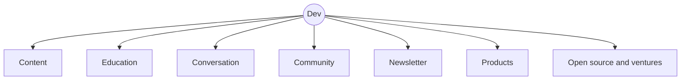

<Sidenote label="Plan">This is a map of what I am building. Much of it is still an idea, and I say so where that is the case.</Sidenote>

<Statement>Learning, creating, teaching, sharing and building should not exist as **disconnected activities**.</Statement>

Dev Universe is a personal ecosystem built around that simple idea. At the center is me: creator, engineer, educator, builder and entrepreneur. Around that identity is an interconnected set of parts spanning content, education, community, conversations, products, knowledge, open source and ventures.

Here is how the parts connect before we walk through each one.

## Content: The Media Layer

Content is the entry point into Dev Universe. Different platforms serve different purposes, instead of simply publishing the same material everywhere.

### ✍️ Dev Drafted

[Dev Drafted](/) is the writing and thinking layer. It is where ideas are developed in written form, covering software engineering, AI and technology, productivity, systems, entrepreneurship, careers, project lessons, experiments and long-form technical writing.

**Its job: deep thinking and written knowledge.**

### 🎥 Saran Mahadev on YouTube

[YouTube](https://www.youtube.com/@saranmahadev) is the primary public-facing content channel. It focuses on technology, AI, software engineering, productivity, business, projects, experiments, tutorials, long-form videos and Shorts.

**Its job: learn, build and share.**

### 📸 Everything.by.Dev

[Instagram](https://www.instagram.com/everything.by.dev) is the discovery and distribution layer. Rather than being another personal account, it acts as a feed of what is happening across Dev Universe: new videos, articles, courses, workshops, podcast episodes, products, community updates, discoveries and educational content.

## The Personal Layer

Not everything needs to be educational or technical.

### 🌱 Lyf as Dev

[Lyf as Dev](https://www.instagram.com/lyf.as.dev) is where the personal side lives: vlogs, casual conversations, travel, behind-the-scenes content, experiments, failures, thoughts and everyday experiences.

The distinction is intentionally simple.

<Compare>
  <Side kind="before" label="Saran Mahadev">What I know and build.</Side>
  <Side label="Lyf as Dev">Who I am and how I live.</Side>
</Compare>

That gives Dev Universe room for both expertise and personality.

## Education: Turning Knowledge Into Learning

Content can teach an individual concept. Education goes further by creating structured learning experiences.

### 💻 Scratch with Dev

Scratch with Dev is the course and structured-learning brand. Its potential areas include programming, software engineering, AI engineering, computer science, system design, developer tools, agent engineering, production engineering and practical software development.

<Statement tone="mint">Learn from scratch. Build practically. Understand deeply.</Statement>

YouTube can introduce concepts and create awareness, while Scratch with Dev provides complete learning paths.

### 🏫 Dev Workshops

Workshops sit between content and formal education. They can include live technical workshops, corporate training, college workshops, developer bootcamps, community sessions, and offline programs at colleges, universities, companies, conferences and events.

## Conversation: Learning From People

### 🎙️ Vazhviyal

Vazhviyal expands the ecosystem beyond technology. The concept is to explore life through conversations with interesting people, covering technology, entrepreneurship, science, careers, finance, creativity, psychology, education, relationships, leadership, failure, philosophy, culture and personal journeys.

The objective is not merely to interview successful people. It is to spend meaningful time with interesting people and understand what they know about life.

## Community: Turning an Audience Into a Network

Content creates an audience. Community turns that audience into people who interact with one another.

### 💬 Dev Den

Dev Den is envisioned as the community home on Discord. It can contain spaces for software engineering, AI, projects, careers, productivity, entrepreneurship, open source, courses, workshops and community events. Over time it can support study groups, project groups, mentorship, events, hackathons, peer learning, job discussions and build-in-public groups.

### 🗣️ r/discusswithdev

Reddit provides the public discussion layer. While Dev Den is the community home, Reddit can offer a more open environment for questions, discussions, debates, project showcases, technical problems and community-generated knowledge.

## Dev Universe Weekly: Connecting Everything

The newsletter is the single subscription point for the ecosystem. Instead of producing another completely separate stream of content, Dev Universe Weekly can be a weekly digest of:

- 📝 What was written
- 🎥 What was published
- 🧠 What was learned
- 🛠️ What was built
- 🎓 New courses
- 🏫 Upcoming workshops
- 🎙️ New Vazhviyal episodes
- 👥 Community highlights
- 🚀 Open-source releases
- 📦 New products
- 🔬 Interesting discoveries

That creates a central thread connecting the different parts of Dev Universe.

## Products: Helping People Execute

### 📦 shop.saranmahadev.in

The product layer turns knowledge and intellectual property into useful things people can actually use. Potential products include templates, developer tools, Notion and Obsidian systems, productivity systems, engineering resources, AI resources, e-books, guides, checklists, code, courses, toolkits and, eventually, SaaS products.

<PullQuote>Content teaches. Products help people execute.</PullQuote>

## AI Library: Building an Open Knowledge Layer

The AI Library is envisioned as a major long-term project. Its purpose is to create a high-quality, open-source learning platform where people can learn AI, understand concepts, follow structured learning paths, study implementations, explore examples, contribute knowledge, build projects, discover tools and track their learning.

The underlying philosophy: open knowledge should be structured, understandable and continuously improved by the community. Over time, the library could grow beyond articles into community-maintained AI knowledge infrastructure.

## Open Source and Ventures

The ecosystem also has a path from ideas to experiments to software to organizations.

<Steps>
  <Step title="Ideas">Where everything starts.</Step>
  <Step title="Experiments">Small tests of whether an idea is worth more.</Step>
  <Step title="Software">The experiments that survive become real tools.</Step>
  <Step title="Organizations">The work that grows gets a home.</Step>
</Steps>

### 🛠️ InflateHub

InflateHub is the open-source engineering arm. It can house developer tools, AI tools, agent infrastructure, productivity software, frameworks, research projects, developer infrastructure and community projects.

**Its principle: don't build because we can. Build because it is worth building.**

### 🎓 InflateEd

InflateEd is the high-touch education and mentorship layer. Its initial concept, Super 40, is a selective cohort of about 40 people, focused on helping highly motivated individuals become significantly better builders through mentorship, technical training, projects, industry exposure, open source, career guidance and an alumni network.

### 🚀 Inflate Ventures

Inflate Ventures Private Limited provides the organizational umbrella that brings all the ventures under one roof.

## In Essence

Dev Universe is the system around my work. It brings together:

<Marquee words={["Learn", "Think", "Create", "Share", "Teach", "Build", "Collaborate", "Productize", "Give Back"]} tone="accent" />
