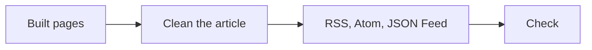

<Sidenote label="True story">These are decisions I really made while building this site. I have put them in a tidier order than they happened.</Sidenote>

Once you can read a blog, the next question is how to follow it. The usual answers are an email list, a social account, or a like button. I decided to stay with RSS, and to make it as good as RSS can be.

## Why Only RSS

A feed lets you follow a site from the app you already use, with no account and nothing sent to your inbox. For a blog that is the whole job. There are no likes either, because nothing here needs to be ranked or counted.

So the work went into making the feed a first-class citizen instead of an afterthought.

## What a Good Feed Contains

<Compare>
  <Side kind="before" label="A thin feed">A title and a one-line summary. You have to leave your reader to read anything.</Side>
  <Side label="A full feed">The whole post, the author, the date it was published and last changed, categories, a permanent link and the share image.</Side>
</Compare>

Drafted publishes three formats: RSS, Atom and JSON Feed. There is one for the whole site, one for each series, and one for each topic, so you can follow only what you care about. If you open a feed in a browser you get a readable page instead of raw XML.

## How It Is Made

The feeds are built from the pages themselves, after the site is built, so a reader gets exactly the text the site shows.

Cleaning matters. Scripts and drawings do not belong in a feed reader, so a diagram becomes its caption and description, and an interactive block becomes a link back to the site.

## A Test That Found My Own Bugs

When I wrote the guide for how articles are built, I put every block into a test post and read the feed. Two things were wrong. The marquee block repeated its words many times in the feed, and a note's label ran straight into its text.

Both were my bugs, and both were invisible on the site itself. The fix was to leave out anything the page hides from screen readers, and to turn notes into labelled quotes. The feed check now runs with every build.

**If you can read it on the site, you should be able to read it in your feed.**

You will find the main feed at [/rss.xml](/rss.xml), and each series and topic has its own on its page.
