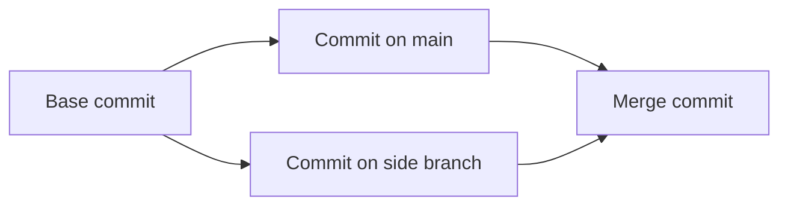

Somewhere on your computer there is probably a file called `report_final_v2_REAL.docx`, and next to it `report_final_v2_REAL_edited.docx`. You made them for a good reason. You wanted to change something without losing the version that worked.

Version control is that instinct, done properly. Most people meet it as a list of commands (`add`, `commit`, `push`, `merge`) and a vague fear of `reset --hard`. The commands make much more sense once you know what they act on. So in this article we won't learn Git by memorising it. We will build a small version of it, in Python, one step at a time, and at the end we will ask the real Git to read what we built.

The tool is called `mygit`. It is about 370 lines, and it can record snapshots of a folder, name them, show you the history, switch between lines of work, merge them, share them between two folders and recover work you thought you had lost. The surprise comes at the end: it writes the same file formats as Git, so real Git can read the repository our code produces.

<Statement tone="sky">Every undo is only a read of something that was written down earlier.</Statement>

## Before You Start

You need three things: Python 3, a terminal, and Git installed for the checks near the end. I ran everything here with Python 3.11 and Git 2.43 on Linux, and I did not test other versions or other systems.

Save the code in a file called `mygit.py`, adding each step below to it in order. Then make a short name for it, and an empty folder to work in:

```text
alias mygit="python3 /path/to/mygit.py"
mkdir project && cd project
```

Three practical notes:

- Everything lives in a folder called `.mygit` inside the folder you run the tool in. It is the equivalent of Git's `.git`.
- Commit IDs depend on the time of the commit, so yours will differ from mine. I set `MYGIT_TIME` where it matters, so you can reproduce one ID exactly, and from then on I leave it unset, as a real tool would. Blob and tree IDs depend only on content, so those will match mine if your files match. Whenever a command below uses one of my commit IDs, use the matching ID from your own output.
- Each step ends with a **Try it** and a question. Run the commands rather than reading the output. The output is there so you can check yourself.

## Step 1: A Repository Is Just a Folder

Start with the least impressive part. A **repository** is where a project keeps its history, and the first thing the tool has to do is make that place. Put this at the top of `mygit.py`, and the last five lines at the very bottom. Every later step goes between them:

```python
import os
import sys

REPO = ".mygit"
COMMANDS = {}


def command(fn):
    COMMANDS[fn.__name__.replace("_", "-")] = fn
    return fn


def create_repo():
    for folder in ("objects", "refs/heads"):
        os.makedirs(f"{REPO}/{folder}", exist_ok=True)
    with open(f"{REPO}/HEAD", "w") as f:
        f.write("ref: refs/heads/main\n")


@command
def init(args):
    create_repo()
    print(f"Initialised an empty repository in {REPO}")
```

```python
def main():
    if len(sys.argv) < 2 or sys.argv[1] not in COMMANDS:
        sys.exit("usage: mygit <command> ...\ncommands: " + ", ".join(sorted(COMMANDS)))
    COMMANDS[sys.argv[1]](sys.argv[2:])


if __name__ == "__main__":
    main()
```

The `@command` line is a small trick: it registers a function as a command, and turns an underscore in its name into a dash (so `hash_object` becomes `hash-object`). The `main` function runs whichever one you typed.

```text
mygit init
Initialised an empty repository in .mygit
```

```text
ls -a
.  ..  .mygit

cat .mygit/HEAD
ref: refs/heads/main
```

There are two things inside. `objects` is where we will keep everything we record. `HEAD` says which branch you are on, and it currently says `main`, a branch that doesn't exist yet. Real Git's `.git` folder has the same skeleton, plus a few extras.

<Sidenote label="Try it">Run `mygit init`, then delete the `.mygit` folder. What did you lose? Now you know why copying a project folder is a backup of its history too.</Sidenote>

**A repository is just a folder. Delete it and the history goes with it.**

## Step 2: Store Things by Their Fingerprint

The obvious way to keep old versions is to copy files with new names, which is how `final_v2_REAL` happens. Git does something smarter: it names every piece of content **by a fingerprint of the content itself**.

The fingerprint is a **hash**: a function that turns any data into a short, fixed-length string. The same data always gives the same string, and a change of even one character gives a completely different one. Git uses the SHA-1 hash by default, so we do too. We hash a small header (the kind of object and its size) followed by the content, and store the compressed result in a file named after the hash. The first two characters of the hash become a folder name, so no single folder gets enormous.

```python
import hashlib
import zlib


def object_id(kind, data):
    store = f"{kind} {len(data)}".encode() + b"\0" + data
    return hashlib.sha1(store).hexdigest(), store


def write_object(kind, data):
    oid, store = object_id(kind, data)
    path = f"{REPO}/objects/{oid[:2]}/{oid[2:]}"
    if not os.path.exists(path):
        os.makedirs(os.path.dirname(path), exist_ok=True)
        with open(path, "wb") as f:
            f.write(zlib.compress(store))
    return oid


def read_object(oid):
    with open(f"{REPO}/objects/{oid[:2]}/{oid[2:]}", "rb") as f:
        store = zlib.decompress(f.read())
    header, _, data = store.partition(b"\0")
    kind, _size = header.decode().split(" ")
    return kind, data


@command
def hash_object(args):
    data = open(args[-1], "rb").read()
    print(write_object("blob", data) if "-w" in args else object_id("blob", data)[0])


@command
def cat_file(args):
    kind, data = read_object(args[-1])
    sys.stdout.write(kind + "\n" if args[0] == "-t" else data.decode(errors="replace"))
```

Make a file and ask for its ID:

```text
printf 'dosa 40\nidli 30\n' > menu.txt

mygit hash-object menu.txt
f1561cc22b7e9de52a6469d83d78c27d142e18fe

git hash-object menu.txt
f1561cc22b7e9de52a6469d83d78c27d142e18fe
```

The second command is real Git, and it gives the same ID, so our fingerprint is the real one. Now store it, twice, under two names:

```text
cp menu.txt copy.txt
mygit hash-object -w menu.txt
mygit hash-object -w copy.txt
find .mygit/objects -type f
.mygit/objects/f1/561cc22b7e9de52a6469d83d78c27d142e18fe
```

Two files, one object. Identical content has an identical fingerprint, so it is stored once. Now change a single character in the copy and ask again:

```text
printf 'dosa 41\nidli 30\n' > copy.txt
mygit hash-object copy.txt
c4d75f4e1362faa8b700579e9d4a6929dc1537de

rm copy.txt
```

An entirely different ID. And you can look inside an object, because it is only a compressed file:

```text
python3 -c "import zlib; print(zlib.decompress(open('.mygit/objects/f1/561cc22b7e9de52a6469d83d78c27d142e18fe','rb').read()))"
b'blob 16\x00dosa 40\nidli 30\n'
```

That is the header (`blob 16`, then a zero byte), followed by the file. A **blob** is what Git calls the stored content of one file. Notice what is missing: the file's name. A blob knows its content and nothing else.

<Sidenote label="Try it">Hash an empty file with both tools. You should get `e69de29bb2d1d6434b8b29ae775ad8c2e48c5391` from each. Why does an empty file have an ID at all?</Sidenote>

**An ID is made from the content. Same content, same ID, stored once. Change anything, and it becomes a different thing.**

## Step 3: Record a Whole Folder, Not Just a File

A project is many files in folders, and a snapshot has to capture all of them. Two ideas do this.

First, a **tree** object: a list of names, each pointing at the ID of a blob (a file) or of another tree (a folder). Because a tree is stored the same way as everything else, one tree ID is the fingerprint of an entire folder, and it only matches if every file inside it matches.

Second, a place to say *which* files go into the next snapshot. That is the **staging area**, which Git calls the index. It is a list of paths and the blob ID each should have. You build it with `add`. Real Git keeps it in a binary format; we use a plain JSON file named `index.json`, which is easy to read.

```python
import json


def load_index():
    path = f"{REPO}/index.json"
    return json.load(open(path)) if os.path.exists(path) else {}


def save_index(index):
    with open(f"{REPO}/index.json", "w") as f:
        json.dump(index, f, indent=1, sort_keys=True)


def walk(path):
    if os.path.isfile(path):
        yield os.path.normpath(path)
        return
    for root, folders, files in os.walk(path):
        folders[:] = [d for d in folders if d != REPO]
        for name in files:
            yield os.path.normpath(os.path.join(root, name))


@command
def add(args):
    index = load_index()
    for target in map(os.path.normpath, args):
        under = lambda p: target == "." or p == target or p.startswith(target + "/")
        for path in [p for p in index if under(p) and not os.path.exists(p)]:
            del index[path]
        if os.path.exists(target):
            for path in walk(target):
                index[path] = write_object("blob", open(path, "rb").read())
    save_index(index)


def build_tree(index, prefix=""):
    entries = {}
    for path, oid in index.items():
        if path.startswith(prefix):
            name, _, rest = path[len(prefix):].partition("/")
            entries[name] = ("40000", None) if rest else ("100644", oid)
    body = b""
    for name, (mode, oid) in sorted(entries.items(), key=lambda e: e[0] + ("/" if e[1][0] == "40000" else "")):
        if mode == "40000":
            oid = build_tree(index, f"{prefix}{name}/")
        body += f"{mode} {name}".encode() + b"\0" + bytes.fromhex(oid)
    return write_object("tree", body)


def parse_tree(oid):
    data, entries = read_object(oid)[1], []
    while data:
        header, _, data = data.partition(b"\0")
        mode, name = header.decode().split(" ", 1)
        entries.append((mode, name, data[:20].hex()))
        data = data[20:]
    return entries


@command
def write_tree(args):
    print(build_tree(load_index()))


@command
def ls_tree(args):
    for mode, name, oid in parse_tree(args[0]):
        print(f"{mode.zfill(6)} {'tree' if mode == '40000' else 'blob'} {oid}\t{name}")
```

```text
mkdir drinks
printf 'chai 15\n' > drinks/hot.txt
mygit add .
cat .mygit/index.json
{
 "drinks/hot.txt": "44b50e1255dd65bda9943b55929f98287f892253",
 "menu.txt": "f1561cc22b7e9de52a6469d83d78c27d142e18fe"
}
```

`add` stored each file as a blob and noted its ID. Now turn that list into a snapshot:

```text
mygit write-tree
8a4ba66d0eaa74853db82715e407df1d256a68c3

mygit ls-tree 8a4ba66d0eaa74853db82715e407df1d256a68c3
040000 tree 369387af82032ccd11c90760231bfd4af2f61461	drinks
100644 blob f1561cc22b7e9de52a6469d83d78c27d142e18fe	menu.txt
```

The root tree lists `drinks` (a tree of its own) and `menu.txt` (a blob). I checked this against Git by creating the same two files in a real repository and running `git add .` and `git write-tree`. It printed the same tree ID, `8a4ba66d0eaa74853db82715e407df1d256a68c3`. The mode `100644` means "ordinary file", and `040000` means "folder".

<Sidenote label="Try it">Add one more file inside `drinks`, run `add` and `write-tree` again, and compare the two root tree IDs, then the two `drinks` tree IDs. Which IDs changed, and which stayed the same? Why?</Sidenote>

**One ID can stand for a whole folder, because it is made from the IDs of everything inside it.**

## Step 4: A Commit Is a Tree With a Story

A tree is a snapshot, but it has no author, no date, no reason and no past. A **commit** wraps a tree with that. It is a small text object listing the tree, the **parent** commit it came from (none, for the first), who made it and when, and a message.

```python
import time


def identity():
    return f"{os.environ.get('MYGIT_NAME', 'Dev')} <{os.environ.get('MYGIT_EMAIL', 'dev@example.com')}>"


def timestamp():
    return f"{os.environ.get('MYGIT_TIME', int(time.time()))} +0000"


def write_commit(tree, parents, message):
    lines = [f"tree {tree}"] + [f"parent {p}" for p in parents]
    lines += [f"author {identity()} {timestamp()}", f"committer {identity()} {timestamp()}", "", message, ""]
    return write_object("commit", "\n".join(lines).encode())


@command
def commit_tree(args):
    parents = [args[i + 1] for i, a in enumerate(args) if a == "-p"]
    print(write_commit(args[0], parents, args[args.index("-m") + 1]))
```

This low-level command makes the object and prints its ID. Setting `MYGIT_TIME` for one command fixes the clock, so you get the same ID as me:

```text
MYGIT_TIME=1700000000 mygit commit-tree 8a4ba66d0eaa74853db82715e407df1d256a68c3 -m "first menu"
a5167e8f5b5b559fa70054709dfc94d71b73eba0

mygit cat-file -p a5167e8f5b5b559fa70054709dfc94d71b73eba0
tree 8a4ba66d0eaa74853db82715e407df1d256a68c3
author Dev <dev@example.com> 1700000000 +0000
committer Dev <dev@example.com> 1700000000 +0000

first menu
```

Change only the message, and the ID changes completely, even though the tree is identical:

```text
MYGIT_TIME=1700000000 mygit commit-tree 8a4ba66d0eaa74853db82715e407df1d256a68c3 -m "first menu!"
61740f9273eaa3bf89922576419bccb147949c46
```

Now the test. Real Git, given the same files, the same author and the same time, should arrive at the same commit ID:

```text
GIT_AUTHOR_NAME=Dev GIT_AUTHOR_EMAIL=dev@example.com GIT_AUTHOR_DATE="1700000000 +0000" \
GIT_COMMITTER_NAME=Dev GIT_COMMITTER_EMAIL=dev@example.com GIT_COMMITTER_DATE="1700000000 +0000" \
git commit -m "first menu"
git rev-parse HEAD
a5167e8f5b5b559fa70054709dfc94d71b73eba0
```

The same ID. If your Git is set up to sign commits, add `-c commit.gpgsign=false`, because a signature becomes part of the commit and changes the ID.

Here is what makes this more than a filing system. A commit's ID is made from everything in it, **including the ID of its parent**. I ran the next experiment in a scratch repository, so it wouldn't clutter yours. Watch what happens when we try to quietly change the first commit's message after the second already exists:

```text
A  = commit "first menu"                    d24a3b86af6b5cf58208242d4fa0a028c1912360
B  = commit "raise price", parent A         d7067d7ee38ce7d23fca7d0897c7bc8cef910843

edit A's message to "first menu (edited)":
A' = a new commit                           5ce3b379bb8cb34e81e3080899cd167f710fb12f
B' = "raise price", parent A'               a1ddc493ef3b53c581314a9306cbd66649362ccb
```

The edited first commit has a new ID, so the second commit that points at it must change too, and so would every commit after that. You cannot change the past without changing every ID that follows it, and anyone holding the old IDs will notice.

<Sidenote label="Try it">Make the same commit twice with a different `MYGIT_TIME`. Do you get the same ID? Now explain why Git commit IDs are different on every computer, even for identical files.</Sidenote>

**A commit's ID includes its parent's ID, so history is a chain. Changing the past changes everything after it.**

## Step 5: A Name for the Latest Commit

IDs are not something anyone wants to type. We need a name that follows the newest commit as you work. In Git that name is a **branch**, and it is the least impressive object of all: **a file with one commit ID in it**. `HEAD` is a file that says which branch you are on.

Now we can write the command you will use all the time. It builds a tree from the staging area, makes a commit whose parent is wherever the current branch points, and moves the branch forward. It also writes a line to a diary of every branch move, called the **reflog**. We will need it at the end.

```python
def head_ref():
    return open(f"{REPO}/HEAD").read().split()[1]


def read_ref(ref):
    path = f"{REPO}/{ref}"
    return open(path).read().strip() if os.path.exists(path) else None


def update_ref(ref, oid, why):
    old = read_ref(ref) or "0" * 40
    os.makedirs(os.path.dirname(f"{REPO}/{ref}"), exist_ok=True)
    with open(f"{REPO}/{ref}", "w") as f:
        f.write(oid + "\n")
    if ref == head_ref():
        os.makedirs(f"{REPO}/logs", exist_ok=True)
        with open(f"{REPO}/logs/HEAD", "a") as f:
            f.write(f"{old} {oid} {identity()} {timestamp()}\t{why}\n")


def head_commit():
    return read_ref(head_ref())


@command
def commit(args):
    message = args[args.index("-m") + 1]
    parents = [p for p in (head_commit(), read_ref("MERGE_HEAD")) if p]
    oid = write_commit(build_tree(load_index()), parents, message)
    update_ref(head_ref(), oid, f"commit: {message}")
    if os.path.exists(f"{REPO}/MERGE_HEAD"):
        os.remove(f"{REPO}/MERGE_HEAD")
    print(f"[{head_ref().split('/')[-1]} {oid[:7]}] {message}")


@command
def branch(args):
    if args:
        update_ref(f"refs/heads/{args[0]}", head_commit(), f"branch: created from {head_commit()[:7]}")
        return
    for name in sorted(os.listdir(f"{REPO}/refs/heads")):
        print(("* " if f"refs/heads/{name}" == head_ref() else "  ") + name)
```

```text
MYGIT_TIME=1700000000 mygit commit -m "first menu"
[main a5167e8] first menu

cat .mygit/HEAD
ref: refs/heads/main

cat .mygit/refs/heads/main
a5167e8f5b5b559fa70054709dfc94d71b73eba0
```

That is the same ID as before, because the tree, the author and the time are the same. The branch `main` exists now, and it is that one line. From here on I leave the clock alone, so your commit IDs will differ from mine. Make a change and commit it, then another:

```text
printf 'dosa 45\nidli 30\n' > menu.txt
mygit add menu.txt
mygit commit -m "raise dosa price"
[main 735ad5c] raise dosa price

printf 'coffee 20\n' > drinks/hot.txt
printf 'vada 25\n' >> menu.txt
mygit add .
mygit commit -m "add vada and coffee"
[main df23433] add vada and coffee

mygit branch tweak
mygit branch
* main
  tweak

cat .mygit/refs/heads/tweak
df23433ac0046012c01dc983fd5ceb1fe649ee88
```

Creating a branch wrote one new 41-byte file. That is why branches in Git are said to be cheap. Here is the whole structure after the first two commits. Notice that the `drinks` folder did not change between them, so both snapshots **share** the same `drinks` tree and the same `chai` blob:

```mermaid caption="Two commits: each points at a tree, and unchanged parts are shared"
flowchart LR
  accTitle: Two commits sharing unchanged content
  accDescr: The second commit points to its parent, the first commit. Each commit points to its own root tree. Both root trees point to the same drinks tree, which points to the same hot.txt blob. Each root tree points to its own version of the menu.txt blob.
  C2[Commit 2] -->|parent| C1[Commit 1]
  C1 --> T1[Root tree 1]
  C2 --> T2[Root tree 2]
  T1 --> M1[menu.txt v1]
  T2 --> M2[menu.txt v2]
  T1 --> D[drinks tree]
  T2 --> D
  D --> H[hot.txt]
```

<Sidenote label="Try it">Run `cat .mygit/logs/HEAD` and read what the reflog recorded. Then create three branches and look at `.mygit/refs/heads`. How many bytes does each branch cost?</Sidenote>

**A branch is a file with one commit ID in it. Moving a branch means changing a file.**

## Step 6: Look Back Through the Chain

Because every commit names its parent, history is a walk backwards through the chain. `log` does the walk, and `diff` compares two snapshots. `status` compares three places at once: the last commit, the staging area and your working folder.

```python
import difflib
import heapq


def parse_commit(oid):
    head, _, message = read_object(oid)[1].decode().partition("\n\n")
    info = {"parents": [], "message": message.strip()}
    for line in head.split("\n"):
        key, _, value = line.partition(" ")
        if key == "parent":
            info["parents"].append(value)
        elif key in ("tree", "author"):
            info[key] = value
    info["time"] = int(info["author"].split()[-2])
    return info


def resolve(name):
    base, _, back = name.partition("~")
    oid = head_commit() if base == "HEAD" else read_ref(f"refs/heads/{base}") or read_ref(f"refs/remotes/{base}")
    if oid is None:
        found = [d + f for d in os.listdir(f"{REPO}/objects") for f in os.listdir(f"{REPO}/objects/{d}") if (d + f).startswith(base)]
        if len(found) != 1:
            sys.exit(f"unknown revision: {name}")
        oid = found[0]
    for _ in range(int(back or 0)):
        oid = parse_commit(oid)["parents"][0]
    return oid


def flatten(tree_oid, prefix=""):
    files = {}
    for mode, name, oid in parse_tree(tree_oid):
        if mode == "40000":
            files.update(flatten(oid, f"{prefix}{name}/"))
        else:
            files[f"{prefix}{name}"] = oid
    return files


def history(start):
    parents, waiting, stack = {}, {}, [start]
    while stack:
        oid = stack.pop()
        if oid not in parents:
            parents[oid] = parse_commit(oid)["parents"]
            for parent in parents[oid]:
                waiting[parent] = waiting.get(parent, 0) + 1
                stack.append(parent)
    ready = [(-parse_commit(oid)["time"], oid) for oid in parents if not waiting.get(oid)]
    heapq.heapify(ready)
    while ready:
        oid = heapq.heappop(ready)[1]
        yield oid
        for parent in parents[oid]:
            waiting[parent] -= 1
            if waiting[parent] == 0:
                heapq.heappush(ready, (-parse_commit(parent)["time"], parent))


@command
def log(args):
    for oid in history(resolve(args[0] if args else "HEAD")):
        print(oid[:7], parse_commit(oid)["message"].splitlines()[0])


def lines_of(oid):
    return read_object(oid)[1].decode(errors="replace").splitlines(keepends=True) if oid else []


@command
def diff(args):
    old, new = (flatten(parse_commit(resolve(a))["tree"]) for a in args)
    for path in sorted(set(old) | set(new)):
        if old.get(path) != new.get(path):
            sys.stdout.writelines(difflib.unified_diff(lines_of(old.get(path)), lines_of(new.get(path)), f"a/{path}", f"b/{path}"))


def changes():
    head = flatten(parse_commit(head_commit())["tree"]) if head_commit() else {}
    index = load_index()
    working = {p: object_id("blob", open(p, "rb").read())[0] for p in walk(".")}
    staged = {p: ("new file" if p not in head else "deleted" if p not in index else "modified")
              for p in sorted(set(head) | set(index)) if head.get(p) != index.get(p)}
    unstaged = {p: ("deleted" if p not in working else "modified")
                for p in sorted(index) if working.get(p) != index[p]}
    untracked = sorted(set(working) - set(index))
    return staged, unstaged, untracked


@command
def status(args):
    staged, unstaged, untracked = changes()
    for title, found in (("Staged for the next commit", staged), ("Changed but not staged", unstaged)):
        if found:
            print(title + ":")
            for path, what in found.items():
                print(f"    {what}: {path}")
    if untracked:
        print("Not tracked:")
        for path in untracked:
            print(f"    {path}")
    if not (staged or unstaged or untracked):
        print("Nothing to commit, working folder clean")
```

`HEAD~2` means "the commit two steps back". The `resolve` function also accepts a branch name or the start of an ID. The `history` function walks the parents and prints newer commits first, but never a commit before the commits that came after it, which matters once merges give a commit two parents.

```text
mygit log
df23433 add vada and coffee
735ad5c raise dosa price
a5167e8 first menu

mygit diff HEAD~2 HEAD
--- a/drinks/hot.txt
+++ b/drinks/hot.txt
@@ -1 +1 @@
-chai 15
+coffee 20
--- a/menu.txt
+++ b/menu.txt
@@ -1,2 +1,3 @@
-dosa 40
+dosa 45
 idli 30
+vada 25
```

Look at what `diff` is doing. Nothing stored a difference. Every commit holds a complete snapshot, and `diff` works out the changes by comparing two of them. Real Git behaves the same way, and it compresses the storage later so a repository doesn't balloon.

`status` is for the moment between commits. After editing `menu.txt`, but before staging it:

```text
mygit status
Changed but not staged:
    modified: menu.txt
```

After `mygit add menu.txt`:

```text
mygit status
Staged for the next commit:
    modified: menu.txt
```

Those are two different places. The first message means the file differs from the staging area. The second means the staging area differs from the last commit. That gap is why the staging area exists: it lets you decide exactly which changes go into the next snapshot.

<Sidenote label="Try it">Change two files and stage only one. Run `status`, commit, then run `status` again. What does the second one tell you?</Sidenote>

**Git stores snapshots and computes the differences. The history is a chain you walk, not a pile of patches.**

## Step 7: Go Back in Time

If a commit is a complete snapshot, then going back means writing that snapshot into your folder. That is all `switch` does: it points `HEAD` at another branch and rewrites the working folder to match.

```python
def write_file(path, oid):
    os.makedirs(os.path.dirname(path) or ".", exist_ok=True)
    with open(path, "wb") as f:
        f.write(read_object(oid)[1])


def checkout_tree(tree_oid):
    files = flatten(tree_oid)
    for path in load_index():
        if path not in files and os.path.exists(path):
            os.remove(path)
            try:
                os.removedirs(os.path.dirname(path) or ".")
            except OSError:
                pass
    for path, oid in files.items():
        write_file(path, oid)
    save_index(files)


@command
def switch(args):
    name = args[-1]
    staged, unstaged, _ = changes()
    if staged or unstaged:
        sys.exit("You have uncommitted changes. Commit them first.")
    if args[0] == "-c":
        update_ref(f"refs/heads/{name}", head_commit(), f"branch: created from {head_commit()[:7]}")
    target = read_ref(f"refs/heads/{name}")
    if target is None:
        sys.exit(f"no such branch: {name}")
    checkout_tree(parse_commit(target)["tree"])
    with open(f"{REPO}/HEAD", "w") as f:
        f.write(f"ref: refs/heads/{name}\n")
    print(f"Switched to {name}")
```

It refuses to run if you have uncommitted changes, because rewriting the folder would destroy them. Real Git is more careful about which changes it will carry across, but the rule is the same: it does not silently throw work away.

```text
mygit switch -c ff
Switched to ff
printf 'pongal 35\n' >> menu.txt
mygit add menu.txt
mygit commit -m "add pongal"
[ff b10ab64] add pongal

mygit switch main
Switched to main
cat menu.txt
dosa 45
idli 30
vada 25
```

`pongal` is gone from the file, because `main` doesn't have that commit. It is not lost: it lives in the commit on the `ff` branch. Your working folder is **disposable**. The repository is the truth, and the folder is only a view of one snapshot.

<Sidenote label="Try it">Edit `menu.txt` without committing, then run `mygit switch ff`. Read the message. Then commit your change, and switch again.</Sidenote>

**Your working folder is a view of one snapshot. The repository is where the work really lives.**

## Step 8: Bring Two Lines of Work Together

Two branches can move on independently. **Merging** combines them into one. There are three situations, and the second and third need an idea called the **merge base**: the most recent commit that both branches have in common.

- **Fast-forward.** If one branch is just behind the other, merging only moves its pointer forward. No new commit is needed.
- **Clean merge.** Both branches changed things, but never the same file. Take each side's changes. The result is a new commit with **two parents**.
- **Conflict.** Both sides changed the same file in different ways. A person has to choose.

For each file, we compare three versions: the base, ours and theirs. If only one side changed it, that side wins. If both changed it identically, there is nothing to decide. If both changed it differently, it is a conflict.

```python
def ancestors(oid):
    seen, stack = set(), [oid]
    while stack:
        current = stack.pop()
        if current not in seen:
            seen.add(current)
            stack.extend(parse_commit(current)["parents"])
    return seen


def merge_base(ours, theirs):
    mine, queue, seen = ancestors(ours), [theirs], set()
    while queue:
        current = queue.pop(0)
        if current in mine:
            return current
        if current not in seen:
            seen.add(current)
            queue.extend(parse_commit(current)["parents"])


def text_of(oid):
    return read_object(oid)[1].decode(errors="replace") if oid else ""


@command
def merge(args):
    ours, theirs = head_commit(), resolve(args[0])
    base = merge_base(ours, theirs)
    if base == theirs:
        return print("Already up to date.")
    if base == ours:
        update_ref(head_ref(), theirs, f"merge {args[0]}: fast-forward")
        checkout_tree(parse_commit(theirs)["tree"])
        return print(f"Fast-forward to {theirs[:7]}")
    b, o, t = (flatten(parse_commit(c)["tree"]) for c in (base, ours, theirs))
    index, conflicts = load_index(), []
    for path in sorted(set(b) | set(o) | set(t)):
        base_id, our_id, their_id = b.get(path), o.get(path), t.get(path)
        if our_id == their_id or their_id == base_id:
            continue
        if our_id == base_id:
            if their_id:
                write_file(path, their_id)
                index[path] = their_id
            else:
                os.remove(path)
                index.pop(path, None)
        else:
            conflicts.append(path)
            with open(path, "w") as f:
                f.write(f"<<<<<<< ours\n{text_of(our_id)}=======\n{text_of(their_id)}>>>>>>> theirs\n")
    save_index(index)
    if conflicts:
        update_ref("MERGE_HEAD", theirs, "merge in progress")
        print("CONFLICT in: " + ", ".join(conflicts))
        return print("Fix the files, add them, then run: mygit commit -m <message>")
    oid = write_commit(build_tree(index), [ours, theirs], f"Merge {args[0]}")
    update_ref(head_ref(), oid, f"merge {args[0]}")
    print(f"Merged {args[0]} as {oid[:7]}")
```

First, the fast-forward. `main` is behind `ff`, so:

```text
mygit merge ff
Fast-forward to b10ab64
cat menu.txt
dosa 45
idli 30
vada 25
pongal 35
```

Now two branches that moved apart, each touching a different file:

```text
mygit switch -c hot-drinks
printf 'tea 10\n' >> drinks/hot.txt
mygit add .
mygit commit -m "add tea"
[hot-drinks 9822500] add tea

mygit switch main
printf 'poori 30\n' >> menu.txt
mygit add .
mygit commit -m "add poori"
[main c28704c] add poori

mygit merge hot-drinks
Merged hot-drinks as 438be31

mygit log
438be31 Merge hot-drinks
c28704c add poori
9822500 add tea
b10ab64 add pongal
df23433 add vada and coffee
735ad5c raise dosa price
a5167e8 first menu
```

Both changes are in, and the merge commit has two parents. Now the case everyone fears. Both branches change the dosa price, differently:

```text
mygit switch -c festival
sed -i 's/dosa 45/dosa 50/' menu.txt
mygit add .
mygit commit -m "festival dosa price"

mygit switch main
sed -i 's/dosa 45/dosa 48/' menu.txt
mygit add .
mygit commit -m "weekday dosa price"

mygit merge festival
CONFLICT in: menu.txt
Fix the files, add them, then run: mygit commit -m <message>

cat menu.txt
<<<<<<< ours
dosa 48
idli 30
vada 25
pongal 35
poori 30
=======
dosa 50
idli 30
vada 25
pongal 35
poori 30
>>>>>>> theirs
```

There is no magic here either. The tool could not decide, so it left both versions in the file between markers, and remembered that a merge is in progress by writing a `MERGE_HEAD` file. You choose, remove the markers, and commit:

```text
printf 'dosa 50\nidli 30\nvada 25\npongal 35\npoori 30\n' > menu.txt
mygit add menu.txt
mygit commit -m "Merge festival"
[main 23d959e] Merge festival
```

Because `MERGE_HEAD` was there, `commit` gave the new commit two parents. A conflict is not an error. It is the tool saying that two people made different decisions about the same thing and it will not guess.



One honest limit: our merge works **file by file**. If both sides touched the same file in any way, we call it a conflict. Real Git goes line by line, and I will show you the difference in a moment.

<Sidenote label="Try it">Make a conflict, then run `mygit status` before you fix it. Then fix the file but forget to run `add`. What does `commit` do?</Sidenote>

**A merge compares three versions: the common ancestor, yours and theirs. A conflict is two decisions about one thing.**

## Step 9: Share Work Between Two Folders

Everything so far was one person in one folder. To share work, a repository has to be copied somewhere else and kept in sync. Here is the idea that makes Git's design work: **objects never change**. An ID names its content forever. So sharing needs only two moves: copy the objects the other side is missing, then move a pointer.

We will use plain folders on one computer as stand-ins for a server and for two people's machines. There is no network, but the logic is the same.

```python
import shutil


def copy_missing_objects(source, target):
    for folder in os.listdir(f"{source}/objects"):
        for name in os.listdir(f"{source}/objects/{folder}"):
            destination = f"{target}/objects/{folder}/{name}"
            if not os.path.exists(destination):
                os.makedirs(os.path.dirname(destination), exist_ok=True)
                shutil.copyfile(f"{source}/objects/{folder}/{name}", destination)


def remote_repo():
    return open(f"{REPO}/remote").read().strip() + "/" + REPO


@command
def remote(args):
    with open(f"{REPO}/remote", "w") as f:
        f.write(os.path.abspath(args[0]))


@command
def clone(args):
    source, folder = os.path.abspath(args[0]), args[1]
    os.makedirs(folder)
    os.chdir(folder)
    create_repo()
    with open(f"{REPO}/remote", "w") as f:
        f.write(source)
    fetch([])
    main = read_ref("refs/remotes/origin/main")
    if main:
        update_ref("refs/heads/main", main, "clone")
        checkout_tree(parse_commit(main)["tree"])


@command
def fetch(args):
    remote = remote_repo()
    copy_missing_objects(remote, REPO)
    for name in os.listdir(f"{remote}/refs/heads"):
        update_ref(f"refs/remotes/origin/{name}", open(f"{remote}/refs/heads/{name}").read().strip(), f"fetch: {name}")


@command
def push(args):
    remote, name = remote_repo(), args[0] if args else head_ref().split("/")[-1]
    ours = read_ref(f"refs/heads/{name}")
    theirs_path = f"{remote}/refs/heads/{name}"
    theirs = open(theirs_path).read().strip() if os.path.exists(theirs_path) else None
    if theirs and theirs not in ancestors(ours):
        sys.exit(f"rejected: {name} is ahead on the remote. Fetch and merge first.")
    copy_missing_objects(REPO, remote)
    os.makedirs(os.path.dirname(theirs_path), exist_ok=True)
    with open(theirs_path, "w") as f:
        f.write(ours + "\n")
    update_ref(f"refs/remotes/origin/{name}", ours, f"push: {name}")
    print(f"Pushed {name} ({ours[:7]})")
```

Set up a "server", point your project at it, and push:

```text
mkdir ../server && cd ../server && mygit init && cd ../project
mygit remote ../server
mygit push main
Pushed main (23d959e)
```

Now two collaborators each clone the server:

```text
cd ..
mygit clone server alice
mygit clone server bob
```

Alice adds a drink and pushes. Bob, who has not heard about it yet, adds a sweet and tries to push:

```text
cd alice
printf 'lassi 20\n' >> drinks/hot.txt
mygit add .
mygit commit -m "alice: add lassi"
[main 8017d24] alice: add lassi
mygit push main
Pushed main (8017d24)

cd ../bob
printf 'jalebi 15\n' > sweets.txt
mygit add .
mygit commit -m "bob: add jalebi"
[main d3cf2d4] bob: add jalebi
mygit push main
rejected: main is ahead on the remote. Fetch and merge first.
```

The push is **rejected**, and the reason is exactly what the code checks: the remote's `main` points at a commit that Bob's history doesn't contain. If Bob's push went through, Alice's commit would silently disappear from the server. So Bob brings the remote's work in first:

```text
mygit fetch
mygit merge origin/main
Merged origin/main as 9570abe

mygit push main
Pushed main (9570abe)
```

`fetch` copied Alice's missing objects and moved a pointer named `origin/main`, which records where the remote was last time we looked. That is called a **remote-tracking branch**. `merge origin/main` is the same merge as before. And the next push works because Bob's history now contains everything the remote has. By default, Git's `pull` is a `fetch` followed by a `merge`.

Our version copies every object the other side lacks. Real Git works out which ones are actually needed, and it speaks over the network, but it is the same idea.

<Sidenote label="Try it">Have Alice and Bob both change the same line of the same file, and walk through the push, the rejection, the conflict and the push again. Where exactly is the conflict resolved, on the server or on Bob's machine?</Sidenote>

**Objects never change, so sharing is copying what is missing and moving a pointer. A rejected push is the tool protecting someone else's work.**

## Step 10: Undo Without Fear

Everything we have built keeps old commits. Moving a branch doesn't destroy the commits it used to point at. That is what makes `reset` less frightening than it sounds. `reset --hard` moves the current branch to another commit and rewrites your folder to match.

```python
@command
def reflog(args):
    lines = open(f"{REPO}/logs/HEAD").read().splitlines()
    for n, line in enumerate(reversed(lines)):
        meta, _, why = line.partition("\t")
        print(f"{meta.split()[1][:7]} HEAD@{{{n}}}: {why}")


@command
def reset(args):
    if args[0] != "--hard":
        sys.exit("only: mygit reset --hard <commit>")
    oid = resolve(args[1])
    update_ref(head_ref(), oid, f"reset: moving to {args[1]}")
    checkout_tree(parse_commit(oid)["tree"])
    print(f"Branch now at {oid[:7]}")
```

Back in `project`, go back one commit, and see what happens to the history:

```text
cd ../project
mygit reset --hard HEAD~1
Branch now at a9e81fd

mygit log
a9e81fd weekday dosa price
438be31 Merge hot-drinks
c28704c add poori
9822500 add tea
...
```

The merge commit has vanished from the log. Did we lose it? Check the diary:

```text
mygit reflog
a9e81fd HEAD@{0}: reset: moving to HEAD~1
23d959e HEAD@{1}: commit: Merge festival
a9e81fd HEAD@{2}: commit: weekday dosa price
81cb4c2 HEAD@{3}: commit: festival dosa price
...
```

`23d959e` is the merge commit, and the reflog recorded when the branch left it. (Use the ID from your own reflog.) The commit object is still in `.mygit/objects`, because we never deleted anything. We only moved a pointer away. Move it back:

```text
mygit reset --hard 23d959e
Branch now at 23d959e
```

The history is whole again. Git does eventually clean up objects that nothing points to, but not right away, which is the reason the reflog is such a good safety net. One caution: `reset --hard` rewrites your working folder, so changes you hadn't committed are not in any object, and they cannot be recovered this way. **Commit first.** That is the title of this article.

<Sidenote label="Try it">Make a commit, run `mygit reset --hard HEAD~1`, and recover it from the reflog. Then do the same with a change you never committed, and see what you get back.</Sidenote>

**Nothing is deleted when you undo. The objects stay, and you only move a pointer.**

## Step 11: Now Meet the Real Thing

Here is the test of everything above. Our repository writes the same object, branch and reflog formats that Git does, so you can point real Git at it. The `--git-dir` flag says where the repository lives:

```text
git --git-dir=.mygit log --oneline --graph
*   23d959e Merge festival
|\
| * 81cb4c2 festival dosa price
* | a9e81fd weekday dosa price
|/
*   438be31 Merge hot-drinks
|\
| * 9822500 add tea
* | c28704c add poori
|/
* b10ab64 add pongal
* df23433 add vada and coffee
```

Real Git read our commits, followed their parents and drew the branches and merges. It also checks the whole repository for damage:

```text
git --git-dir=.mygit fsck
dangling commit 61740f9273eaa3bf89922576419bccb147949c46
```

No errors. It does report one **dangling commit**: an object that nothing points to. That is the `first menu!` experiment from Step 4, which we made but never gave a branch. And it reads our diary too:

```text
git --git-dir=.mygit reflog
23d959e HEAD@{0}: reset: moving to 23d959e
a9e81fd HEAD@{1}: reset: moving to HEAD~1
23d959e HEAD@{2}: commit: Merge festival
a9e81fd HEAD@{3}: commit: weekday dosa price
```

Every command you built has a real counterpart:

<div class="table-wrap">
<table>
<caption>What we built, and what Git calls it</caption>
<thead>
<tr><th>mygit</th><th>Git</th><th>What it does</th></tr>
</thead>
<tbody>
<tr><td><code>init</code></td><td><code>git init</code></td><td>Creates the repository folder</td></tr>
<tr><td><code>hash-object</code>, <code>cat-file</code></td><td>The same names</td><td>Store and read a single object</td></tr>
<tr><td><code>add</code>, <code>write-tree</code></td><td><code>git add</code>, <code>git write-tree</code></td><td>Stage files, and turn the stage into a tree</td></tr>
<tr><td><code>commit-tree</code>, <code>commit</code></td><td><code>git commit-tree</code>, <code>git commit</code></td><td>Wrap a tree into a commit and move the branch</td></tr>
<tr><td><code>branch</code>, <code>switch</code></td><td><code>git branch</code>, <code>git switch</code></td><td>Create a pointer, and move to it</td></tr>
<tr><td><code>log</code>, <code>diff</code>, <code>status</code></td><td>The same names</td><td>Walk, compare and summarise</td></tr>
<tr><td><code>merge</code></td><td><code>git merge</code></td><td>Combine two lines of work</td></tr>
<tr><td><code>clone</code>, <code>fetch</code>, <code>push</code></td><td>The same names</td><td>Copy missing objects and move pointers</td></tr>
<tr><td><code>reset --hard</code>, <code>reflog</code></td><td>The same names</td><td>Move a branch, and read the diary of moves</td></tr>
</tbody>
</table>
</div>

### Where ours is cruder

`mygit` is a teaching tool, and the gaps are worth knowing. Its index is a plain JSON file and not Git's binary format. It has no ignore file, no executable bit, no tags, no pack files and no timezones. And its merge works file by file. Here is the difference, with two branches that change *different lines* of the same file: the first line on one branch, and the last line on the other.

```text
git merge a -m "merge a"
Auto-merging menu.txt
Merge made by the 'ort' strategy.
 menu.txt | 2 +-
 1 file changed, 1 insertion(+), 1 deletion(-)

cat menu.txt
dosa 45
idli 30
vada 25
pongal 35
poori 32
```

Real Git merged them without any help. Ours, given the same two branches:

```text
mygit merge a
CONFLICT in: menu.txt
```

Real Git compares line by line, so changes to different parts of a file combine cleanly. Changes to the same line, or to adjacent lines, would still conflict in both. Building the line-level version is the second extension at the end of this article.

<Sidenote label="Try it">Run `git --git-dir=.mygit diff HEAD~3 HEAD` and compare it with `mygit diff HEAD~3 HEAD`. What does real Git print that ours doesn't?</Sidenote>

**Git is not a different species of thing from what you built. It is the same design with decades of care added.**

## What GitHub Adds

Git works completely on its own: everything above ran without a network or an account. **GitHub** is a service that hosts Git repositories, and it adds the things that help people work together: a shared home for the repository, **pull requests** (a proposal to merge one branch into another, with a place to discuss and review it), issues, and automation that runs checks on every change. A pull request is a conversation wrapped around the merge you built in Step 8.

I have not run GitHub for this article, so I am describing it and not showing its output. What I can say is that everything it does rests on the same objects, branches and pushes you have just made.

## You Can't Un-record It Either

The title has a second meaning, and it matters. Because every commit is immutable and chained to the next, **what you recorded stays recorded.**

Suppose someone saves a password in a file, commits it, notices, and "removes" it in the next commit. Here is the demonstration, with an obviously fake key:

```text
cat settings.txt
DEMO_KEY=not-a-real-key-123

(edit the file to remove the key, then commit)
mygit commit -m "remove the key"

cat settings.txt
DEMO_KEY=

mygit diff HEAD~1 HEAD
--- a/settings.txt
+++ b/settings.txt
@@ -1 +1 @@
-DEMO_KEY=not-a-real-key-123
+DEMO_KEY=
```

The current file is clean. The history is not: the diff prints the key, and so would going back one commit.

```text
mygit reset --hard HEAD~1
cat settings.txt
DEMO_KEY=not-a-real-key-123
```

Anyone who can read the repository can do this. So if a secret ever reaches a commit, the safe assumption is that it is **compromised**: change it, and do not rely on deleting it. This is the Security rod from article 3 again, and it is a place where understanding the design saves you. A few habits follow from how it all works:

- **Commit small, with a message that says why.** Every commit is a point you can return to. A message is the only thing that explains the change to the person reading the history, and that person is often you.
- **Keep secrets out of the repository in the first place.** Real Git has an ignore file for files that should never be tracked. Building one is the first extension below.
- **Commit before you do anything risky.** The safety net in Step 10 only catches what was recorded.

## Take It Further

Each of these extends `mygit`, and each has a way to check that it works and questions to answer afterwards.

### 1. An ignore file

**The problem.** Some files should never be recorded: secrets, build output, editor files. Add support for a `.mygitignore` file with one pattern per line, and make `add` skip anything that matches.

**It works when** a file listed in `.mygitignore` is never staged by `mygit add .`, and a file that was already tracked is not removed from the history by adding it to the list.

**Questions.** Why can't an ignore file un-record something that was already committed? What happens to a pattern like `*.log` in a subfolder? Which Python module could you use for matching?

### 2. Line-level merge

**The problem.** Make `merge` combine changes to different lines of the same file, and report a conflict only when both sides changed the same lines.

**It works when** the example from Step 11 merges cleanly in `mygit`, and a same-line change still conflicts. Compare its result with real Git on three cases you invent.

**Questions.** What do you need to compute first: differences from the base to each side? How should two changes to adjacent lines be treated? Real Git reports a conflict for them, so why?

### 3. Tags

**The problem.** Add `mygit tag v1`, which gives a fixed name to a commit, so it does not move when you commit.

**It works when** `git --git-dir=.mygit tag` lists your tag and `git --git-dir=.mygit rev-parse v1` prints the right commit.

**Questions.** How is a tag different from a branch, in terms of the files on disk? Real Git also has *annotated* tags, which are objects of their own. What would one contain?

### 4. Stash

**The problem.** Add `mygit stash` to save your uncommitted changes and clean the working folder, and `mygit stash pop` to bring them back.

**It works when** you can stash edits, switch branches, switch back and pop them with nothing lost.

**Questions.** Could a stash be an ordinary commit? On which branch does it live? What happens if the popped changes conflict with new work?

### 5. Bisect

**The problem.** Add `mygit bisect <good> <bad> <test-command>`, which finds the first commit where a test starts failing by checking out the middle commit and halving the range each time.

**It works when**, on a history of 16 commits with a bug introduced at a known commit, it finds that commit in at most four checks.

**Questions.** Why is the number of checks about the logarithm of the number of commits? What goes wrong if the history has merges?

### 6. Count the cost

**The problem.** Make 200 small edits to one file and commit each. Measure the size of `.mygit/objects`. Then do the same in a real Git repository and run `git gc`, and measure again.

**It works when** you have two numbers and an explanation for the difference.

**Questions.** Our repository stores a whole new blob for every version. What does Git store after `git gc`? Read about *pack files* and *delta compression*, and describe the idea in your own words.

## The Whole File

Here is `mygit.py` in one piece, with the imports gathered at the top. If you built it step by step, yours should match.

```python
import difflib
import hashlib
import heapq
import json
import os
import shutil
import sys
import time
import zlib

REPO = ".mygit"
COMMANDS = {}


def command(fn):
    COMMANDS[fn.__name__.replace("_", "-")] = fn
    return fn


def create_repo():
    for folder in ("objects", "refs/heads"):
        os.makedirs(f"{REPO}/{folder}", exist_ok=True)
    with open(f"{REPO}/HEAD", "w") as f:
        f.write("ref: refs/heads/main\n")


@command
def init(args):
    create_repo()
    print(f"Initialised an empty repository in {REPO}")


def object_id(kind, data):
    store = f"{kind} {len(data)}".encode() + b"\0" + data
    return hashlib.sha1(store).hexdigest(), store


def write_object(kind, data):
    oid, store = object_id(kind, data)
    path = f"{REPO}/objects/{oid[:2]}/{oid[2:]}"
    if not os.path.exists(path):
        os.makedirs(os.path.dirname(path), exist_ok=True)
        with open(path, "wb") as f:
            f.write(zlib.compress(store))
    return oid


def read_object(oid):
    with open(f"{REPO}/objects/{oid[:2]}/{oid[2:]}", "rb") as f:
        store = zlib.decompress(f.read())
    header, _, data = store.partition(b"\0")
    kind, _size = header.decode().split(" ")
    return kind, data


@command
def hash_object(args):
    data = open(args[-1], "rb").read()
    print(write_object("blob", data) if "-w" in args else object_id("blob", data)[0])


@command
def cat_file(args):
    kind, data = read_object(args[-1])
    sys.stdout.write(kind + "\n" if args[0] == "-t" else data.decode(errors="replace"))


def load_index():
    path = f"{REPO}/index.json"
    return json.load(open(path)) if os.path.exists(path) else {}


def save_index(index):
    with open(f"{REPO}/index.json", "w") as f:
        json.dump(index, f, indent=1, sort_keys=True)


def walk(path):
    if os.path.isfile(path):
        yield os.path.normpath(path)
        return
    for root, folders, files in os.walk(path):
        folders[:] = [d for d in folders if d != REPO]
        for name in files:
            yield os.path.normpath(os.path.join(root, name))


@command
def add(args):
    index = load_index()
    for target in map(os.path.normpath, args):
        under = lambda p: target == "." or p == target or p.startswith(target + "/")
        for path in [p for p in index if under(p) and not os.path.exists(p)]:
            del index[path]
        if os.path.exists(target):
            for path in walk(target):
                index[path] = write_object("blob", open(path, "rb").read())
    save_index(index)


def build_tree(index, prefix=""):
    entries = {}
    for path, oid in index.items():
        if path.startswith(prefix):
            name, _, rest = path[len(prefix):].partition("/")
            entries[name] = ("40000", None) if rest else ("100644", oid)
    body = b""
    for name, (mode, oid) in sorted(entries.items(), key=lambda e: e[0] + ("/" if e[1][0] == "40000" else "")):
        if mode == "40000":
            oid = build_tree(index, f"{prefix}{name}/")
        body += f"{mode} {name}".encode() + b"\0" + bytes.fromhex(oid)
    return write_object("tree", body)


def parse_tree(oid):
    data, entries = read_object(oid)[1], []
    while data:
        header, _, data = data.partition(b"\0")
        mode, name = header.decode().split(" ", 1)
        entries.append((mode, name, data[:20].hex()))
        data = data[20:]
    return entries


@command
def write_tree(args):
    print(build_tree(load_index()))


@command
def ls_tree(args):
    for mode, name, oid in parse_tree(args[0]):
        print(f"{mode.zfill(6)} {'tree' if mode == '40000' else 'blob'} {oid}\t{name}")


def identity():
    return f"{os.environ.get('MYGIT_NAME', 'Dev')} <{os.environ.get('MYGIT_EMAIL', 'dev@example.com')}>"


def timestamp():
    return f"{os.environ.get('MYGIT_TIME', int(time.time()))} +0000"


def write_commit(tree, parents, message):
    lines = [f"tree {tree}"] + [f"parent {p}" for p in parents]
    lines += [f"author {identity()} {timestamp()}", f"committer {identity()} {timestamp()}", "", message, ""]
    return write_object("commit", "\n".join(lines).encode())


@command
def commit_tree(args):
    parents = [args[i + 1] for i, a in enumerate(args) if a == "-p"]
    print(write_commit(args[0], parents, args[args.index("-m") + 1]))


def head_ref():
    return open(f"{REPO}/HEAD").read().split()[1]


def read_ref(ref):
    path = f"{REPO}/{ref}"
    return open(path).read().strip() if os.path.exists(path) else None


def update_ref(ref, oid, why):
    old = read_ref(ref) or "0" * 40
    os.makedirs(os.path.dirname(f"{REPO}/{ref}"), exist_ok=True)
    with open(f"{REPO}/{ref}", "w") as f:
        f.write(oid + "\n")
    if ref == head_ref():
        os.makedirs(f"{REPO}/logs", exist_ok=True)
        with open(f"{REPO}/logs/HEAD", "a") as f:
            f.write(f"{old} {oid} {identity()} {timestamp()}\t{why}\n")


def head_commit():
    return read_ref(head_ref())


@command
def commit(args):
    message = args[args.index("-m") + 1]
    parents = [p for p in (head_commit(), read_ref("MERGE_HEAD")) if p]
    oid = write_commit(build_tree(load_index()), parents, message)
    update_ref(head_ref(), oid, f"commit: {message}")
    if os.path.exists(f"{REPO}/MERGE_HEAD"):
        os.remove(f"{REPO}/MERGE_HEAD")
    print(f"[{head_ref().split('/')[-1]} {oid[:7]}] {message}")


@command
def branch(args):
    if args:
        update_ref(f"refs/heads/{args[0]}", head_commit(), f"branch: created from {head_commit()[:7]}")
        return
    for name in sorted(os.listdir(f"{REPO}/refs/heads")):
        print(("* " if f"refs/heads/{name}" == head_ref() else "  ") + name)


def parse_commit(oid):
    head, _, message = read_object(oid)[1].decode().partition("\n\n")
    info = {"parents": [], "message": message.strip()}
    for line in head.split("\n"):
        key, _, value = line.partition(" ")
        if key == "parent":
            info["parents"].append(value)
        elif key in ("tree", "author"):
            info[key] = value
    info["time"] = int(info["author"].split()[-2])
    return info


def resolve(name):
    base, _, back = name.partition("~")
    oid = head_commit() if base == "HEAD" else read_ref(f"refs/heads/{base}") or read_ref(f"refs/remotes/{base}")
    if oid is None:
        found = [d + f for d in os.listdir(f"{REPO}/objects") for f in os.listdir(f"{REPO}/objects/{d}") if (d + f).startswith(base)]
        if len(found) != 1:
            sys.exit(f"unknown revision: {name}")
        oid = found[0]
    for _ in range(int(back or 0)):
        oid = parse_commit(oid)["parents"][0]
    return oid


def flatten(tree_oid, prefix=""):
    files = {}
    for mode, name, oid in parse_tree(tree_oid):
        if mode == "40000":
            files.update(flatten(oid, f"{prefix}{name}/"))
        else:
            files[f"{prefix}{name}"] = oid
    return files


def history(start):
    parents, waiting, stack = {}, {}, [start]
    while stack:
        oid = stack.pop()
        if oid not in parents:
            parents[oid] = parse_commit(oid)["parents"]
            for parent in parents[oid]:
                waiting[parent] = waiting.get(parent, 0) + 1
                stack.append(parent)
    ready = [(-parse_commit(oid)["time"], oid) for oid in parents if not waiting.get(oid)]
    heapq.heapify(ready)
    while ready:
        oid = heapq.heappop(ready)[1]
        yield oid
        for parent in parents[oid]:
            waiting[parent] -= 1
            if waiting[parent] == 0:
                heapq.heappush(ready, (-parse_commit(parent)["time"], parent))


@command
def log(args):
    for oid in history(resolve(args[0] if args else "HEAD")):
        print(oid[:7], parse_commit(oid)["message"].splitlines()[0])


def lines_of(oid):
    return read_object(oid)[1].decode(errors="replace").splitlines(keepends=True) if oid else []


@command
def diff(args):
    old, new = (flatten(parse_commit(resolve(a))["tree"]) for a in args)
    for path in sorted(set(old) | set(new)):
        if old.get(path) != new.get(path):
            sys.stdout.writelines(difflib.unified_diff(lines_of(old.get(path)), lines_of(new.get(path)), f"a/{path}", f"b/{path}"))


def changes():
    head = flatten(parse_commit(head_commit())["tree"]) if head_commit() else {}
    index = load_index()
    working = {p: object_id("blob", open(p, "rb").read())[0] for p in walk(".")}
    staged = {p: ("new file" if p not in head else "deleted" if p not in index else "modified")
              for p in sorted(set(head) | set(index)) if head.get(p) != index.get(p)}
    unstaged = {p: ("deleted" if p not in working else "modified")
                for p in sorted(index) if working.get(p) != index[p]}
    untracked = sorted(set(working) - set(index))
    return staged, unstaged, untracked


@command
def status(args):
    staged, unstaged, untracked = changes()
    for title, found in (("Staged for the next commit", staged), ("Changed but not staged", unstaged)):
        if found:
            print(title + ":")
            for path, what in found.items():
                print(f"    {what}: {path}")
    if untracked:
        print("Not tracked:")
        for path in untracked:
            print(f"    {path}")
    if not (staged or unstaged or untracked):
        print("Nothing to commit, working folder clean")


def write_file(path, oid):
    os.makedirs(os.path.dirname(path) or ".", exist_ok=True)
    with open(path, "wb") as f:
        f.write(read_object(oid)[1])


def checkout_tree(tree_oid):
    files = flatten(tree_oid)
    for path in load_index():
        if path not in files and os.path.exists(path):
            os.remove(path)
            try:
                os.removedirs(os.path.dirname(path) or ".")
            except OSError:
                pass
    for path, oid in files.items():
        write_file(path, oid)
    save_index(files)


@command
def switch(args):
    name = args[-1]
    staged, unstaged, _ = changes()
    if staged or unstaged:
        sys.exit("You have uncommitted changes. Commit them first.")
    if args[0] == "-c":
        update_ref(f"refs/heads/{name}", head_commit(), f"branch: created from {head_commit()[:7]}")
    target = read_ref(f"refs/heads/{name}")
    if target is None:
        sys.exit(f"no such branch: {name}")
    checkout_tree(parse_commit(target)["tree"])
    with open(f"{REPO}/HEAD", "w") as f:
        f.write(f"ref: refs/heads/{name}\n")
    print(f"Switched to {name}")


def ancestors(oid):
    seen, stack = set(), [oid]
    while stack:
        current = stack.pop()
        if current not in seen:
            seen.add(current)
            stack.extend(parse_commit(current)["parents"])
    return seen


def merge_base(ours, theirs):
    mine, queue, seen = ancestors(ours), [theirs], set()
    while queue:
        current = queue.pop(0)
        if current in mine:
            return current
        if current not in seen:
            seen.add(current)
            queue.extend(parse_commit(current)["parents"])


def text_of(oid):
    return read_object(oid)[1].decode(errors="replace") if oid else ""


@command
def merge(args):
    ours, theirs = head_commit(), resolve(args[0])
    base = merge_base(ours, theirs)
    if base == theirs:
        return print("Already up to date.")
    if base == ours:
        update_ref(head_ref(), theirs, f"merge {args[0]}: fast-forward")
        checkout_tree(parse_commit(theirs)["tree"])
        return print(f"Fast-forward to {theirs[:7]}")
    b, o, t = (flatten(parse_commit(c)["tree"]) for c in (base, ours, theirs))
    index, conflicts = load_index(), []
    for path in sorted(set(b) | set(o) | set(t)):
        base_id, our_id, their_id = b.get(path), o.get(path), t.get(path)
        if our_id == their_id or their_id == base_id:
            continue
        if our_id == base_id:
            if their_id:
                write_file(path, their_id)
                index[path] = their_id
            else:
                os.remove(path)
                index.pop(path, None)
        else:
            conflicts.append(path)
            with open(path, "w") as f:
                f.write(f"<<<<<<< ours\n{text_of(our_id)}=======\n{text_of(their_id)}>>>>>>> theirs\n")
    save_index(index)
    if conflicts:
        update_ref("MERGE_HEAD", theirs, "merge in progress")
        print("CONFLICT in: " + ", ".join(conflicts))
        return print("Fix the files, add them, then run: mygit commit -m <message>")
    oid = write_commit(build_tree(index), [ours, theirs], f"Merge {args[0]}")
    update_ref(head_ref(), oid, f"merge {args[0]}")
    print(f"Merged {args[0]} as {oid[:7]}")


def copy_missing_objects(source, target):
    for folder in os.listdir(f"{source}/objects"):
        for name in os.listdir(f"{source}/objects/{folder}"):
            destination = f"{target}/objects/{folder}/{name}"
            if not os.path.exists(destination):
                os.makedirs(os.path.dirname(destination), exist_ok=True)
                shutil.copyfile(f"{source}/objects/{folder}/{name}", destination)


def remote_repo():
    return open(f"{REPO}/remote").read().strip() + "/" + REPO


@command
def remote(args):
    with open(f"{REPO}/remote", "w") as f:
        f.write(os.path.abspath(args[0]))


@command
def clone(args):
    source, folder = os.path.abspath(args[0]), args[1]
    os.makedirs(folder)
    os.chdir(folder)
    create_repo()
    with open(f"{REPO}/remote", "w") as f:
        f.write(source)
    fetch([])
    main = read_ref("refs/remotes/origin/main")
    if main:
        update_ref("refs/heads/main", main, "clone")
        checkout_tree(parse_commit(main)["tree"])


@command
def fetch(args):
    remote = remote_repo()
    copy_missing_objects(remote, REPO)
    for name in os.listdir(f"{remote}/refs/heads"):
        update_ref(f"refs/remotes/origin/{name}", open(f"{remote}/refs/heads/{name}").read().strip(), f"fetch: {name}")


@command
def push(args):
    remote, name = remote_repo(), args[0] if args else head_ref().split("/")[-1]
    ours = read_ref(f"refs/heads/{name}")
    theirs_path = f"{remote}/refs/heads/{name}"
    theirs = open(theirs_path).read().strip() if os.path.exists(theirs_path) else None
    if theirs and theirs not in ancestors(ours):
        sys.exit(f"rejected: {name} is ahead on the remote. Fetch and merge first.")
    copy_missing_objects(REPO, remote)
    os.makedirs(os.path.dirname(theirs_path), exist_ok=True)
    with open(theirs_path, "w") as f:
        f.write(ours + "\n")
    update_ref(f"refs/remotes/origin/{name}", ours, f"push: {name}")
    print(f"Pushed {name} ({ours[:7]})")


@command
def reflog(args):
    lines = open(f"{REPO}/logs/HEAD").read().splitlines()
    for n, line in enumerate(reversed(lines)):
        meta, _, why = line.partition("\t")
        print(f"{meta.split()[1][:7]} HEAD@{{{n}}}: {why}")


@command
def reset(args):
    if args[0] != "--hard":
        sys.exit("only: mygit reset --hard <commit>")
    oid = resolve(args[1])
    update_ref(head_ref(), oid, f"reset: moving to {args[1]}")
    checkout_tree(parse_commit(oid)["tree"])
    print(f"Branch now at {oid[:7]}")


def main():
    if len(sys.argv) < 2 or sys.argv[1] not in COMMANDS:
        sys.exit("usage: mygit <command> ...\ncommands: " + ", ".join(sorted(COMMANDS)))
    COMMANDS[sys.argv[1]](sys.argv[2:])


if __name__ == "__main__":
    main()
```

## Notice What You Just Did

You did not learn a list of Git commands. You built the thing they operate on: a folder of objects named by their contents, trees that stand for folders, commits that chain to their parents, and branches that are files with one line in them. Then the real Git read your repository and agreed.

Look at how much of Git's behaviour followed from those few decisions. Branches are cheap because they are files. Sharing is safe because objects never change. Undo works because nothing is deleted. A secret cannot be unrecorded for the same reason a mistake can be undone.

None of it is magic, and that is the point of this series. Curiosity took you from wondering how it works to having built it. You can't undo what you never recorded. And the next time something goes wrong, you will know what to look for.

The next rod is the place all of this runs: **Linux and the command line**, the environment where you have been typing these commands.

<CurvedText text="Curious to Coder" shape="circle" mark="C" tone="sky" spin decorative />
