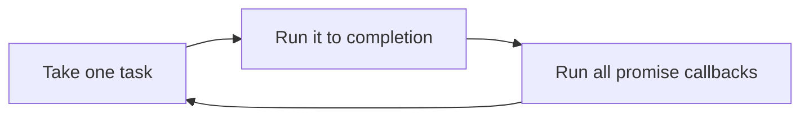

Open a program written in a language you have never seen. Most of the time, you can read about half of it. You can see where the loop is, where the function starts and where something is being saved. The other half looks strange, and that strange half is where one language made a different choice from another.

In the last article, the first rod was a programming language. This article takes that rod seriously, in two halves. In **Understanding**, twelve ideas get one worked example each, and each idea is explained properly: what it is, why it exists, what goes wrong, and what the trade-offs are. In **Exploring**, eight projects ask you to build real things and answer questions about what you noticed.

You will meet six languages along the way, each in the place where it shows an idea most plainly. The language is never the subject of a section. By the end, I want you to notice what happened to you: the ideas stayed, and the languages came and went.

<Statement tone="sky">A language is how you say it. The concept is what you are saying.</Statement>

## Before You Start: One Idea, One Example

Each section picks one language and explains one idea through it:

- **Python** for syntax and semantics, and for errors, because it is readable and its tools let you look inside the language.
- **Rust** for types and for modules, because it checks a lot before your program runs.
- **C** for memory, because it hides nothing.
- **JavaScript** for closures and for async, because both are central to how it works.
- **Java** for objects and functions, and for the runtime, because it has both styles and a famous virtual machine.
- **Go** for generics, concurrency and performance, because it is small and its tools are built in.

A few outputs change every time you run them, such as memory addresses, race results and timings. The ones shown are from a single run, so yours will differ in those details.

You don't need all six installed. Reading is useful, but running a sample teaches more, and each section asks you to **predict the output before reading it**. A wrong prediction is the most useful thing that can happen here.

## Syntax Is Spelling. Semantics Is Meaning.

Every language has two layers. **Syntax** is what you are allowed to write: the keywords, brackets and punctuation. **Semantics** is what it means when it runs. Most of what feels like "learning a language" is learning its syntax, and most of what makes you good at it is understanding its semantics.

I will use Python here, because it lets you look at its own parse of your code.

### From characters to a tree

Before anything runs, the language turns your text into a structure. First it splits the text into **tokens** (numbers, names, operators). Then it **parses** the tokens into a tree that shows how they group. Here is the tree for `1 + 2 * 3`:

```python
import ast
print(ast.dump(ast.parse("1 + 2 * 3", mode="eval").body, indent=2))
```

```text
BinOp(
  left=Constant(value=1),
  op=Add(),
  right=BinOp(
    left=Constant(value=2),
    op=Mult(),
    right=Constant(value=3)))
```

Read it from the outside in. The outermost operation is the addition, and its right side is the multiplication. Nobody wrote a bracket, yet the tree knows the multiplication happens first. That is **precedence**: a rule of the grammar, decided before your program runs. The tree, not the text, is what the language executes.

### Wrong spelling and wrong meaning are caught at different times

A line can be wrong in two different ways, and the language notices at different moments:

```python
for source in ["1 +", "print(undefined)", '1 + "a"']:
    try:
        exec(compile(source, "<demo>", "exec"))
    except SyntaxError as e:
        print("before running:", type(e).__name__, "-", e.msg)
    except Exception as e:
        print("while running:", type(e).__name__, "-", e)
```

```text
before running: SyntaxError - invalid syntax
while running: NameError - name 'undefined' is not defined
while running: TypeError - unsupported operand type(s) for +: 'int' and 'str'
```

`1 +` cannot become a tree, so it fails immediately. `print(undefined)` and `1 + "a"` are perfectly good trees: the spelling is fine. They fail only when the language tries to give them a meaning, because there is no such name and because a number cannot be added to text. **A syntax error is a sentence that isn't grammatical. A semantic error is a grammatical sentence that says something impossible.**

### Rules you cannot see in the text

Semantics also includes rules about *how* a tree is evaluated. Predict each line below before reading the output:

```python
print([] or "default")
print(0 and print("never printed"))
print(None or 0 or "")
print(2 ** 3 ** 2, (2 ** 3) ** 2)
print(10 - 4 - 3, 10 - (4 - 3))
print([bool(v) for v in [0, "", [], {}, "0", [0]]])
```

```text
default
0

512 64
3 9
[False, False, False, False, True, True]
```

Each line is a rule:

- **Truthiness.** An empty list is false in Python, so `[] or "default"` gives `"default"`. Which values count as true is a choice each language makes, and the text `"0"` is true here because it is not empty.
- **Short-circuiting.** `0 and print(...)` never runs the `print`. Once the left side is false, the answer is known, so the right side is skipped. The same happens with `or`, and the result is the *value* that decided it, not just `True` or `False`.
- **Associativity.** `10 - 4 - 3` groups to the left, `(10 - 4) - 3`, giving 3. Exponent groups to the right, so `2 ** 3 ** 2` is `2 ** 9`, which is 512.

Other languages draw some of these lines in different places. In JavaScript, for example, an empty list is truthy, and in C a condition only tests whether a value is zero. That is why reading a language is not enough: you need to know its semantics.

<Sidenote label="Try it">Pick a language you know a little and test the same six values from the last example. Then test an expression with two operators of your own, such as `8 / 4 / 2`, and draw its tree on paper before you run it.</Sidenote>

**Syntax tells you what a program looks like. Semantics tells you what it does, and it is the part that is different in every language.**

## Types Decide What You Are Allowed to Do With a Value

A **type** says what kind of thing a value is, and so what you may do with it. You can add two numbers, but you cannot add a number to a name. The interesting question is *when* a language checks this, and Rust checks it before the program exists.

### A type is a promise about the values it allows

```rust
fn main() {
    let count = 5;
    let small: u8 = 255;
    println!("{}", count * 2);
    println!("{:?} {}", small.checked_add(1), small.wrapping_add(1));
}
```

```text
10
None 0
```

`count` has no label, because Rust works out that it is an integer. That is **type inference**. `small` is a `u8`, an unsigned number that fits in eight bits, so its values run from 0 to 255 and nothing else. Adding one to 255 has no honest answer. `checked_add` admits that by returning `None`, and `wrapping_add` goes around the clock to 0. The type is a promise about *which values can exist*, and every operation has to respect it.

### The promise is checked before you run

```rust
fn main() {
    let n: i32 = "5";
    println!("{n}");
}
```

```text
error[E0308]: mismatched types
 --> s2b.rs:2:18
  |
2 |     let n: i32 = "5";
  |            ---   ^^^ expected `i32`, found `&str`
  |            |
  |            expected due to this
```

The program never ran. The compiler found a value that breaks a promise, pointed at it and stopped. This is what **static typing** means: types are checked before the program runs. In a **dynamically typed** language, the same mistake is found when execution reaches that line, which may be in front of a user. Neither is free. Static types cost you some typing and some patience; they give back errors found early and code you can change with confidence.

There is a second axis. Some languages convert between types to be helpful (`"1" + 1` becomes `"11"` in JavaScript), and some refuse (`"1" + 1` is an error in Python, and does not compile in Rust). That is the difference between **weak** and **strong** typing, and it is separate from static and dynamic.

### Absence is a type too

Many famous bugs come from a value that wasn't there. A **null** is a value that stands for "nothing", and it can sneak into any place that expects a real value. Rust has no null. When something might be absent, the type says so:

```rust
fn main() {
    let names = vec!["asha", "ravi"];
    match names.get(5) {
        Some(n) => println!("found {n}"),
        None => println!("no name at 5"),
    }
    let first: &str = names[0];
    println!("{first} {}", names.len());
}
```

```text
no name at 5
asha 2
```

`get` returns an `Option`, which is either `Some(value)` or `None`, and the compiler makes you handle both. You cannot forget the empty case, because the code will not compile until you deal with it.

### Types can describe choices

A value can also be "one of these shapes". That is called a **sum type**, or an enum:

```rust
enum Shape {
    Circle(f64),
    Rect(f64, f64),
}

fn area(s: &Shape) -> f64 {
    match s {
        Shape::Circle(r) => 3.14 * r * r,
        Shape::Rect(w, h) => w * h,
    }
}

fn main() {
    println!("{} {}", area(&Shape::Circle(1.0)), area(&Shape::Rect(2.0, 3.0)));
}
```

```text
3.14 6
```

Now add a third shape, `Triangle(f64, f64)`, and leave `area` alone:

```text
error[E0004]: non-exhaustive patterns: `&Shape::Triangle(_, _)` not covered
  --> s2e.rs:8:11
   |
 8 |     match s {
   |           ^ pattern `&Shape::Triangle(_, _)` not covered
```

The compiler lists every place that forgot the new case. In a large program, that turns "I hope I found all the places" into a checklist the machine writes for you.

<Sidenote label="Try it">Change `small` in the first example to `u16`, `i8` and `i64`, and find the largest value each can hold. Then write down which of your own bugs a type could have caught before you ran the code.</Sidenote>

**A type is a promise. A static language checks the promise before the program runs, and a dynamic language checks it as the program runs.**

## Memory: Where Values Live, and Who Cleans Up

Every value you create lives somewhere in memory. Understanding where is the difference between code that mostly works and code you can explain. C is the right place to see it, because it shows the machine and hides nothing.

### The stack and the heap

```c
#include <stdio.h>
#include <stdlib.h>

int main(void) {
    int local = 1;
    int *heap = malloc(sizeof *heap);
    printf("stack: %p\n", (void *)&local);
    printf("heap:  %p\n", (void *)heap);
    free(heap);
}
```

```text
stack: 0x7ffc46e0fbbc
heap:  0x560a521db2a0
```

A **memory address** is a number that says where a value lives. The two addresses are far apart because the values live in different regions. The **stack** holds the variables of each running function. It grows when a function is called and shrinks when it returns, so it is fast and tidy, but everything on it disappears when its function ends. The **heap** holds values you request explicitly with `malloc`, and they stay until you release them. Running it again gives different addresses, because the operating system moves things around on purpose.

### How big is a value?

```c
#include <stdio.h>

struct loose { char a; int b; char c; };
struct tight { int b; char a; char c; };

int main(void) {
    printf("char %zu, int %zu, long %zu, pointer %zu\n", sizeof(char), sizeof(int), sizeof(long), sizeof(int *));
    printf("loose %zu, tight %zu\n", sizeof(struct loose), sizeof(struct tight));
}
```

```text
char 1, int 4, long 8, pointer 8
loose 12, tight 8
```

Every type takes a fixed number of bytes. The two structs hold exactly the same fields, and one is 12 bytes while the other is 8. The processor reads whole numbers most easily from addresses that are multiples of their size, so the compiler inserts empty **padding** to keep each field **aligned**. The lesson is not about structs; it is that memory has a physical layout, and layout has consequences for speed and size.

### Two names, one value

```c
#include <stdio.h>
#include <stdlib.h>

int main(void) {
    int *a = malloc(2 * sizeof *a);
    a[0] = 1; a[1] = 2;
    int *b = a;
    b[0] = 99;
    printf("%d\n", a[0]);
    free(a);
}
```

```text
99
```

`b = a` copied the *address*, not the data, so both names point to the same two numbers. Changing one changed the other. This is called **aliasing**. It is ordinary and useful, and it is also behind many bugs: you change something through one name and a different part of the program is surprised.

### Who cleans up?

Memory you reserve must be released exactly once, and C leaves that to you. The three classic mistakes are using memory after releasing it, forgetting to release it, and keeping a pointer to something that no longer exists. Compiling with the address sanitizer (`gcc -g -fsanitize=address`) turns them from silent corruption into reports:

```c
int *a = malloc(sizeof *a);
*a = 42;
free(a);
printf("%d\n", *a);   // use after free
```

```text
==650==ERROR: AddressSanitizer: heap-use-after-free on address 0x502000000010 at pc 0x5633f5b8e2e7 bp 0x7ffd3c576c20 sp 0x7ffd3c576c10
READ of size 4 at 0x502000000010 thread T0
```

```c
char *p = malloc(100);
p = NULL;   // the only pointer to the block is gone
```

```text
==658==ERROR: LeakSanitizer: detected memory leaks

Direct leak of 100 byte(s) in 1 object(s) allocated from:
```

```c
int *broken(void) {
    int x = 7;
    return &x;   // x lives on the stack and vanishes when the function returns
}
```

```text
s3f.c: In function 'broken':
s3f.c:5:12: warning: function returns address of local variable [-Wreturn-local-addr]
```

The first reads a block that was already given back. The second lost the only address of a block, so it can never be freed. The third returns the address of something that is destroyed the moment the function returns. In all three, the language did what it was told. The mistake is in the *lifetime*: the span between a value being created and being freed.

Every language has to answer the question *who frees this, and when?* C answers "you do". Many languages answer "a garbage collector finds what is no longer reachable and frees it", and some count how many names refer to a value and free it at zero. Rust answers with rules the compiler checks: every value has one owner, and it is freed when the owner goes away. Each answer is a trade between effort, speed and safety, and understanding the question lets you read any of them.

<Sidenote label="Try it">Compile the use-after-free example with and without `-fsanitize=address`, and compare what happens. Then change the struct field order in the sizes example to find the smallest layout for three fields of your own choice.</Sidenote>

**Memory has places, sizes and lifetimes. Every language has to decide who is responsible for each.**

## Functions Can Remember Where They Were Born

A function is a value you can pass around, store and return. And a function can carry along the variables from the place where it was written. That second part is a **closure**, and JavaScript is built around it.

### Functions as values

```js
const makeAdder = (n) => (x) => x + n;
const addTen = makeAdder(10);
console.log(addTen(5), [1, 2, 3].map(makeAdder(100)));
```

```text
15 [ 101, 102, 103 ]
```

`makeAdder(10)` returns a new function. The `10` was a parameter of `makeAdder`, which has finished by the time `addTen(5)` runs, yet `addTen` still knows it. A function that takes or returns functions is called a **higher-order function**, and `map` is one. Much of everyday JavaScript is passing small functions to larger ones.

### Remembering, per function

```js
function makeCounter() {
  let n = 0;
  return () => ++n;
}
const a = makeCounter(), b = makeCounter();
console.log(a(), a(), a(), b());
```

```text
1 2 3 1
```

Each call to `makeCounter` creates a fresh `n`, and the returned function keeps its own. The pair of *a function plus the variables it can see* is a closure. The variable stays alive for as long as the function does, which is why `a` and `b` count independently.

### Names are found where the function was written

```js
let x = "outer";
function show() { return x; }
function run() {
  let x = "inner";
  return show();
}
console.log(run());
```

```text
outer
```

`show` is called from inside `run`, where `x` is `"inner"`, yet it prints `"outer"`. It looks up names where it was **written**, not where it is **called**. This is **lexical scope**, and closures are what make it work when functions travel.

### Privacy without a keyword

```js
function createAccount(start) {
  let total = start;
  return {
    deposit(x) { total += x; },
    read() { return total; },
  };
}
const acct = createAccount(100);
acct.deposit(50);
console.log(acct.read(), acct.total);
```

```text
150 undefined
```

Nothing outside can touch `total`. The only way in is through the two functions that closed over it. A closure is, in effect, a tiny object whose private data is whatever it captured.

### The trap: it remembers the variable, not the value

A closure keeps a **variable**, not a copy of the value it had. Predict what these print:

```js
const fs = [];
for (var i = 0; i < 3; i++) fs.push(() => i);
console.log(fs.map(f => f()));
const gs = [];
for (let j = 0; j < 3; j++) gs.push(() => j);
console.log(gs.map(g => g()));
```

```text
[ 3, 3, 3 ]
[ 0, 1, 2 ]
```

With `var`, there is one `i` for the whole loop, and by the time any function runs, the loop has finished and `i` is 3. With `let`, each turn gets its own fresh variable. The same trap exists in other languages, and some have changed their rules over time, which is why the question *"which variable does this closure share?"* is worth asking every time.

<Sidenote label="Try it">Write a function `makeLimiter(max)` that returns a function allowing only `max` calls and then returns `"stop"`. Use no object and no global.</Sidenote>

**A closure is a function plus the variables it was born next to. Always ask whether those variables are shared.**

## Objects and Functions Are Two Ways to Organise Code

Programs need structure, and two big families of ideas compete to supply it. **Object-oriented programming** groups data with the actions that use it, and shares behaviour between types that have something in common. **Functional programming** builds programs from functions that take values and return new values, without changing anything in place. Java has grown to support both, which makes it a good place to see them side by side.

### Polymorphism: one call, many behaviours

```java
interface Shape { double area(); }
record Square(double side) implements Shape { public double area() { return side * side; } }
record Circle(double radius) implements Shape { public double area() { return Math.PI * radius * radius; } }

public class A {
    public static void main(String[] args) {
        Shape[] shapes = { new Square(2), new Circle(1) };
        for (Shape s : shapes) System.out.println(s.getClass().getSimpleName() + " " + s.area());
    }
}
```

```text
Square 4.0
Circle 3.141592653589793
```

The loop calls `s.area()` without knowing which kind of shape it holds. The call goes to the right method for each one. That is **polymorphism**, and an **interface** is the promise that makes it possible: any type that implements `Shape` has an `area`. The first article's inheritance is a close relative: a way to share behaviour between related types.

### Encapsulation: protect the rules

```java
class Account {
    private long cents;

    Account(long cents) { this.cents = cents; }

    void withdraw(long amount) {
        if (amount > cents) throw new IllegalStateException("insufficient funds: have " + cents + ", need " + amount);
        cents -= amount;
    }

    long balance() { return cents; }
}
```

```text
300
Exception in thread "main" java.lang.IllegalStateException: insufficient funds: have 300, need 900
	at Account.withdraw(B.java:7)
```

The first line is the balance after withdrawing 200 from 500. The second withdrawal, of 900, is refused. Because `cents` is `private`, the only way to change it is through `withdraw`, and `withdraw` is the only place the rule "you cannot go below zero" has to be written. That is **encapsulation**: keep the data behind a small set of operations, so the rules of the data live in one place.

A practical warning: inheritance gets overused. A class that *extends* another is tied to its details, and a hierarchy gets hard to change. Many teams prefer **composition**, where an object holds another object and uses it, because it couples things loosely.

### The same shapes, the other way round

Here is the same domain, written so that the data is plain and the behaviour lives in functions:

```java
sealed interface Shape permits Circle, Rect {}
record Circle(double radius) implements Shape {}
record Rect(double w, double h) implements Shape {}

public class C {
    static double area(Shape s) {
        return switch (s) {
            case Circle c -> Math.PI * c.radius() * c.radius();
            case Rect r -> r.w() * r.h();
        };
    }

    static String describe(Shape s) {
        return switch (s) {
            case Circle c -> "circle of radius " + c.radius();
            case Rect r -> r.w() + " by " + r.h();
        };
    }

    public static void main(String[] args) {
        for (Shape s : new Shape[] { new Circle(1), new Rect(2, 3) })
            System.out.println(describe(s) + ": " + area(s));
    }
}
```

```text
circle of radius 1.0: 3.141592653589793
2.0 by 3.0: 6.0
```

A `sealed` interface lists every allowed shape, and a `switch` handles each one. Delete the `Rect` case from `area` and the compiler says so:

```text
E.java:7: error: the switch expression does not cover all possible input values
        return switch (s) {
               ^
1 error
```

### The choice you are really making

Look at what each version makes easy. In the first version, **adding a new shape** is one new class and nothing else changes, but **adding a new operation** (say, `perimeter`) means editing every class. In the second, **adding an operation** is one new function, but **adding a new shape** makes the compiler point at every `switch`. Neither is better. Which kind of change will you make more often? That is the question behind the object-versus-function choice, and it is called the **expression problem**.

### Functions over data

```java
List<Integer> nums = List.of(1, 2, 3, 4, 5, 6);
List<Integer> squares = nums.stream().filter(n -> n % 2 == 0).map(n -> n * n).toList();
int total = nums.stream().reduce(0, Integer::sum);
System.out.println(squares + " " + total + " " + nums);
try { nums.add(7); } catch (UnsupportedOperationException e) { System.out.println("immutable list"); }
```

```text
[4, 16, 36] 21 [1, 2, 3, 4, 5, 6]
immutable list
```

Each step says *what* is wanted (keep the evens, square them, add them all up) and not *how* to loop. The original list is untouched, and the list itself refuses to change. Functions that do not change anything outside themselves are called **pure**, and values that cannot change are **immutable**. They are easier to reason about because the same input always gives the same output, and nothing else can interfere.

<Sidenote label="Try it">Add a `perimeter` operation to both versions of the shapes example, then add a `Triangle`. Count how many places you had to touch each time.</Sidenote>

**Objects bundle behaviour with data, and functions transform data. Choose by asking which kind of change you expect to make most.**

## Generics: Write It Once for Many Types

You write a `max` function for numbers. Then you need it for decimals, then for text. The logic is identical; only the type changes. **Generics** let you write the logic once with a placeholder for the type. Go added them in version 1.18, and its small design makes the idea easy to see.

### One function, many types

```go
func Max[T cmp.Ordered](a, b T) T {
	if a >= b {
		return a
	}
	return b
}

func main() {
	fmt.Println(Max(3, 7), Max(2.5, 1.5), Max("pear", "apple"))
}
```

```text
7 2.5 pear
```

`T` is a **type parameter**: a stand-in that the compiler fills in with `int`, `float64` or `string` at each call. You never wrote those types; the compiler worked them out from the arguments.

### A container that does not care what it holds

```go
type Stack[T any] struct{ items []T }

func (s *Stack[T]) Push(x T) { s.items = append(s.items, x) }

func (s *Stack[T]) Pop() (T, bool) {
	var zero T
	if len(s.items) == 0 {
		return zero, false
	}
	x := s.items[len(s.items)-1]
	s.items = s.items[:len(s.items)-1]
	return x, true
}

func Map[T, U any](xs []T, f func(T) U) []U {
	out := make([]U, 0, len(xs))
	for _, x := range xs {
		out = append(out, f(x))
	}
	return out
}
```

```text
b false
[1 4 9]
```

A `Stack[string]` holds only strings, and the compiler will not let you push a number. The same code serves a `Stack[int]`. And `Map` takes a list of `T` and a function from `T` to `U`, and gives back a list of `U`. This is the main use of generics: **containers and algorithms that work the same way whatever they hold**, with the type checks kept.

### Saying what you need from the type

A function that adds things cannot accept just any type. It needs a type that supports `+`:

```go
type Number interface{ ~int | ~float64 }

func Sum[T Number](xs []T) T {
	var total T
	for _, x := range xs {
		total += x
	}
	return total
}
```

```text
6 0.75
```

`Number` is a **constraint**: a statement of what a type must be able to do. Ask for a sum of strings and the compiler refuses:

```text
./c.go:17:17: string does not satisfy Number (string missing in ~int | ~float64)
```

The constraint is a contract in both directions. It lets the function use `+` safely, and it tells every caller exactly what is allowed. Languages implement this differently under the surface (some erase the types after checking, some generate a copy of the code per type), but the idea is the same: **a placeholder, plus a rule about what the placeholder must support**.

Generics are not always the answer. If a single interface already says what you need, or the function only ever sees one type, a generic version adds complexity for nothing.

<Sidenote label="Try it">Write a generic `Filter[T any](xs []T, keep func(T) bool) []T` and use it on a list of numbers and a list of strings. Then write `Contains[T comparable](xs []T, x T) bool` and find out why `any` is not enough for it.</Sidenote>

**Generics are a placeholder for a type, plus a promise about what that type can do.**

## Errors: Where Does the Bad News Go?

Something will fail: a file is missing, text is not a number, a network drops. The real question is where the failure goes and who has to deal with it. Python's exceptions show the idea clearly.

### The failure travels up

```python
def parse_age(text):
    return int(text)

def load(record):
    return parse_age(record["age"])

print(load({"age": "abc"}))
```

```text
Traceback (most recent call last):
  File "a.py", line 7, in <module>
    print(load({"age": "abc"}))
  File "a.py", line 5, in load
    return parse_age(record["age"])
  File "a.py", line 2, in parse_age
    return int(text)
ValueError: invalid literal for int() with base 10: 'abc'
```

Your file paths will be longer, and Python adds a row of `^` markers under each line, which I have left out. Nothing handled the failure, so it climbed through each function that called `int` until it reached the top and the program stopped. The **traceback** is the list of calls it climbed through, and it is the best map you will get to what went wrong. Read it from the bottom up: the last line says what, and the lines above say where.

### Turn a low-level failure into a useful one

```python
class AgeError(ValueError):
    pass

def parse_age(text):
    try:
        age = int(text)
    except ValueError as e:
        raise AgeError(f"age must be a whole number, got {text!r}") from e
    if not 0 <= age <= 130:
        raise AgeError(f"age out of range: {age}")
    return age

for raw in ["34", "abc", "400"]:
    try:
        print("ok", parse_age(raw))
    except AgeError as e:
        print("rejected:", e)
```

```text
ok 34
rejected: age must be a whole number, got 'abc'
rejected: age out of range: 400
```

The caller does not care about how `int` works. It cares that the age was bad, and why. So `parse_age` catches the low-level failure and raises one in the caller's own terms, and `from e` keeps the original attached for debugging. The same `try` catches only `AgeError`, so a real bug elsewhere will not be hidden.

### Cleanup that always runs

```python
def read_first_line(path):
    f = open(path)
    try:
        return f.readline().strip()
    finally:
        f.close()
        print("closed", path)

print(read_first_line("c.py"))
with open("c.py") as g:
    g.readline()
print(g.closed)
try:
    read_first_line("missing.txt")
except FileNotFoundError as e:
    print("caught:", e.strerror, e.filename)
```

```text
closed c.py
def read_first_line(path):
True
caught: No such file or directory missing.txt
```

`finally` runs whether the code above it succeeded or failed, and it is how you guarantee a file gets closed. The `with` statement does the same job in fewer lines: the file is closed the moment the block ends, which is why `g.closed` is `True`. When `open` itself fails, there is nothing to close, so `finally` never starts.

### The most dangerous handler is the one that hides the problem

```python
def average(xs):
    return sum(xs) / len(xs)

def safe(xs):
    try:
        return average(xs)
    except Exception:
        pass

print(safe([2, 4, 6]))
print(safe([]))
print(safe(None))
try:
    average([])
except ZeroDivisionError as e:
    print("loud:", e)
```

```text
4.0
None
None
loud: division by zero
```

`safe` swallows every error, so an empty list and a `None` both quietly come back as `None`, and nobody ever learns that two different things went wrong. A bug is far easier to fix when it fails loudly where it happened.

Not every language reports failure this way. Some return the error as an ordinary value that you must look at, so a forgotten check is visible in the code. The trade is the same in all of them: automatic propagation is convenient and easy to forget, and visible error handling is more typing and harder to ignore.

Underneath, good error handling comes down to a few habits: separate failures you **expect** (a missing file, bad input) from **bugs** (a broken assumption), handle a failure where you can actually do something about it, add context as it travels, always release what you hold, and never hide one.

<Sidenote label="Try it">Write a function that reads a number from a file. List every way it can fail, then check which of your list your code would catch, which would crash with a clear message and which would be silently wrong.</Sidenote>

**A failure always goes somewhere. Decide where, and make sure it is loud when it should be.**

## Concurrency: Two Things at Once, and the Bugs That Come With It

**Concurrency** means several tasks are in progress at the same time. **Parallelism** means they are literally running at the same moment on different processor cores. The trouble starts when tasks share data. Go makes starting a task cheap, so it is a good place to watch what goes wrong.

### The race

A hundred **goroutines**, Go's lightweight threads, each add 1 to one counter ten thousand times. The right answer is 1,000,000:

```go
var wg sync.WaitGroup
count := 0
for g := 0; g < 100; g++ {
	wg.Add(1)
	go func() {
		defer wg.Done()
		for i := 0; i < 10000; i++ {
			count++
		}
	}()
}
wg.Wait()
fmt.Println(count)
```

Three runs:

```text
412645
349627
589683
```

Three runs, three wrong answers, none of them close to a million. `count++` looks like one step, but it is three: read the number, add one, write it back. Two goroutines can read the same number and both write back the same result, so an update is lost. That is a **race condition**: the result depends on timing. Go can find these. Running it with `go run -race` prints a `WARNING: DATA RACE` report and the lines involved.

### Take turns: a lock

```go
var mu sync.Mutex
// inside the loop:
mu.Lock()
count++
mu.Unlock()
```

```text
1000000
1000000
```

A **mutex** (mutual exclusion lock) lets one goroutine in at a time. The updates no longer collide, and the answer is right every time. The price is that the goroutines now wait for each other, so a lock held too long makes parallel code behave like sequential code.

### Don't share: pass messages

The other approach is to share nothing and send values instead:

```go
jobs := make(chan int)
results := make(chan int)
for w := 0; w < 3; w++ {
	go func() {
		for n := range jobs {
			results <- n * n
		}
	}()
}
go func() {
	for n := 1; n <= 5; n++ {
		jobs <- n
	}
	close(jobs)
}()
sum := 0
for i := 0; i < 5; i++ {
	sum += <-results
}
fmt.Println(sum)
```

```text
55
```

A **channel** is a pipe between goroutines. Three workers take numbers from `jobs`, square them and send the results back, and no two goroutines ever touch the same variable. The Go community's saying for this is *don't communicate by sharing memory; share memory by communicating*.

### Waiting forever, and giving up

Concurrency has a second family of bugs: tasks that wait for something that never comes.

```go
ch := make(chan int)
ch <- 1   // nobody is receiving
```

```text
fatal error: all goroutines are asleep - deadlock!

goroutine 1 [chan send]:
```

This is a **deadlock**: every task is waiting for another. Go noticed that nothing could ever make progress and stopped the program. You will not always get a message like that, so real programs put limits on waiting:

```go
select {
case msg := <-slow:
	fmt.Println(msg)
case <-time.After(50 * time.Millisecond):
	fmt.Println("gave up after 50ms")
}
```

```text
gave up after 50ms
```

`select` waits on several things at once and takes whichever happens first. Here, a response that takes 200 ms loses to a 50 ms timeout. Every wait that can be unbounded should have a bound.

<Sidenote label="Try it">Run the racy counter with `go run -race` and read the report. Then change the number of goroutines to 2 and see whether the wrong answer still appears. What does that tell you about testing for races?</Sidenote>

**Shared data that more than one task can change is the source of the hardest bugs. Take turns, pass messages, and always bound your waits.**

## Async: One Thread Waiting for Many Things

Most programs spend most of their time waiting: for a disk, a network, a database. **Asynchronous** programming is a way to keep one thread useful while it waits, by starting something and moving on until it finishes. JavaScript is built around it, which makes it the clearest place to learn it.

### The loop that runs everything

JavaScript runs your code on one thread, driven by an **event loop**. Predict the order of this:

```js
console.log("A");
setTimeout(() => console.log("C"), 0);
Promise.resolve().then(() => console.log("B"));
console.log("D");
```

```text
A
D
B
C
```

The timer was set for zero milliseconds and still printed last. The loop takes one task, runs it to the end, then runs every queued **promise** callback (a promise stands for a value that will arrive later), and only then takes the next task, such as a timer.



### Waiting in order, or waiting together

`await` pauses a function until a promise is ready, without blocking the thread. Here are three one-third-of-a-second waits, once in sequence and once together:

```js
const wait = (ms, value) => new Promise((resolve) => setTimeout(() => resolve(value), ms));

async function sequential() {
  const t = performance.now();
  const a = await wait(300, "a");
  const b = await wait(300, "b");
  const c = await wait(300, "c");
  console.log("one after another:", [a, b, c], Math.round(performance.now() - t), "ms");
}

async function together() {
  const t = performance.now();
  const all = await Promise.all([wait(300, "a"), wait(300, "b"), wait(300, "c")]);
  console.log("all at once:", all, Math.round(performance.now() - t), "ms");
}

sequential().then(together);
```

```text
one after another: [ 'a', 'b', 'c' ] 902 ms
all at once: [ 'a', 'b', 'c' ] 301 ms
```

The work is the same and the time is a third. A common slowdown in real programs is awaiting things one at a time that could have been started together.

### The loop has one rule: never block it

```js
const start = performance.now();
setTimeout(() => console.log("timer fired after", Math.round(performance.now() - start), "ms"), 100);

const until = performance.now() + 1000;
while (performance.now() < until) {} // 1 second of work, no waiting
console.log("busy loop finished");
```

```text
busy loop finished
timer fired after 1010 ms
```

The timer was due after 100 ms, and it fired after about a second, because nothing else can run while one task is busy. This is why async code suits **I/O-bound** work (mostly waiting) and does nothing for **CPU-bound** work (mostly calculating): waiting costs nothing, but calculating occupies the only thread.

### Failures in async code

```js
const failAfter = (ms) => new Promise((_, reject) => setTimeout(() => reject(new Error("timed out")), ms));

async function main() {
  try {
    await failAfter(50);
  } catch (e) {
    console.log("caught:", e.message);
  }
  failAfter(50); // nobody awaits this one
}
main();
```

```text
caught: timed out
Error: timed out
```

The first failure was awaited, so `try` and `catch` worked as in ordinary code. The second was started and forgotten, so nobody was there to catch it. Node printed the error and stopped the program with exit code 1. Anything you start asynchronously needs someone responsible for what happens to it.

<Sidenote label="Try it">Replace the busy loop with `await wait(1000)` and run it again. Then explain, using the event loop diagram, why the timer now fires on time.</Sidenote>

**Waiting is not working. Async is the art of not wasting the time you spend waiting.**

## Modules and Packages: How Code Finds Other Code

Once a program is bigger than one file, you need two things: a way to split it, and a way to use other people's code. A **module** is one unit of code with a name that other code can import. A **package** is a bundle with a name and a version that tools can fetch for you. Rust's tools show both ideas in a clean form.

### A module is a boundary

A new project with a folder of code looks like this:

```text
shop/
  Cargo.toml
  src/
    main.rs
    pricing/
      mod.rs
```

```rust
// src/pricing/mod.rs
pub fn total(prices: &[u32]) -> u32 {
    apply_tax(prices.iter().sum())
}

fn apply_tax(amount: u32) -> u32 {
    amount * 105 / 100
}
```

```rust
// src/main.rs
mod pricing;

fn main() {
    println!("{}", pricing::total(&[100, 200]));
}
```

```text
315
```

`total` is marked `pub`, so other modules can use it, and `apply_tax` is not, so they cannot. Try to call it from `main`:

```text
error[E0603]: function `apply_tax` is private
 --> src/main.rs:4:29
  |
4 |     println!("{}", pricing::apply_tax(100));
  |                             ^^^^^^^^^ private function
```

This is the point of a module. It has a **public surface** (what others may use) and **private details** (what only the module may touch). Keeping that surface small is what lets you rewrite the inside later without breaking anyone.

### A package is a module with a name and a version

Using someone else's code is one command, and it changes two files:

```text
[dependencies]
itoa = "1.0.18"
```

```text
[[package]]
name = "itoa"
version = "1.0.18"
source = "registry+https://github.com/rust-lang/crates.io-index"
```

`Cargo.toml` is what you *asked for*: a package called `itoa`, at a compatible version. `Cargo.lock` is what you *got*: the exact version, and where it came from. The first is your intention; the second makes your build repeatable on anyone's machine. Most language ecosystems have this same pair of files under different names.

Most packages also use packages of their own, so a tool resolves the whole tree of them. That is a convenience and a risk. Every package you add is code you did not write that now runs inside your program, and **versions** are a promise from its author about what might break when you update, which is not always kept.

<Sidenote label="Try it">Create a project in any language, add one outside dependency, and then find the file that records the exact version. Count how many packages you actually pulled in.</Sidenote>

**A module hides details behind a small public surface. A package is a module with a name, a version and a source you are trusting.**

## What Actually Runs: Compilers, Interpreters and Virtual Machines

Your code is text, and a processor runs machine instructions. Something has to translate, and the choice of *when* and *how* is the biggest hidden difference between languages. Java shows three of the options in one system.

<Compare>
  <Side kind="before" label="Translate ahead of time">A compiler turns the whole program into machine code before you run it. Starting is fast, and the result runs directly on the processor.</Side>
  <Side label="Translate while running">An interpreter, or a virtual machine, reads simple instructions and runs them, and can translate the busiest parts into machine code as it learns what is hot.</Side>
</Compare>

### Step one: source to bytecode

Take a method that does a lot of simple arithmetic:

```java
static long work() {
    long total = 0;
    for (int i = 0; i < 200_000_000; i++) total += i % 7;
    return total;
}
```

`javac` does not produce machine code. It produces **bytecode**, a compact instruction set for an imaginary computer. You can read it with `javap -c`:

```text
static long work();
  Code:
     0: lconst_0
     1: lstore_0
     2: iconst_0
     3: istore_2
     4: iload_2
     5: ldc           #7                  // int 200000000
     7: if_icmpge     24
    10: lload_0
    11: iload_2
    12: bipush        7
    14: irem
    15: i2l
    16: ladd
    17: lstore_0
    18: iinc          2, 1
    21: goto          4
    24: lload_0
    25: lreturn
```

Each line is one step for a stack machine: load a value, push a constant, take a remainder, add. A program called the **Java Virtual Machine** (JVM) runs this on whatever real processor you have. That is why the same compiled file runs on different kinds of computers.

### Step two: the machine learns what is hot

Running it the normal way, and then forcing the VM to only interpret, gives very different results:

```text
default:
599999994 in 297 ms
599999994 in 339 ms
interpreter only (-Xint):
599999994 in 3028 ms
```

The answer is the same and the time is about ten times different. By default, the VM starts by interpreting, counts what runs often, and compiles those parts into real machine code while the program is running. That is a **just-in-time (JIT) compiler**. With `-Xint`, it is not allowed to, so every instruction is interpreted. You can watch it happen, because the VM can print what it compiles:

```text
46    7       3       Hot::square (4 bytes)
46    8       4       Hot::square (4 bytes)
```

`square` was compiled twice, at tier 3 and then at tier 4. Higher tiers mean more optimisation, applied once the VM is more sure the method matters.

This explains something you may have already seen: the first run of a program on such a runtime is slower than later runs. This is **warm-up**, and it is why measurements have to repeat.

The word **runtime** covers everything that sits between your program and the machine while it runs: the VM, the memory manager that frees what you no longer use, the loader that brings code in, and the scheduler for threads. Some languages ship a large runtime, and some ship almost none, and that is a big part of why they feel so different.

<Sidenote label="Try it">Run the `Sum` example with `-Xint` and without, and then run it three times in the same process by calling `work()` in a loop. Describe what the first, second and third calls cost.</Sidenote>

**There is no such thing as a compiled or an interpreted language. There are implementations, and each one decides when to translate.**

## Performance: Measure Before You Believe

Everyone has an opinion about what is fast. A better habit is a method: measure, find where the time goes, change one thing and measure again. Go has benchmarking and profiling built in, so it makes the method easy to see.

### Two ways to find a duplicate

```go
// HasDuplicateSlow compares every pair.
func HasDuplicateSlow(xs []int) bool {
	for i := 0; i < len(xs); i++ {
		for j := i + 1; j < len(xs); j++ {
			if xs[i] == xs[j] {
				return true
			}
		}
	}
	return false
}

// HasDuplicateFast remembers what it has seen.
func HasDuplicateFast(xs []int) bool {
	seen := make(map[int]struct{}, len(xs))
	for _, x := range xs {
		if _, ok := seen[x]; ok {
			return true
		}
		seen[x] = struct{}{}
	}
	return false
}
```

Before measuring anything, a test confirms they always give the same answer, because a faster wrong answer is not an improvement. Then `go test -bench . -benchmem` runs each one with 100, 1,000 and 10,000 numbers:

```text
BenchmarkSlow/100-4      312478      4045 ns/op        0 B/op   0 allocs/op
BenchmarkSlow/1000-4       3681    337693 ns/op        0 B/op   0 allocs/op
BenchmarkSlow/10000-4        32  34741193 ns/op        0 B/op   0 allocs/op
BenchmarkFast/100-4      241381      4597 ns/op     2344 B/op   3 allocs/op
BenchmarkFast/1000-4      25970     44553 ns/op    36944 B/op   5 allocs/op
BenchmarkFast/10000-4      2282    503370 ns/op   295552 B/op  33 allocs/op
```

Read it carefully, because it says several things at once:

- **Growth matters more than speed.** Ten times more numbers made the slow version about 83 times slower (4,045 ns to 337,693 ns), and the next ten times made it about 103 times slower (to 34.7 million ns), because it compares every pair. The fast version grew about ten times at each step. At 10,000 numbers, the slow one took about 35 ms and the fast one about 0.5 ms. This is what people mean by **complexity**: how the work grows as the input grows.
- **For small inputs, the "slow" one is not slower.** At 100 numbers, the slow version (4,045 ns) was a little *faster* than the fast one (4,597 ns). The fast version pays to build a table. "Faster" depends on how much data you have.
- **Speed is bought with memory.** The slow version allocated nothing. The fast one allocated about 295 KB at 10,000 numbers. Almost every optimisation is a trade.
- **The numbers are noisy.** Run the same benchmark twice and the results move: the slow version at 10,000 numbers took 34.7 ms in one run and 39.5 ms in another, and the fast version 503 µs and 457 µs. Differences of a few percent are not information.

### Where does the time go?

Instead of guessing, ask the profiler. `go test -cpuprofile` records where the processor spent its time, and `go tool pprof -top` lists it:

```text
      flat  flat%   sum%        cum   cum%
     180ms 12.08% 12.08%      180ms 12.08%  internal/runtime/maps.h2 (inline)
     170ms 11.41% 23.49%     1250ms 83.89%  perf.HasDuplicateFast
     170ms 11.41% 34.90%      380ms 25.50%  runtime.mapassign_fast64
     110ms  7.38% 42.28%      110ms  7.38%  runtime.futex
     110ms  7.38% 49.66%      530ms 35.57%  runtime.mapaccess2_fast64
     110ms  7.38% 57.05%      110ms  7.38%  runtime.memhash64
```

For the fast version, most of the time is spent inside the map: inserting, looking up and hashing. That tells you where a further improvement would have to come from. Without the profile, you might have spent a day optimising the loop around it.

The method is short: **measure, find the hot spot, change one thing, measure again.** And remember that the best speedups usually come from a better algorithm, not a cleverer line of code, and that every number is about one program on one machine.

<Sidenote label="Try it">Run both benchmarks at 20 numbers and at 1,000,000. Find the size where the two versions cross over on your machine, and write down what you expected before you measured.</Sidenote>

**Speed is a property of a program, a size of input and a machine. It is not a property of a language.**

## Notice What You Just Did

You have just walked through twelve ideas and met six languages. Look at what stayed and what changed:

<div class="table-wrap">
<table>
<caption>Twelve ideas: the language we used, what stays the same, and where other languages choose differently</caption>
<thead>
<tr><th>Idea</th><th>Seen in</th><th>What stays the same everywhere</th><th>What other languages choose</th></tr>
</thead>
<tbody>
<tr><td>Syntax and semantics</td><td>Python</td><td>Text becomes a tree, and the tree has rules for evaluating it</td><td>What counts as true, how operators group, what is checked before running</td></tr>
<tr><td>Types</td><td>Rust</td><td>A value has a kind, and the kind limits what you can do</td><td>Whether types are checked before or during the run, and how much is converted for you</td></tr>
<tr><td>Memory</td><td>C</td><td>Values have places, sizes and lifetimes</td><td>Who frees: you, a collector, a counter or an ownership rule</td></tr>
<tr><td>Closures</td><td>JavaScript</td><td>A function can carry the variables it was written next to</td><td>Whether loop variables are shared, and how scope is spelled</td></tr>
<tr><td>Objects and functions</td><td>Java</td><td>Code needs structure, and structure decides which changes are easy</td><td>How much of each style a language supports</td></tr>
<tr><td>Generics</td><td>Go</td><td>A placeholder for a type, with a rule about what it must support</td><td>How the types are implemented underneath, and how constraints are written</td></tr>
<tr><td>Errors</td><td>Python</td><td>Failures happen and must go somewhere</td><td>Thrown, or returned as values you must inspect</td></tr>
<tr><td>Concurrency</td><td>Go</td><td>Tasks that share data can collide, and waiting can deadlock</td><td>Locks, messages, or compile-time rules about sharing</td></tr>
<tr><td>Async</td><td>JavaScript</td><td>Waiting should not waste the thread</td><td>An event loop with <code>await</code>, or lightweight tasks scheduled for you</td></tr>
<tr><td>Modules</td><td>Rust</td><td>A public surface, private details, and a named, versioned package</td><td>The names of the files and tools, and how strictly privacy is enforced</td></tr>
<tr><td>Runtime</td><td>Java</td><td>Source is translated before the processor can run it</td><td>When it is translated, and how much runtime comes along</td></tr>
<tr><td>Performance</td><td>Go</td><td>Measure, find the hot spot, change one thing, measure again</td><td>Almost nothing, until you measure a real program</td></tr>
</tbody>
</table>
</div>

The third column is the same for every language. The fourth is where the languages differ, and it is always a *choice*, usually with a trade attached: effort against safety, control against convenience, a fast start against a fast run.

That is the point of this article. The concept of a **lifetime** appeared in a C program and would appear, wearing different clothes, in every other language. **Closures** showed up in JavaScript, and you will recognise one anywhere. The **race condition** was in Go, and it lives in any language where tasks share data. The language was a choice made for each example, and you could have made a different one.

## Now Build Something

Reading shows you how a concept looks. Building shows you where it bites. The eight projects below are problems, not tutorials. Each has a statement and a way to check that it works. After you have built it, a short list of questions asks what you noticed.

How to use them:

- **Build each one in at least two languages**, ideally from different families (for example, one dynamic and one compiled). The questions only get interesting when you can compare.
- **Do not copy a solution.** The point is the struggle. If you are stuck, read the language's documentation, not someone's finished project.
- **Write down the answers to the questions.** Short notes are enough. The notes are what you will remember.
- Each project lists the concepts from above that it exercises, so you can go back and reread them.

## Project 1: Build a Command-Line Tool

**The problem.** Build `mini-wc`, a small version of the `wc` tool. It reads text from files or from standard input and counts lines, words and bytes.

**Requirements.**
- `mini-wc [-l] [-w] [-c] [file ...]`
- With no flags, print all three counts. With flags, print only those, always in the order lines, words, bytes, whatever order the flags were typed.
- Print each count right-aligned in a column 7 characters wide, then the file name. When there are two or more files, finish with a line whose name is `total`.
- A word is a run of bytes that are not ASCII whitespace. Count bytes, not characters.
- With no files, read standard input.
- If a file cannot be read (a missing file, or a directory), print a message to standard error, carry on with the other files, and exit with code 1. Exit with 0 if everything worked.
- An unknown flag prints a usage message to standard error and exits with code 2.

**Build it in:** Python and Go.

**It works when** the counts match the real `wc` on three different files, including an empty file and one with no trailing newline, and the exit code is 1 when you pass a file that doesn't exist.

**A hint.** If you read a file in chunks, a word can be split across two chunks. Test with a file big enough to cross a chunk boundary.

**Questions to answer afterwards.**
1. How did each language handle command-line arguments and errors? Which one made the wrong thing easier to do?
2. Does your program read the whole file into memory? What would happen with a file larger than your memory?
3. How large is each program on disk, and how long does each take to start?

**Concepts it uses:** errors, modules, memory, runtime.

## Project 2: Build an HTTP Server From Scratch

**The problem.** Build a web server using only raw sockets, with no web framework and no HTTP library. You are going to find out what HTTP actually is.

**Requirements.**
- Listen on a port and parse the request line (`GET /path HTTP/1.1`) and the headers. A request ends with a blank line, that is, `\r\n\r\n`.
- `GET /health` replies with status 200 and the body `ok`.
- `GET /` serves `public/index.html`, and `GET /<path>` serves the file with that name from the `public` folder, or 404 if there isn't one. Any path that would resolve outside `public`, such as `/../secret.txt`, is a 404.
- A request line that is not exactly `METHOD SP /target SP HTTP/x` gets a 400. Any method other than `GET` gets a 405.
- Every response carries a `Content-Length` header and `Connection: close`.
- Close a connection that has been idle for 5 seconds, and refuse a header block larger than 64 KB.
- Two clients must be served at once: a client that connects and sends nothing must not block a second client.

**Build it in:** Python (`socket`) and Go (`net`, not `net/http`).

**It works when** `curl` retrieves a file and `/health`, `curl` against a missing path gets 404, and a connection that stays silent doesn't stop a second `curl` from getting its answer. Also send a request in two pieces with a pause between them (for example `GET /health HTT`, then `P/1.1` and the blank line a moment later). It must still be answered correctly.

**Questions to answer afterwards.**
1. How does your server know where a request ends?
2. What happens with a client that sends half a request and then stops? With one that sends garbage?
3. Which concurrency approach did you choose (a thread per connection, an event loop, goroutines), and what would break first if a thousand clients connected?

**Concepts it uses:** concurrency, async, errors, memory.

## Project 3: Implement a Parser

**The problem.** Write a program that reads an arithmetic expression as text, such as `2 * (3 + 4)`, and computes its value. You will tokenise the text into pieces, build a structure from them, then evaluate it.

**Requirements.**
- Integers, `+`, `-`, `*`, `/`, parentheses and unary minus.
- Multiplication and division bind tighter than addition and subtraction, and operators of the same strength group from the left.
- Whitespace between tokens is ignored, and two minus signs in a row (`--3`) are allowed.
- Integers are 64-bit signed. Overflow is an error, not a wrong answer.
- `/` truncates toward zero, so `-7 / 2` is `-3`.
- A syntax error or a division by zero produces an error message that includes a position. Positions are 0-based character offsets into the original input. For an unexpected end of input, the position is the length of the input; for division by zero, it is the position of the `/`.

**Build it in:** Python and Rust.

**It works when:**

```text
1 + 2 * 3    ->  7
(1 + 2) * 3  ->  9
-2 * -3      ->  6
10 - 4 - 3   ->  3
2 * (3       ->  error at position 6
4 / 0        ->  error at position 2
```

**Questions to answer afterwards.**
1. How did you represent the parsed expression: classes, enums, nested lists? Why?
2. How does each language make you deal with errors, and where did a mistake of yours show up, at compile time or at run time?
3. If you added a new operator, how many places would you have to change in each version?

**Concepts it uses:** types, objects and functions, errors.

## Project 4: Implement a Thread Pool

**The problem.** Build a pool of worker threads. Callers submit jobs; the workers pick them up and run them; callers get the results back.

**Requirements.**
- A fixed number of workers, N, chosen when the pool is created.
- A queue of waiting jobs, with a capacity you choose and state (a full queue makes `submit` wait, or the queue is unbounded; say which).
- `submit` returns a handle, such as a channel or a future, from which the caller reads that job's result.
- `shutdown` stops accepting new jobs, runs everything already queued, waits for all workers to finish, and then returns. Submitting after a shutdown must be reported as an error you can handle.

**Build it in:** Go and Rust (using only the standard library). Java is a good third.

**It works when** a hundred jobs on four workers all complete with the right results, shutting down with jobs still queued runs them all first, and for a job that burns CPU, four workers finish faster than one. That last check needs a machine with at least four cores, so write down how many yours has.

```mermaid caption="A thread pool: callers add jobs to a queue and workers take them out"
flowchart LR
  accTitle: A thread pool
  accDescr: Callers submit jobs to a shared queue. A fixed set of workers each take a job from the queue, run it and return the result to the caller.
  C[Callers] --> Q[Job queue]
  Q --> W1[Worker 1]
  Q --> W2[Worker 2]
  Q --> W3[Worker N]
  W1 --> R[Results]
  W2 --> R
  W3 --> R
```

**Questions to answer afterwards.**
1. What data is shared between threads, and what protects it in each language?
2. What happens to jobs that are still queued when you shut down? How did you decide?
3. How could this deadlock? Can you make it happen on purpose? (A hint: what if a job submits another job to the same pool and waits for its result, and there is only one worker?)
4. Does adding workers help CPU-bound jobs and waiting jobs equally? Check it, then compare with Python threads from the concurrency section.

**Concepts it uses:** concurrency, memory, errors.

## Project 5: Implement a Key-Value Store

**The problem.** Build a tiny database server. Clients connect over TCP and store and retrieve values by key, and the data survives a restart.

**Requirements.**
- One command per line: `SET key value` (replies `OK`), `GET key` (replies with the value, or `NOT_FOUND`) and `DEL key` (replies `OK` or `NOT_FOUND`). The key is one word. The value is the rest of the line, may contain spaces, and may not contain a newline. Anything else gets `ERR bad command`.
- Every `SET` and `DEL` is written to a log file *before* the server replies. A completed write protects against the server process dying; protecting against a power cut needs an explicit `fsync`, which is optional here.
- When the server starts, it rebuilds its state by replaying the log. On replay, ignore a final line that has no newline at its end, and cut the file back to the last complete line before you append anything new.

**Build it in:** Go and Python.

**It works when** two clients can use it at once, and after you stop the server abruptly with `kill -9` and start it again, the data you stored is back.

**Questions to answer afterwards.**
1. What happens if the server is killed halfway through writing a log line? How does your startup deal with a half-written last line?
2. Two clients set the same key at the same moment. What guarantees one of them wins cleanly?
3. What grows without limit in this design? Sketch how you would shrink it without losing data.

**Concepts it uses:** concurrency, errors, modules, memory.

## Project 6: Benchmark Different Implementations

**The problem.** Take one task and measure it fairly in three languages. The goal is not to crown a winner; it is to learn how hard it is to measure honestly.

**Requirements.**
- Pick one task: word frequency over a large text file works well. Every version must produce the same output.
- Use the method from the performance section: a warm-up run, at least five measured runs, and the median plus the spread.
- Record the language version, the build flags and the machine.

**Build it in:** any three of the six, ideally one compiled and one with a virtual machine.

**It works when** all three versions agree on the output, and you can repeat the measurement and get a similar median.

**Questions to answer afterwards.**
1. What dominated the time: the language, the algorithm or reading the file?
2. How noisy were your runs? What was the smallest difference you could trust?
3. Change the algorithm in the slowest version. Does it beat a different language running your original algorithm?

**Concepts it uses:** performance, runtime, memory.

## Project 7: Profile CPU and Memory Usage

**The problem.** Take a program from earlier, find where it spends its time and memory, change one thing, and measure again. Do not guess first: write your guess down, then let the tool tell you.

**Requirements.**
- Pick the slowest program you have built so far, from Project 3, 5 or 6.
- Use a profiler for the language: `cProfile` for Python, `pprof` for Go, `perf` or a flame graph for compiled code, or the tools in your Java installation.
- Record the top three places where time is spent and the top place where memory is allocated.

**Build it in:** Python and Go, then a third of your choice.

**It works when** you can point at the function responsible for most of the time, change it, and show with a second measurement that the time moved.

**Questions to answer afterwards.**
1. Did the profiler agree with your guess? Where were you wrong?
2. Which part of the time was your code, and which was the language's own machinery (allocation, locking, garbage collection)?
3. Did your fix change the result, or only the speed? How do you know?

**Concepts it uses:** performance, memory, runtime.

## Project 8: Read a Language Runtime's Source

**The problem.** Choose one operation in a language you use and follow it through the real source code of that language's runtime, until you understand how it works.

**Suggested targets.**
- In CPython (`github.com/python/cpython`): what happens when you call `append` on a list? Start in `Objects/listobject.c` and look for how the list grows.
- In Go: what happens when a goroutine sends on a channel? Start in `src/runtime/chan.go`, in the function `chansend`. It is already on your machine, in the folder printed by `go env GOROOT`.
- In another language: the standard library's growable array, or its hash map.

**Method.**
1. Find the entry point by searching for the function's name.
2. Read the comments before the code. Runtime authors explain a lot there.
3. Read the tests for that function; they show what it is meant to do.
4. Write the steps down in your own words, and draw them if that helps.

**It works when** you can explain the operation to someone else without reading the source.

**Questions to answer afterwards.**
1. How does a list make room for new items? Does it grow by one slot each time, or by more? Why?
2. What happens to a goroutine that sends on a channel when no one is receiving?
3. What surprised you? Which choice here connects to a concept from the first half of this article?

**Concepts it uses:** memory, concurrency, runtime.

## Choose the Language Last

After the twelve ideas and the eight projects, the useful question has changed. It is no longer *which language is best*. It is *which language makes my next question easiest to ask?*

- If the question is about **memory and the machine**, C shows you everything and Rust shows you the rules.
- If the question is about **trying ideas quickly**, Python and JavaScript get you to a running program fastest.
- If the question is about **doing many things at once**, Go builds it into the language.
- If the question is about **large codebases, tooling and a mature virtual machine**, Java has decades of both.

That is a way of choosing, not a ranking. Everyone's list will differ, and yours should change as your questions do.

You started this article with a handful of ideas about what programming is. You are leaving it with a way to look at any language: ask how it treats types, memory, errors, concurrency and translation, and you will understand most of it before you write a line. The next rod is the one that lets you keep all of this safe while you learn: **Git**, the tool that remembers every change you make.

Pick one project. Pick two languages. And start.

<CurvedText text="Curious to Coder" shape="circle" mark="C" tone="sky" spin decorative />
