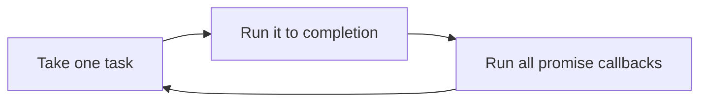

Open a program written in a language you have never seen. Most of the time, you can read about half of it. You can see where the loop is, where the function starts and where something is being saved. The other half looks strange, and that strange half is the part worth studying: it is where one language made a different choice from another.

In the last article, the first rod was a programming language. This article takes that rod seriously. It has two halves. In **Understanding**, twelve ideas are shown in two or three languages each, so you can watch the same concept change its spelling and, sometimes, its meaning. In **Exploring**, eight projects ask you to build real things in more than one language and answer questions about what you saw.

By the end, I want you to notice something about what just happened to you. You will have met six languages, and the thing that stayed constant is not any one of them.

<Statement tone="sky">A language is how you say it. The concept is what you are saying.</Statement>

## Before You Start: Six Languages, One Machine

Each idea below uses the languages that show it best, usually two or three of these six:

- **C**, close to the machine, where you manage memory yourself.
- **Python**, readable, with types checked while the program runs.
- **JavaScript**, which runs in browsers and, through Node, on servers.
- **Java**, with classes and interfaces, running on a virtual machine.
- **Go**, a small compiled language built around lightweight concurrency.
- **Rust**, a compiled language that checks ownership of data before the program runs.

Everything in this article was run, and the output shown is the real output. I ran it on one machine: Python 3.11, Node 22, Java 21, Go 1.24, Rust 1.97 and GCC 13, on an Intel Xeon at 2.1 GHz with four cores. I did not test other versions or other computers, and a few results change with the version, so I say so where it matters.

You don't need all six installed. Reading is useful, but running a sample teaches more, and each section asks you to **predict the output before reading it**. A wrong prediction is the most useful thing that can happen here.

## Syntax Is Spelling. Semantics Is Meaning.

**Syntax** is what you are allowed to write: the brackets, keywords and punctuation. **Semantics** is what it means when it runs. Two languages can spell something almost the same way and still disagree about its meaning.

Take a plain question: *is this value true?* Here is the same loop in Python and JavaScript, testing four values:

```python
for v in [0, "", [], "0"]:
    print(repr(v), bool(v))
print(0 == "0")
```

```js
for (const v of [0, "", [], "0"]) console.log(JSON.stringify(v), Boolean(v));
console.log(0 == "0");
```

Before you read on, decide which of the four values are true in each language. Here is what they print:

Python prints:

```text
0 False
'' False
[] False
'0' True
False
```

JavaScript prints:

```text
0 false
"" false
[] true
"0" true
true
```

The empty list is false in Python and true in JavaScript. And `0 == "0"` is false in Python, which refuses to compare a number to a string, and true in JavaScript, which quietly converts one to the other before comparing.

C makes a third choice. There is no true or false; there is zero and not-zero:

```c
#include <stdio.h>
int main(void) {
    int zero = 0;
    const char *empty = "";
    printf("%d %d\n", zero ? 1 : 0, empty ? 1 : 0);
}
```

```text
0 1
```

The number zero is false, as expected. But `empty` is true, because it is not the text inside the string that is tested; it is a pointer, an address in memory, and that address is not zero.

<Sidenote label="Try it">Pick a fourth language you know a little and test the same four values. Then test two more: `None`, `null` or `nil`, and a list containing one false value. Write down which languages agree.</Sidenote>

**The same-looking line can mean different things. Learn the meaning, not the spelling.**

## Types Decide What You Are Allowed to Add

A **type** says what kind of thing a value is: a number, some text, a list. A language is **statically typed** if it checks types before the program runs, and **dynamically typed** if it checks them while the program runs. Languages also differ on how willing they are to convert one type into another on your behalf.

Try adding the text `"1"` and the number `1`:

```python
try:
    print("1" + 1)
except TypeError as e:
    print("TypeError:", e)
```

```js
console.log("1" + 1);
console.log("3" * "4");
```

```rust
fn main() {
    let n: i32 = "1" + 1;
    println!("{n}");
}
```

Python refuses, but only when it reaches that line. JavaScript decides that `+` with text means joining, and `*` means maths, so it prints two answers. Rust refuses before the program exists:

```text
TypeError: can only concatenate str (not "int") to str
11
12
error[E0369]: cannot add `{integer}` to `&str`
 --> t2.rs:2:22
  |
2 |     let n: i32 = "1" + 1;
  |                  --- ^ - {integer}
  |                  |
  |                  &str
```

Three languages, three timings. JavaScript gives you an answer, but probably not the one you wanted. Python stops the program in the middle. Rust never lets the program run at all. Each choice trades something: how quickly you can write, how early a mistake is found, and how much the language guesses.

<Sidenote label="Try it">Write `[] + {}` in a JavaScript console and `[] + []` too. Then predict what Python does with each, and check. Notice that the lesson is not that JavaScript is wrong; the lesson is that its `+` has more than one meaning.</Sidenote>

**Types are a promise about values. Languages differ on when they check the promise.**

## Memory: Who Owns the Data, and Who Cleans It Up

Every value you create lives somewhere in memory. Short-lived values usually live on the **stack**, an area that grows and shrinks as functions run. Values that need to live longer, or whose size isn't known in advance, live on the **heap**. Somebody has to decide when heap memory is no longer needed, and languages disagree about who that somebody is.

The first question is what happens when you copy a variable. In Python:

```python
a = [1, 2]
b = a
b.append(3)
print(a, a is b)
```

```text
[1, 2, 3] True
```

`b = a` did not copy the list. It gave the same list a second name, so changing it through `b` changed it for `a`. The same thing happens in C, where both names are pointers to one block you reserved yourself:

```c
#include <stdio.h>
#include <stdlib.h>
int main(void) {
    int *a = malloc(2 * sizeof *a);
    a[0] = 1; a[1] = 2;
    int *b = a;
    b[0] = 99;
    printf("%d\n", a[0]);
    free(a);
}
```

```text
99
```

In C, the `free` at the end is your job. Forget it and the memory leaks. Do it twice, or use the memory after it, and the behaviour is *undefined*, which means the language makes no promise at all. Compiling with `gcc -fsanitize=address` and reading the freed value reports `heap-use-after-free` and points at the line, which is a good way to meet that bug safely.

Python, Java and JavaScript take the cleanup off your hands. They track what is still reachable and free the rest. Python mainly counts how many names refer to an object, and Java and JavaScript runtimes periodically search for what is unreachable. This is called **garbage collection**.

Rust chooses a third answer: **ownership**. Every value has exactly one owner, and when the owner goes out of scope the value is freed. Assignment moves ownership:

```rust
fn main() {
    let a = vec![1, 2];
    let b = a;
    println!("{:?}", a);
}
```

```text
error[E0382]: borrow of moved value: `a`
 --> t3.rs:4:22
  |
2 |     let a = vec![1, 2];
  |         - move occurs because `a` has type `Vec<i32>`, which does not implement the `Copy` trait
3 |     let b = a;
  |             - value moved here
4 |     println!("{:?}", a);
  |                      ^ value borrowed here after move
```

The same two lines that quietly alias in Python are a compile error in Rust, because after `let b = a`, the name `a` no longer owns anything.

<Sidenote label="Try it">In C, add `printf("%d\n", *a);` after the `free(a)` in a small program and compile it with `gcc -g -fsanitize=address`. Then, in Rust, fix the error above two ways: once with `a.clone()`, and once with a reference, `let b = &a;`. Notice what each fix costs.</Sidenote>

**Every language answers the same question: who frees this, and when? You pay for the answer in effort, speed or restrictions.**

## Functions Can Remember Where They Were Born

A **closure** is a function that carries along the variables from the place where it was created. The classic demonstration is a counter:

```js
function makeCounter() {
  let n = 0;
  return () => ++n;
}
const a = makeCounter(), b = makeCounter();
console.log(a(), a(), b());
```

```text
1 2 1
```

Each counter has its own `n`, kept alive after `makeCounter` has returned. Closures are how callbacks, event handlers and many other patterns carry their context with them.

They also hide a famous trap. A closure keeps the *variable*, not the value it had at that moment. Predict what each of these prints, three functions that each return the loop counter:

```js
const fs = [];
for (var i = 0; i < 3; i++) fs.push(() => i);
console.log(fs.map(f => f()));
const gs = [];
for (let j = 0; j < 3; j++) gs.push(() => j);
console.log(gs.map(g => g()));
```

```python
fs = [lambda: i for i in range(3)]
print([f() for f in fs])
gs = [lambda i=i: i for i in range(3)]
print([g() for g in gs])
```

```go
var fs []func() int
for i := 0; i < 3; i++ {
	fs = append(fs, func() int { return i })
}
for _, f := range fs {
	fmt.Print(f(), " ")
}
```

```text
[ 3, 3, 3 ]     JavaScript with var
[ 0, 1, 2 ]     JavaScript with let
[2, 2, 2]       Python
[0, 1, 2]       Python with i=i
0 1 2           Go
```

With `var`, one variable `i` is shared by all three functions, and by the time any of them runs, the loop has finished and `i` is `3`. With `let`, every turn of the loop gets a fresh variable. Python's list-comprehension version shares one variable, so every function sees the last value, `2`, until you bind the current value with `i=i`. Go behaved like the first group before version 1.22 and, with the toolchain I used (1.24), now gives each iteration its own variable, so it prints `0 1 2`.

That is a language's *semantics* changing between versions, and it is exactly why the behaviour matters more than the spelling.

<Sidenote label="Try it">Write the Python loop with a regular `def` inside a `for` loop and predict the output. Then rewrite it using `functools.partial` instead of the `i=i` trick.</Sidenote>

**A closure remembers a variable, not a value. Always ask which variable it remembers.**

## Objects and Functions Are Two Ways to Organise the Same Code

There are two big families of ideas for structuring a program. In **object-oriented programming**, you group data and the actions on that data together, and you share behaviour through types that have something in common. In **functional programming**, you build programs from functions that take values and return new values, and you avoid changing things in place. Most real languages mix both.

The first article described inheritance, the idea that one class can build on another. Here is a shared idea, `area`, written three ways. Each defines two shapes that both know how to compute an area:

```java
interface Shape { double area(); }
record Square(double s) implements Shape { public double area() { return s * s; } }
record Circle(double r) implements Shape { public double area() { return Math.PI * r * r; } }

public class Main {
    public static void main(String[] args) {
        for (Shape s : new Shape[] { new Square(2), new Circle(1) })
            System.out.println(s.area());
    }
}
```

```python
import math

class Square:
    def __init__(self, s): self.s = s
    def area(self): return self.s ** 2

class Circle:
    def __init__(self, r): self.r = r
    def area(self): return math.pi * self.r ** 2

for shape in [Square(2), Circle(1)]:
    print(shape.area())
```

```rust
trait Shape { fn area(&self) -> f64; }
struct Square(f64);
struct Circle(f64);
impl Shape for Square { fn area(&self) -> f64 { self.0 * self.0 } }
impl Shape for Circle { fn area(&self) -> f64 { std::f64::consts::PI * self.0 * self.0 } }

fn main() {
    let shapes: Vec<Box<dyn Shape>> = vec![Box::new(Square(2.0)), Box::new(Circle(1.0))];
    for s in &shapes { println!("{}", s.area()); }
}
```

All three print the areas (`4.0` and `3.141592653589793` in Java, and `4` and `3.141592653589793` in Python and Rust, which format `4.0` differently). The ideas differ. Java declares an **interface**, a promise that a type has certain methods, and each type states that it keeps the promise. Python never declares the promise: if it has an `area` method, it works, which is called *duck typing*. Rust uses a **trait**, similar to an interface, but a type gets its behaviour by implementing it, not by inheriting from a parent.

The functional style looks different. The same job in three languages, squaring the even numbers:

```python
nums = [1, 2, 3, 4, 5, 6]
print([n * n for n in nums if n % 2 == 0])
```

```js
const nums = [1, 2, 3, 4, 5, 6];
console.log(nums.filter(n => n % 2 === 0).map(n => n * n));
```

```rust
fn main() {
    let nums = [1, 2, 3, 4, 5, 6];
    let out: Vec<i32> = nums.iter().filter(|n| *n % 2 == 0).map(|n| n * n).collect();
    println!("{:?}", out);
}
```

```text
[4, 16, 36]
[ 4, 16, 36 ]
[4, 16, 36]
```

Each one describes *what* you want (keep the evens, square them) and leaves *how* to the language. No variable is changed along the way. A purely functional language such as Haskell takes this much further; I did not have one installed to run here, so I am only pointing at it.

<Sidenote label="Try it">Add a third shape to each version of the area example. Count what you had to touch in each language. Then add a second *action*, `perimeter`, and count again.</Sidenote>

**Objects bundle behaviour with data. Functions transform data. Languages let you choose, and most good programs use both.**

## Generics: Write It Once for Many Types

You want a `max` function that works on numbers and on text. Writing it twice is wasteful, and writing it with no types at all gives up the checking from earlier. **Generics** let you write it once, with a placeholder for the type.

```java
import java.util.ArrayList;

public class Main {
    static <T extends Comparable<T>> T max(T a, T b) { return a.compareTo(b) >= 0 ? a : b; }

    public static void main(String[] args) {
        System.out.println(max(3, 7) + " " + max("pear", "apple"));
        System.out.println(new ArrayList<String>().getClass() == new ArrayList<Integer>().getClass());
    }
}
```

```rust
fn max<T: PartialOrd>(a: T, b: T) -> T { if a >= b { a } else { b } }

fn main() {
    println!("{} {}", max(3, 7), max("pear", "apple"));
}
```

```go
package main

import (
	"cmp"
	"fmt"
)

func Max[T cmp.Ordered](a, b T) T {
	if a >= b {
		return a
	}
	return b
}

func main() { fmt.Println(Max(3, 7), Max("pear", "apple")) }
```

```text
7 pear
true
7 pear
7 pear
```

All three give the same answer. The surprise is the second line of the Java output: `true`. A list of strings and a list of integers have the *same* runtime class. Java checks the types when it compiles and then **erases** them, so at runtime both are just lists. Rust does the opposite: for each type you use, the compiler generates a specialised copy of the function, so there is no cost at runtime. Go added generics in version 1.18; before that, you wrote the function twice or used a more general type and gave up the checking.

The constraint matters too. `T extends Comparable<T>`, `T: PartialOrd` and `cmp.Ordered` are the same sentence in three accents: *this works for any type that can be ordered.* Without it, the compiler cannot know that `>=` makes sense for `T`.

<Sidenote label="Try it">Remove the constraint from one of the three versions and read the compiler's complaint. Then call each with a type that has no ordering, such as a list of lists, and compare the messages.</Sidenote>

**A generic function states what it needs from its types. The compiler then holds you to it.**

## Errors Are Either Thrown, Returned or Ignored

Something will fail: a file is missing, a number can't be read, a network drops. Languages differ in where that failure goes. Here is the same failed conversion, turning `"abc"` into a number, in four languages:

```python
try:
    n = int("abc")
except ValueError as e:
    print("caught:", e)
```

```go
n, err := strconv.Atoi("abc")
fmt.Println(n, err)
```

```rust
match "abc".parse::<i32>() {
    Ok(n) => println!("{n}"),
    Err(e) => println!("error: {e}"),
}
```

```c
const char *s = "abc";
char *end;
long n = strtol(s, &end, 10);
printf("%ld %s\n", n, end == s ? "(nothing parsed)" : "ok");
```

```text
caught: invalid literal for int() with base 10: 'abc'
0 strconv.Atoi: parsing "abc": invalid syntax
error: invalid digit found in string
0 (nothing parsed)
```

Python **throws an exception**, which jumps out of the current code until something catches it. If nothing does, the program stops. Go **returns the error** as a second value, and the caller decides what to do with it, although you can ignore it by writing `_` in its place. Rust returns a `Result`, which is either `Ok` with a value or `Err` with a problem, and the compiler warns when you don't handle it. C has no error type at all: `strtol` returns `0` for `"abc"`, the same as it returns for `"0"`, and you have to inspect a separate pointer to find out what happened.

Each design answers the same question: *when something goes wrong far from where it is understood, how does the news travel?* Exceptions travel automatically, which is convenient and easy to forget about. Returned errors are visible in every function signature and every call, which is more typing and harder to ignore.

<Sidenote label="Try it">Write a function that reads a number from a file in Python and in Go. List every way it can fail. Then check whether each language's code handles every item on your list, or whether some can slip through.</Sidenote>

**A failure always goes somewhere. The language decides whether you have to choose where.**

## Concurrency: Two Things at Once, and the Bugs That Come With It

**Concurrency** means several tasks are in progress at the same time. **Parallelism** means they are literally running at the same moment on different processor cores. The trouble starts when they share data.

Here are a hundred goroutines, which are Go's lightweight threads, each adding 1 to the same counter 10,000 times. The right answer is 1,000,000:

```go
package main

import (
	"fmt"
	"sync"
)

func main() {
	var wg sync.WaitGroup
	count := 0
	for g := 0; g < 100; g++ {
		wg.Add(1)
		go func() {
			defer wg.Done()
			for i := 0; i < 10000; i++ {
				count++
			}
		}()
	}
	wg.Wait()
	fmt.Println(count)
}
```

I ran it three times:

```text
521228
1000000
468789
```

Three runs, three answers, and one of them was right *by luck*. That is a **race condition**. `count++` looks like one step but is really three: read, add, write. Two goroutines can read the same value and both write back the same result, so an update is lost. Go can catch this: `go run -race` reports `WARNING: DATA RACE` and shows the two lines involved.

The fix is to let only one goroutine in at a time, with a **mutex**, a lock:

```go
var mu sync.Mutex
// inside the loop:
mu.Lock()
count++
mu.Unlock()
```

With the lock, I got `1000000` every time. Java has an alternative for this exact case, an atomic integer, whose increment is a single indivisible step; a hundred threads each calling `incrementAndGet` ten thousand times printed `1000000`.

Rust goes a step further and refuses to compile the unsafe version. If you try to modify a variable from a spawned thread, it stops you:

```text
error[E0373]: closure may outlive the current function, but it borrows `count`, which is owned by the current function
 --> rrace.rs:5:32
  |
5 |     let handle = thread::spawn(|| { count += 1; });
  |                                ^^   ----- `count` is borrowed here
  |                                |
  |                                may outlive borrowed value `count`
```

Python tells a different story, about whether threads can even run in parallel. Here are two threads each counting down from 20 million, against the same work done one after the other:

```python
import time
from threading import Thread

def burn(n):
    while n:
        n -= 1

N = 20_000_000
t = time.perf_counter(); burn(N); burn(N)
print("sequential:", round(time.perf_counter() - t, 2), "s")

t = time.perf_counter()
ts = [Thread(target=burn, args=(N,)) for _ in range(2)]
[x.start() for x in ts]; [x.join() for x in ts]
print("two threads:", round(time.perf_counter() - t, 2), "s")
```

```text
sequential: 0.83 s
two threads: 0.82 s
```

On a four-core machine, two threads were no faster. The standard build of CPython has a **global interpreter lock**, so only one thread runs Python code at a time. Threads still help when the work is waiting, such as network calls, but not for CPU-bound code like this. Newer Python versions offer an optional build without the lock, so check which version you are using before you rely on this.

<Sidenote label="Try it">Run the racy Go program with `go run -race` and read the report. Then run the Python timing with `multiprocessing` instead of `Thread`, and see what changes.</Sidenote>

**Shared data that more than one task can change is the source of the hardest bugs. Every language gives you a different tool for it.**

## Async: One Thread Waiting for Many Things

Most programs spend most of their time waiting: for a disk, a network, a database. **Asynchronous** programming is a way to keep one thread useful while it waits, by starting something and moving on until it finishes.

JavaScript is built around this. A single thread runs a loop: take a task, run it, run any promise callbacks that were queued, then take the next task. Here is a small test of the order. Guess it first:

```js
console.log("A");
setTimeout(() => console.log("C"), 0);
Promise.resolve().then(() => console.log("B"));
console.log("D");
```

```text
A
D
B
C
```

The timer was set for zero milliseconds, yet it prints last. Promise callbacks run in a queue that is emptied as soon as the current code finishes, and timers wait for their turn as new tasks. That is the event loop:



Python has the same idea in `asyncio`. Three jobs that each wait one second finish together in about one second, because the thread starts all three and waits for them at once:

```python
import asyncio, time

async def job(n):
    await asyncio.sleep(1)
    return n

async def main():
    t = time.perf_counter()
    print(await asyncio.gather(job(1), job(2), job(3)))
    print(round(time.perf_counter() - t, 1), "s")

asyncio.run(main())
```

```text
[1, 2, 3]
1.0 s
```

Go takes a different road to the same result. There is no `async` keyword. You start three goroutines that each sleep for a second, and the runtime spreads them over operating system threads:

```go
for n := 1; n <= 3; n++ {
	wg.Add(1)
	go func() { defer wg.Done(); time.Sleep(time.Second) }()
}
wg.Wait()
```

```text
1s
```

The two models look different from the inside. In JavaScript and Python, a function chooses to give up control at an `await`, and nothing else runs on that thread until it does. In Go, the runtime decides when to switch. Each is a different answer to the same question: *how does one machine seem to do many things at once?*

<Sidenote label="Try it">In Node, put a loop that runs for two seconds inside a promise callback, and see what happens to a timer set for 100 milliseconds. Then explain the result using the diagram above.</Sidenote>

**Waiting is not working. Async is the art of not wasting the time you spend waiting.**

## Modules and Packages: How Code Finds Other Code

Once a program grows past one file, you need a way to split it up and a way to use other people's code. A **module** is one unit of code you can import. A **package** is usually a bundle of modules that has a name and a version, so tools can fetch it for you.

Here is the same tiny module, a `hello` function used from another file, in four languages:

```python
# greet.py
def hello(name):
    return f"hello, {name}"

# main.py
from greet import hello
print(hello("Devato"))
```

```js
// greet.mjs
export const hello = (name) => `hello, ${name}`;

// main.mjs
import { hello } from "./greet.mjs";
console.log(hello("Devato"));
```

```go
// greet/greet.go
package greet

func Hello(name string) string { return "hello, " + name }

// main.go
import "example.com/demo/greet"
// ...
fmt.Println(greet.Hello("Devato"))
```

```rust
// src/greet.rs
pub fn hello(name: &str) -> String { format!("hello, {name}") }

// src/main.rs
mod greet;
fn main() { println!("{}", greet::hello("Devato")); }
```

All four printed `hello, Devato`. The difference lives in the file that describes the project. Go uses `go.mod`, created by `go mod init`:

```text
module example.com/demo

go 1.24.7
```

Rust uses `Cargo.toml`, created by `cargo new`, and the `[dependencies]` section is where outside packages are listed:

```text
[package]
name = "demo"
version = "0.1.0"
edition = "2024"

[dependencies]
```

JavaScript uses `package.json`, and Python projects use files such as `pyproject.toml` or `requirements.txt`. Different file names, different tools, one job: *name the project, and list what it depends on.* How a language finds and loads code is one of the biggest day-to-day differences between languages, even though the ideas underneath are nearly identical.

<Sidenote label="Try it">Create a project in each language you have installed and add one outside dependency. Notice which file changed, what was created next to it, and how long it took.</Sidenote>

**A module is a boundary. A package is a boundary with a name and a version.**

## What Actually Runs: Compilers, Interpreters and Virtual Machines

Your code is text. A processor runs machine instructions. Something has to translate, and when and how it translates is the biggest hidden difference between these languages.

<Compare>
  <Side kind="before" label="Compiled ahead of time">C, Go and Rust turn the source into machine code before you run it. The result is a program the processor runs directly.</Side>
  <Side label="Bytecode on a virtual machine">Python and Java turn the source into bytecode, a compact instruction set, and a program called a virtual machine runs it. Java and JavaScript engines also compile hot code to machine code while the program runs.</Side>
</Compare>

You can look at each translation yourself. Take the smallest function there is:

```python
def add(a, b):
    return a + b
```

```java
static int add(int a, int b) { return a + b; }
```

```c
int add(int a, int b) { return a + b; }
```

Python's `dis` module shows the bytecode:

```text
  2           2 LOAD_FAST                0 (a)
              4 LOAD_FAST                1 (b)
              6 BINARY_OP                0 (+)
             10 RETURN_VALUE
```

`javap -c` shows Java's:

```text
static int add(int, int);
  Code:
     0: iload_0
     1: iload_1
     2: iadd
     3: ireturn
```

And `gcc -O1 -S` shows the machine code the processor will actually run, on my x86-64 machine:

```text
add:
	endbr64
	leal	(%rdi,%rsi), %eax
	ret
```

The three are the same idea: load two things, add, return. The Python and Java versions are instructions for a program; the C version is an instruction for the processor, and it is one add instruction. Python's bytecode also differs between versions; the listing above is from 3.11.

<Sidenote label="Try it">Do the same with a function that contains a loop, and compare the lengths of the three outputs. Then compile the C version with `-O0` and `-O2` and see what the compiler removed.</Sidenote>

**There is no such thing as a language that is "interpreted" or "compiled" in itself. There are implementations, and each one makes a choice about when to translate.**

## Performance: Measure Before You Believe

Everyone has an opinion about which language is faster. A better habit is a method. Run the same task, warm it up, repeat it, take the median, and change one thing at a time.

Here is a small task: count the primes below five million with a sieve. I wrote it in each language, ran it five times in one process and took the median. Python, written the plain way, looks like this:

```python
def sieve(n):
    is_prime = bytearray([1]) * (n + 1)
    is_prime[0] = is_prime[1] = 0
    for i in range(2, int(n ** 0.5) + 1):
        if is_prime[i]:
            for j in range(i * i, n + 1, i):
                is_prime[j] = 0
    return sum(is_prime)
```

Every version found the same 348,513 primes. The medians, in milliseconds on my machine, were:

<Bars unit=" ms" tone="sky" items={[
  { label: "Python", value: 327 },
  { label: "Rust, unoptimised build", value: 106 },
  { label: "C, no optimisation (-O0)", value: 49 },
  { label: "JavaScript (Node)", value: 34 },
  { label: "Go", value: 29 },
  { label: "C, optimised (-O2)", value: 22 },
]} />

Rust built with optimisation matched C at 22 ms, and Java's median was 31 ms. I ran the whole set twice, and the medians moved by a few milliseconds each time, so treat differences of a few milliseconds as noise. This is one task on one machine, and it says nothing about your program.

Read the chart for what it teaches, not for who won:

- **The same language can differ more than two languages do.** Rust's unoptimised build was about five times slower than the optimised one, and C without optimisation was twice as slow as with it. Before comparing languages, make sure you are building the same way.
- **Warm-up is real.** Java's five runs took 50, 40, 31, 29 and 29 ms. The first run was slowest because the virtual machine was still compiling hot code. A single measurement would have told a different story.
- **How you write it can beat the language.** In Python, I replaced the inner loop with one slice assignment, `is_prime[i * i::i] = bytes(len(range(i * i, n + 1, i)))`, and the median fell from 327 ms to about 48 ms. Same language, about six to seven times faster, because the work moved from Python's loop into code written in C.

<Sidenote label="Try it">Run the Python sieve on your machine three times. Write down the spread. Then change one thing, such as the size of `n`, and decide whether the difference you see is bigger than the spread.</Sidenote>

**Speed is a property of a program on a machine, built a certain way. It is not a property of a language.**

## Notice What You Just Did

You have just read the same twelve ideas in six languages. Look at what stayed the same and what changed:

<div class="table-wrap">
<table>
<caption>Twelve concepts: what stays the same, and what each language chooses</caption>
<thead>
<tr><th>Concept</th><th>The same everywhere</th><th>What a language chooses</th></tr>
</thead>
<tbody>
<tr><td>Syntax and semantics</td><td>Code has a form and a meaning</td><td>What counts as true; what <code>==</code> compares</td></tr>
<tr><td>Types</td><td>Values have kinds</td><td>When types are checked, and how much is converted for you</td></tr>
<tr><td>Memory</td><td>Data lives somewhere, and must be freed</td><td>You free it, a collector frees it, or ownership frees it</td></tr>
<tr><td>Closures</td><td>A function can carry its surroundings</td><td>Which variable it keeps, and when it is created</td></tr>
<tr><td>Objects and functions</td><td>Code needs structure</td><td>Interfaces, traits, duck typing, or plain functions</td></tr>
<tr><td>Generics</td><td>One function, many types</td><td>Erased, copied per type, or constrained</td></tr>
<tr><td>Errors</td><td>Things fail</td><td>Thrown, returned, wrapped in a result, or coded as numbers</td></tr>
<tr><td>Concurrency</td><td>Tasks share data</td><td>Locks, atomics, channels, or compile-time ownership</td></tr>
<tr><td>Async</td><td>Waiting should not waste time</td><td>An event loop with <code>await</code>, or lightweight threads</td></tr>
<tr><td>Modules</td><td>Code is split and shared</td><td>The file that names the project, and the tool that fetches it</td></tr>
<tr><td>Runtime</td><td>Source is translated before it runs</td><td>Ahead of time, bytecode on a virtual machine, or a mix</td></tr>
<tr><td>Performance</td><td>Time and memory are limited</td><td>Almost nothing, until you measure a real program</td></tr>
</tbody>
</table>
</div>

The middle column is the same in every row, for every language. The right column is the only thing that varies, and it is a *choice*, usually with a trade attached: speed of writing against safety, control against convenience, fast start against fast run.

That is the point of this article. Once you understand **ownership**, you see it in C as a risk, in Python as something done for you, and in Rust as a rule. Once you understand **concurrency**, you recognise a lock whatever it is called. The concepts travel with you. The language is a choice you make for a project, and you can make a different one next time.

## Now Build Something

Reading shows you how a concept looks. Building shows you where it bites. The eight projects below are problems, not tutorials. Each has a statement and a way to check that it works. After you have built it, a short list of questions asks what you noticed.

How to use them:

- **Build each one in at least two languages**, ideally from different families (for example, one dynamic and one compiled). The questions only get interesting when you can compare.
- **Do not copy a solution.** The point is the struggle. If you are stuck, read the language's documentation, not someone's finished project.
- **Write down the answers to the questions.** Short notes are enough. The notes are what you will remember.
- Each project lists the concepts from above that it exercises, so you can go back and reread them.

## Project 1: Build a Command-Line Tool

**The problem.** Build `mini-wc`, a small version of the `wc` tool. It reads text from files or from standard input and counts lines, words and bytes.

**Requirements.**
- `mini-wc [-l] [-w] [-c] [file ...]`
- With no flags, print all three counts. With flags, print only those, always in the order lines, words, bytes, whatever order the flags were typed.
- Print each count right-aligned in a column 7 characters wide, then the file name. When there are two or more files, finish with a line whose name is `total`.
- A word is a run of bytes that are not ASCII whitespace. Count bytes, not characters.
- With no files, read standard input.
- If a file cannot be read (a missing file, or a directory), print a message to standard error, carry on with the other files, and exit with code 1. Exit with 0 if everything worked.
- An unknown flag prints a usage message to standard error and exits with code 2.

**Build it in:** Python and Go.

**It works when** the counts match the real `wc` on three different files, including an empty file and one with no trailing newline, and the exit code is 1 when you pass a file that doesn't exist.

**A hint.** If you read a file in chunks, a word can be split across two chunks. Test with a file big enough to cross a chunk boundary.

**Questions to answer afterwards.**
1. How did each language handle command-line arguments and errors? Which one made the wrong thing easier to do?
2. Does your program read the whole file into memory? What would happen with a file larger than your memory?
3. How large is each program on disk, and how long does each take to start?

**Concepts it uses:** errors, modules, memory, runtime.

## Project 2: Build an HTTP Server From Scratch

**The problem.** Build a web server using only raw sockets, with no web framework and no HTTP library. You are going to find out what HTTP actually is.

**Requirements.**
- Listen on a port and parse the request line (`GET /path HTTP/1.1`) and the headers. A request ends with a blank line, that is, `\r\n\r\n`.
- `GET /health` replies with status 200 and the body `ok`.
- `GET /` serves `public/index.html`, and `GET /<path>` serves the file with that name from the `public` folder, or 404 if there isn't one. Any path that would resolve outside `public`, such as `/../secret.txt`, is a 404.
- A request line that is not exactly `METHOD SP /target SP HTTP/x` gets a 400. Any method other than `GET` gets a 405.
- Every response carries a `Content-Length` header and `Connection: close`.
- Close a connection that has been idle for 5 seconds, and refuse a header block larger than 64 KB.
- Two clients must be served at once: a client that connects and sends nothing must not block a second client.

**Build it in:** Python (`socket`) and Go (`net`, not `net/http`).

**It works when** `curl` retrieves a file and `/health`, `curl` against a missing path gets 404, and a connection that stays silent doesn't stop a second `curl` from getting its answer. Also send a request in two pieces with a pause between them (for example `GET /health HTT`, then `P/1.1` and the blank line a moment later). It must still be answered correctly.

**Questions to answer afterwards.**
1. How does your server know where a request ends?
2. What happens with a client that sends half a request and then stops? With one that sends garbage?
3. Which concurrency approach did you choose (a thread per connection, an event loop, goroutines), and what would break first if a thousand clients connected?

**Concepts it uses:** concurrency, async, errors, memory.

## Project 3: Implement a Parser

**The problem.** Write a program that reads an arithmetic expression as text, such as `2 * (3 + 4)`, and computes its value. You will tokenise the text into pieces, build a structure from them, then evaluate it.

**Requirements.**
- Integers, `+`, `-`, `*`, `/`, parentheses and unary minus.
- Multiplication and division bind tighter than addition and subtraction, and operators of the same strength group from the left.
- Whitespace between tokens is ignored, and two minus signs in a row (`--3`) are allowed.
- Integers are 64-bit signed. Overflow is an error, not a wrong answer.
- `/` truncates toward zero, so `-7 / 2` is `-3`.
- A syntax error or a division by zero produces an error message that includes a position. Positions are 0-based character offsets into the original input. For an unexpected end of input, the position is the length of the input; for division by zero, it is the position of the `/`.

**Build it in:** Python and Rust.

**It works when:**

```text
1 + 2 * 3    ->  7
(1 + 2) * 3  ->  9
-2 * -3      ->  6
10 - 4 - 3   ->  3
2 * (3       ->  error at position 6
4 / 0        ->  error at position 2
```

**Questions to answer afterwards.**
1. How did you represent the parsed expression: classes, enums, nested lists? Why?
2. How does each language make you deal with errors, and where did a mistake of yours show up, at compile time or at run time?
3. If you added a new operator, how many places would you have to change in each version?

**Concepts it uses:** types, objects and functions, errors.

## Project 4: Implement a Thread Pool

**The problem.** Build a pool of worker threads. Callers submit jobs; the workers pick them up and run them; callers get the results back.

**Requirements.**
- A fixed number of workers, N, chosen when the pool is created.
- A queue of waiting jobs, with a capacity you choose and state (a full queue makes `submit` wait, or the queue is unbounded; say which).
- `submit` returns a handle, such as a channel or a future, from which the caller reads that job's result.
- `shutdown` stops accepting new jobs, runs everything already queued, waits for all workers to finish, and then returns. Submitting after a shutdown must be reported as an error you can handle.

**Build it in:** Go and Rust (using only the standard library). Java is a good third.

**It works when** a hundred jobs on four workers all complete with the right results, shutting down with jobs still queued runs them all first, and for a job that burns CPU, four workers finish faster than one. That last check needs a machine with at least four cores, so write down how many yours has.

```mermaid caption="A thread pool: callers add jobs to a queue and workers take them out"
flowchart LR
  accTitle: A thread pool
  accDescr: Callers submit jobs to a shared queue. A fixed set of workers each take a job from the queue, run it and return the result to the caller.
  C[Callers] --> Q[Job queue]
  Q --> W1[Worker 1]
  Q --> W2[Worker 2]
  Q --> W3[Worker N]
  W1 --> R[Results]
  W2 --> R
  W3 --> R
```

**Questions to answer afterwards.**
1. What data is shared between threads, and what protects it in each language?
2. What happens to jobs that are still queued when you shut down? How did you decide?
3. How could this deadlock? Can you make it happen on purpose? (A hint: what if a job submits another job to the same pool and waits for its result, and there is only one worker?)
4. Does adding workers help CPU-bound jobs and waiting jobs equally? Check it, then compare with Python threads from the concurrency section.

**Concepts it uses:** concurrency, memory, errors.

## Project 5: Implement a Key-Value Store

**The problem.** Build a tiny database server. Clients connect over TCP and store and retrieve values by key, and the data survives a restart.

**Requirements.**
- One command per line: `SET key value` (replies `OK`), `GET key` (replies with the value, or `NOT_FOUND`) and `DEL key` (replies `OK` or `NOT_FOUND`). The key is one word. The value is the rest of the line, may contain spaces, and may not contain a newline. Anything else gets `ERR bad command`.
- Every `SET` and `DEL` is written to a log file *before* the server replies. A completed write protects against the server process dying; protecting against a power cut needs an explicit `fsync`, which is optional here.
- When the server starts, it rebuilds its state by replaying the log. On replay, ignore a final line that has no newline at its end, and cut the file back to the last complete line before you append anything new.

**Build it in:** Go and Python.

**It works when** two clients can use it at once, and after you stop the server abruptly with `kill -9` and start it again, the data you stored is back.

**Questions to answer afterwards.**
1. What happens if the server is killed halfway through writing a log line? How does your startup deal with a half-written last line?
2. Two clients set the same key at the same moment. What guarantees one of them wins cleanly?
3. What grows without limit in this design? Sketch how you would shrink it without losing data.

**Concepts it uses:** concurrency, errors, modules, memory.

## Project 6: Benchmark Different Implementations

**The problem.** Take one task and measure it fairly in three languages. The goal is not to crown a winner; it is to learn how hard it is to measure honestly.

**Requirements.**
- Pick one task: word frequency over a large text file works well. Every version must produce the same output.
- Use the method from the performance section: a warm-up run, at least five measured runs, and the median plus the spread.
- Record the language version, the build flags and the machine.

**Build it in:** any three of the six, ideally one compiled and one with a virtual machine.

**It works when** all three versions agree on the output, and you can repeat the measurement and get a similar median.

**Questions to answer afterwards.**
1. What dominated the time: the language, the algorithm or reading the file?
2. How noisy were your runs? What was the smallest difference you could trust?
3. Change the algorithm in the slowest version. Does it beat a different language running your original algorithm?

**Concepts it uses:** performance, runtime, memory.

## Project 7: Profile CPU and Memory Usage

**The problem.** Take a program from earlier, find where it spends its time and memory, change one thing, and measure again. Do not guess first: write your guess down, then let the tool tell you.

**Requirements.**
- Pick the slowest program you have built so far, from Project 3, 5 or 6.
- Use a profiler for the language: `cProfile` for Python, `pprof` for Go, `perf` or a flame graph for compiled code, or the tools in your Java installation.
- Record the top three places where time is spent and the top place where memory is allocated.

**Build it in:** Python and Go, then a third of your choice.

**It works when** you can point at the function responsible for most of the time, change it, and show with a second measurement that the time moved.

**Questions to answer afterwards.**
1. Did the profiler agree with your guess? Where were you wrong?
2. Which part of the time was your code, and which was the language's own machinery (allocation, locking, garbage collection)?
3. Did your fix change the result, or only the speed? How do you know?

**Concepts it uses:** performance, memory, runtime.

## Project 8: Read a Language Runtime's Source

**The problem.** Choose one operation in a language you use and follow it through the real source code of that language's runtime, until you understand how it works.

**Suggested targets.**
- In CPython (`github.com/python/cpython`): what happens when you call `append` on a list? Start in `Objects/listobject.c` and look for how the list grows.
- In Go: what happens when a goroutine sends on a channel? Start in `src/runtime/chan.go`, in the function `chansend`. It is already on your machine, in the folder printed by `go env GOROOT`.
- In another language: the standard library's growable array, or its hash map.

**Method.**
1. Find the entry point by searching for the function's name.
2. Read the comments before the code. Runtime authors explain a lot there.
3. Read the tests for that function; they show what it is meant to do.
4. Write the steps down in your own words, and draw them if that helps.

**It works when** you can explain the operation to someone else without reading the source.

**Questions to answer afterwards.**
1. How does a list make room for new items? Does it grow by one slot each time, or by more? Why?
2. What happens to a goroutine that sends on a channel when no one is receiving?
3. What surprised you? Which choice here connects to a concept from the first half of this article?

**Concepts it uses:** memory, concurrency, runtime.

## Choose the Language Last

After the twelve ideas and the eight projects, the useful question has changed. It is no longer *which language is best*. It is *which language makes my next question easiest to ask?*

- If the question is about **memory and the machine**, C shows you everything and Rust shows you the rules.
- If the question is about **trying ideas quickly**, Python and JavaScript get you to a running program fastest.
- If the question is about **doing many things at once**, Go builds it into the language.
- If the question is about **large codebases, tooling and a mature virtual machine**, Java has decades of both.

That is a way of choosing, not a ranking. Everyone's list will differ, and yours should change as your questions do.

You started this article with a handful of ideas about what programming is. You are leaving it with a way to look at any language: ask how it treats types, memory, errors, concurrency and translation, and you will understand most of it before you write a line. The next rod is the one that lets you keep all of this safe while you learn: **Git**, the tool that remembers every change you make.

Pick one project. Pick two languages. And start.

<CurvedText text="Curious to Coder" shape="circle" mark="C" tone="sky" spin decorative />
