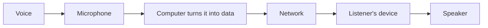

<Sidenote label="True story">This really happened to me. Where I describe what a person said, it is the sense of it, not the exact words.</Sidenote>

There was a time when I was quite certain about what I was going to become. I wanted to be an IPS officer. As a kid, I was fascinated by cop movies—the uniform, the investigations, the authority, and the idea of walking into a difficult situation and being the person responsible for figuring it out. Somewhere along the way, that fascination became a plan. I would prepare for UPSC, become an IPS officer, and that was what I told everyone whenever they asked me about my future. Looking back, though, I realize I had a plan for my future without really knowing what I was naturally curious about.

That took a while to discover, and strangely enough, the first clue came from a classroom.

## The First Spark

For a long time, Computer Science was simply another subject. I studied it because I had to, learned things because there was an exam waiting, and cared mostly about getting the marks. I hadn't yet discovered that the subject itself could be interesting. Then one day, a substitute teacher came into our class and started explaining **inheritance**. I don't remember the exact words he used, but I remember how he explained it. Instead of treating inheritance like another definition we had to memorize, he turned it into something physical, using doors, actions, movement, and examples. Suddenly, this strange programming concept from a textbook had a logic that I could actually see.

Here is the idea underneath, in one line: a class can *inherit* what its parent class already has, instead of copying it.

<Compare>
  <Side kind="before" label="Without inheritance">Copy the same code into every class that needs it.</Side>
  <Side label="With inheritance">Write it once in a parent class. Every child gets it, and adds only what is different.</Side>
</Compare>

Something changed for me that day. For the first time, I wasn't thinking about whether I would get the answer right in an exam. I was thinking, *“Wait, so this is how programming works?”* It was a small question, but it was different from the questions I had asked before. It wasn't a question I needed answered; it was a question I **wanted** answered. I didn't know it then, but that was probably the first real spark.

The interesting part is that the spark didn't come out of nowhere. Looking back, there had been signs for years. I just didn't know they were signs.

## You Don't Just Use Technology. You Wonder About It.

Once that curiosity started growing, I began looking at computers differently. A website was no longer just a website. I wanted to know what was behind it. How was the page created? How did one page connect to another? What happened when I clicked something? How did all of this actually exist inside a computer?

In short, this is what happens when you click a link:

<Steps>
  <Step title="Ask">Your browser asks a server for the page.</Step>
  <Step title="Answer">The server sends back a page written in HTML.</Step>
  <Step title="Draw">Your browser reads the HTML and draws the page on your screen.</Step>
</Steps>

Then I discovered HTML.

It was incredibly basic stuff: a few tags, some text, a little structure, and suddenly I could create something that looked like a webpage. I would write the code, run it on localhost, and see the page appear. Technically, nobody else could see it, but in my head it felt like the world could. I had created something that wasn't there before.

That feeling was completely different from studying a chapter and getting a good mark. A mark told me that I had understood something; this told me that **I could make something**. And once you experience that, it becomes difficult not to wonder what else you could make.

## You Start Building Before You Know Enough to Build

The funny thing is that I didn't know much. I was learning basic syntax and discovering things like `clrscr` and `getch`. I didn't have a sophisticated understanding of software engineering, and I certainly didn't know enough to build anything impressive. But I knew enough to make something happen.

So I started building pages. Then I wanted those pages to connect, so I started figuring out navigation. I would spend hours trying to make pages work together, learning whatever little piece of syntax I needed along the way. I wasn't following a carefully designed curriculum, and nobody had told me what I should learn next. I simply wanted the thing in my head to work on the screen.

Every time it did, I felt an absurd amount of satisfaction. It almost felt like having a superpower: learn something, type it, and watch the computer do something that didn't exist a few minutes ago. **Knowledge was turning into creation.**

If the act of turning an idea into something that works excites you, that feeling is worth paying attention to.

## You See a Product and Immediately Think You Could Make It Better

As I became more comfortable with computers, another habit started appearing. I would use an application and start thinking about how I would build it. I remember using a meal-tracking app and thinking, *“I could do this better.”*

At that point, I wasn't necessarily capable of building a better product. That wasn't the important part. What mattered was that I had stopped looking at the application purely as a user. I was looking at it as something that could be questioned, taken apart, improved, and rebuilt.

Why does it work this way? Why isn't this easier? What if this feature worked differently? What would I change?

That instinct is incredibly valuable in software development because you stop seeing only what exists and start wondering what **could exist instead**.

## You Celebrate When the Bug Finally Dies

Then there was the lab exercise.

Something wasn't working, and I was trying to figure out what was wrong. Eventually, I found the bug, fixed it, ran the program again, and it worked. I danced. Literally. Then I went around showing people.

It was just a lab exercise. Nothing revolutionary had been built, nobody was going to use the program, and there was no startup waiting to acquire it. But I didn't care. Something that was broken had become something that worked because I had stayed with it long enough to understand what was wrong.

There is a particular kind of satisfaction that comes from debugging. You have a problem that refuses to make sense, and then suddenly one small thing clicks. The confusion disappears, the program runs, and you know that **you made it work**.

If that moment gives you disproportionate happiness, pay attention. You may not love programming because you love code. You may love it because you love the moment when **a problem finally makes sense**.

## Technology Slowly Stops Feeling Like Work

At some point, technology also became entertainment for me. I started watching tech videos because I wanted to, not because somebody had assigned them to me. I could spend hours learning about some new technology or watching somebody build something, with no examination, certificate, or assignment attached to it. I was simply interested.

There is a huge difference between saying, *“I have to learn this,”* and finding yourself asking, *“Wait, how does this work?”* when nobody is forcing you to care. The second one is where passion tends to hide.

## You Get Annoyed by Things That Could Be Automated

I also developed another slightly strange habit: I would spend hours trying to automate things that I could probably have just memorized. From a purely practical perspective, that wasn't always the most efficient decision, but the thought that kept coming back was:

<Statement>Why am I doing this manually?</Statement>

That question is deceptively powerful. Why repeat something? Why perform the same sequence again? Why accept a tedious process just because that is how it has always been done?

You don't have to be an automation engineer to have that instinct. Sometimes the symptom is simply that repetitive work bothers you enough that your brain immediately starts searching for a system.

## You Start Asking Questions Nobody Asked You to Ask

Perhaps the biggest sign of all is when your curiosity escapes the boundaries of what you are supposed to be learning.

You're sitting in a meeting. Someone speaks. You hear their voice through a speaker, and suddenly your brain goes somewhere completely unnecessary: *How does the microphone actually capture that voice?* How is the sound converted? How is unwanted noise handled? How does the speaker reproduce it on the other side?

Nobody asked you to know this. It isn't on an exam or part of your assignment. You just want to know.

Roughly, this is the journey of that voice:

That is the kind of curiosity that keeps pulling people deeper into technology. One question leads to another, one answer creates three more questions, and eventually you realize that the thing you thought was merely a subject in school has become a way of looking at the world.

## So, Should You Pursue Coding?

Not because you recognized yourself in every paragraph. Not because somebody told you software engineering is a good career. And not because you think you need to become a programmer simply because technology is important.

But if you repeatedly find yourself wondering how things work, wanting to build things, imagining better versions of products, getting unusually excited when you fix something, consuming technology because you genuinely enjoy it, trying to automate things, and asking questions nobody asked you to ask, then there is something worth exploring.

**Your curiosity might be pointing somewhere.**

I didn't recognize mine immediately. For years, I thought I was simply studying Computer Science. Then I thought I was just playing around with websites. Then I thought I was just trying to fix bugs. Then I thought I was just watching too many technology videos. Only much later did all of those moments start looking like pieces of the same story.

I wasn't consciously trying to become a software developer.

**I was slowly becoming one.**

## Who Is a Coder?

We have a strange idea of what a coder is. We imagine someone who remembers enormous amounts of syntax, types incredibly fast, knows ten programming languages, and can immediately solve every problem thrown at them. That isn't the definition I believe in.

A coder isn't someone who knows everything. A coder is someone who is **curious enough to see a problem and courageous enough to do something about it**. They don't necessarily know how the story ends. They start anyway.

Think about the technology products we use every day. Someone looked at something that already existed and wondered whether it could be different. Someone wasn't satisfied with the solution in front of them. Someone asked another question, then another. They experimented, built, failed, and tried again. They refused to settle for a mediocre solution simply because it was already there.

**That is the spirit of coding.**

And no, this doesn't mean you have to spend your entire life solving problems. You don't have to turn every inconvenience into a software project or automate every mundane activity you encounter. There is a weightage to all of this. The point is not that every curious person must become a developer; the point is that **curiosity is worth listening to**.

## Curious to Coder

And if you've made it this far, there is one final thing I want you to notice.

You were curious enough to keep reading. You wanted to know where this story was going. You wanted to understand what a coder actually is, and you followed the question all the way to the end.

So perhaps the first symptom has already revealed itself.

**You're curious.**

And maybe that's enough to start.

Welcome to **Curious to Coder**.

This series isn't about turning you into a particular kind of developer. It is about discovering the curiosity that already exists inside you and learning how to express it in **your own style**.

Because you don't become a coder by trying to look like one.

You become one when you start following your curiosity far enough that you eventually **build something with it**.

<CurvedText text="Curious to Coder" shape="circle" mark="C" tone="sky" spin decorative />
