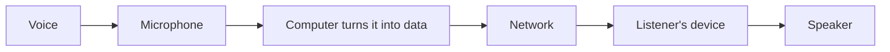

There was a time when I was quite certain about what I was going to become. I wanted to be an IPS officer. As a kid, I was fascinated by cop movies: the uniform, the investigations, the authority, and the idea of walking into a difficult situation and being the person responsible for figuring it out. Somewhere along the way, that fascination became a plan. I would prepare for UPSC, become an IPS officer, and tell everyone so whenever they asked about my future.

Looking back, I realize I had a plan without really knowing what I was naturally curious about. That took a while to discover, and strangely enough, the first clue came from a classroom.

## The First Spark

For a long time, Computer Science was simply another subject. I studied it because I had to, and cared mostly about the marks. Then one day, a substitute teacher came into our class and started explaining **inheritance**. I don't remember the exact words he used, but I remember how he explained it. Instead of a definition to memorize, he turned it into something physical, using doors, actions and movement. Suddenly, this strange concept from a textbook had a logic that I could actually see.

The idea underneath is simple: a class can *inherit* what its parent class already has, instead of copying it.

<Compare>
  <Side kind="before" label="Without inheritance">Copy the same code into every class that needs it.</Side>
  <Side label="With inheritance">Write it once in a parent class. Every child gets it, and adds only what is different.</Side>
</Compare>

For the first time, I wasn't thinking about whether I would get the answer right in an exam. I was thinking, *"Wait, so this is how programming works?"* It wasn't a question I needed answered; it was a question I **wanted** answered. That was probably the first real spark.

It didn't come out of nowhere. Looking back, there had been signs for years. I just didn't know they were signs. Here are the ones I recognize now.

## You Wonder How It Works

A website was no longer just a website. How was the page created? How did one page connect to another? What happened when I clicked something? In short, this is what happens when you click a link:

<Steps>
  <Step title="Ask">Your browser asks a server for the page.</Step>
  <Step title="Answer">The server sends back a page written in HTML.</Step>
  <Step title="Draw">Your browser reads the HTML and draws the page on your screen.</Step>
</Steps>

Then I discovered HTML. It was incredibly basic: a few tags, some text, a little structure, and suddenly I could create something that looked like a webpage. I ran it on localhost and saw the page appear. Technically, nobody else could see it, but in my head it felt like the world could. A mark in an exam told me that I had understood something; this told me that **I could make something**.

## You Build Before You Know Enough to Build

I didn't know much. I was learning basic syntax and discovering things like `clrscr` and `getch`. But I knew enough to make something happen. So I built pages, then figured out navigation to connect them, learning whatever little piece of syntax I needed along the way. Nobody had told me what to learn next. I simply wanted the thing in my head to work on the screen.

Every time it did, it felt like a superpower: learn something, type it, and watch the computer do something that didn't exist a few minutes ago. **Knowledge was turning into creation.**

## You Think You Could Make It Better

I would use an application and start thinking about how I would build it. I remember using a meal-tracking app and thinking, *"I could do this better."* I wasn't necessarily capable of it. What mattered was that I had stopped looking at the application purely as a user. I was looking at it as something that could be questioned, taken apart and rebuilt. That instinct is valuable because you stop seeing only what exists and start wondering what **could exist instead**.

## You Celebrate When the Bug Dies

Then there was the lab exercise. Something wasn't working, and I was trying to figure out what was wrong. Eventually, I found the bug, fixed it, ran the program again, and it worked. I danced. Literally. Then I went around showing people.

It was just a lab exercise. Nobody was going to use the program, and there was no startup waiting to acquire it. But something broken had become something that worked because I had stayed with it long enough to understand what was wrong. You may not love programming because you love code. You may love it because you love the moment when **a problem finally makes sense**.

## You Get Annoyed by What Could Be Automated

I would spend hours trying to automate things I could probably have just memorized. It wasn't always the efficient decision, but the thought that kept coming back was:

<Statement>Why am I doing this manually?</Statement>

You don't have to be an automation engineer to have that instinct. Sometimes the symptom is simply that repetitive work bothers you enough that your brain immediately starts searching for a system.

## You Ask Questions Nobody Asked You to Ask

The biggest sign is when your curiosity escapes what you are supposed to be learning. You're in a meeting, someone speaks, and your brain goes somewhere completely unnecessary: *How does the microphone actually capture that voice?* Nobody asked you to know this. You just want to know. Roughly, this is the journey of that voice:

## So, Should You Pursue Coding?

Not because you recognized yourself in every paragraph, and not because somebody told you it is a good career. But if you keep wondering how things work, wanting to build things, imagining better versions of products, getting unusually excited when you fix something, and asking questions nobody asked you to ask, then there is something worth exploring.

**Your curiosity might be pointing somewhere.**

I didn't recognize mine immediately. First I thought I was just studying Computer Science, then just playing with websites, then just fixing bugs. Only later did those moments look like pieces of the same story. I wasn't consciously trying to become a software developer. **I was slowly becoming one.**

A coder isn't someone who remembers enormous amounts of syntax or knows ten languages. A coder is someone who is **curious enough to see a problem and courageous enough to do something about it**. They don't necessarily know how the story ends. They start anyway.

## Curious to Coder

You were curious enough to keep reading. You wanted to know where this story was going, and you followed the question to the end. So perhaps the first symptom has already revealed itself.

**You're curious.** And maybe that's enough to start.

Welcome to **Curious to Coder**. This series isn't about turning you into a particular kind of developer. It is about discovering the curiosity that already exists inside you and learning how to express it in **your own style**.

Because you don't become a coder by trying to look like one. You become one when you start following your curiosity far enough that you eventually **build something with it**.

<CurvedText text="Curious to Coder" shape="circle" mark="C" tone="sky" spin decorative />
