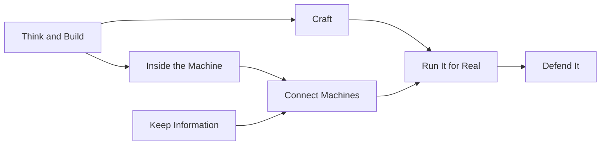

Devato is a food ordering app for the canteen near your college, and you are the one building it.

The first version works. A student picks a dish, adds it to a cart, pays, and gets a message when the food is ready. You show it to a few friends, and they like it. Then comes Friday, 1:10 pm.

The lunch rush arrives all at once. Forty students stand at the counter with their phones out, and the app stops cooperating. Some orders never reach the kitchen. One student is charged twice. Another opens Devato and sees yesterday's menu. By 1:30, the canteen owner has gone back to shouting orders across the counter, and you are staring at a screen full of errors.

Devato wasn't badly built. It was built without rods.

In the last article, I wrote that you don't need a roadmap, only a direction, and that the direction begins with the foundations. This article is about what those foundations are, and why they only make sense together.

## Software Is a Building, and Buildings Have Rods

A concrete building is concrete poured around a cage of steel rods. The wall looks solid, and most of the time it is. But the rods are not there for the quiet days. They are there for the day a heavy load arrives and the concrete is asked to do something it is weak at.

<Sidenote label="Definition">Concrete is strong when it is pressed together and weak when it is pulled apart. The steel rods inside it carry the pulling.</Sidenote>

Software behaves the same way. It stands perfectly well while one person uses it on one laptop. It cracks when the load arrives: more users, more data, a failed payment, a slow network, someone trying to cheat. Each time, you will find that the crack is exactly where a rod was never placed.

I count twelve rods that every software building needs. Devato will crack at each of them, in this order.

<Timeline>
  <Event date="Rod 1" title="A programming language">The idea becomes instructions a machine can follow.</Event>
  <Event date="Rod 2" title="Data structures and algorithms">The data gets a shape that stays fast as it grows.</Event>
  <Event date="Rod 3" title="Git and GitHub">Every change is remembered, and any of them can be undone.</Event>
  <Event date="Rod 4" title="Testing and debugging">Mistakes get caught before your users find them.</Event>
  <Event date="Rod 5" title="Linux and the command line">You can work on a machine you cannot see.</Event>
  <Event date="Rod 6" title="Operating systems">You understand what your program lives on.</Event>
  <Event date="Rod 7" title="SQL and databases">Data outlives the program that made it.</Event>
  <Event date="Rod 8" title="Networking">You can follow one request across the world.</Event>
  <Event date="Rod 9" title="APIs and distributed systems">Machines can talk, and fail, without breaking everything.</Event>
  <Event date="Rod 10" title="Docker">The app runs the same way everywhere.</Event>
  <Event date="Rod 11" title="Cloud">Capacity grows and shrinks with the load.</Event>
  <Event date="Rod 12" title="Security">The app refuses what it should refuse.</Event>
</Timeline>

**Software rarely fails where it is strong. It fails where a rod was never placed.**

## You Think and Build

### Rod 1: A Programming Language

Before Devato can crack, it has to exist. Right now it is a sentence in your head: *students choose food and pay for it.* A computer cannot do anything with that sentence. You have to say what a dish is, what a cart is, what an order is, and exactly what happens when someone taps the button.

A programming language is the medium for saying it. It is how you take an idea that feels obvious to you and make it precise enough for a machine to carry out. Every other rod assumes this one. Git stores your code, tests run it, servers host it. If the language is the rod you can see, the others are the rods that hold it up.

### Rod 2: Data Structures and Algorithms

The canteen's menu grows from thirty dishes to three hundred, and now it serves more than one canteen. Searching the whole list for every keystroke, for every student, at the same moment, starts to add up.

Two ideas live here. A **data structure** is how you arrange information so it is easy to use. An **algorithm** is a step-by-step method for solving a problem with it. Orders are a good example: the first student who ordered should be served first. That rule has a name, a *queue*, and it is one of the oldest data structures in computing.

The shape you choose now decides how well everything else copes later. A database, a server and a network all have to work with the shape of your data.

<Sidenote label="Try it">Write a tiny menu program in any language that stores a few dishes and prints the cheapest. Then store them in two different ways, and notice what gets easier or harder.</Sidenote>

**You are not writing code yet. You are deciding what shape the problem has.**

## You Keep Your Work Safe and Correct

### Rod 3: Git and GitHub

On a Thursday night, you add a promo code to the cart. By morning, checkout is broken, and you can't remember what you changed.

Git is a tool that remembers. Every time you save a meaningful step, called a **commit**, it records a snapshot with a short message. You can compare two snapshots, go back to any of them, and try a risky idea knowing you can undo it. GitHub keeps that history online, so other people can see it, add to it and review it.

Git doesn't care which language you used. That is why so much depends on it. Tests run when you push a change, containers are built from it, cloud servers pull from it, and a teammate can join by cloning it.

### Rod 4: Testing and Debugging

You fix checkout, and a new bug appears: a ₹50 discount gets applied twice, so a ₹200 order costs ₹100.

A test is a small program that checks another program. You write one saying: a ₹200 order with a ₹50 code should cost ₹150. It fails today. You fix the code, it passes, and from then on it fails the day someone breaks that rule again. Debugging is the other half: reproduce the problem, narrow down where it comes from, change one thing, and check.

Tests need the first rod to exist, and they lean on the third to run on every change. Together, they let you keep changing Devato without being afraid of it.

<Sidenote label="Try it">Put your menu program in a Git repository. Break it on purpose, then use the history to get the working version back. Write one test that would have caught your break.</Sidenote>

**Git lets you undo a mistake. Tests tell you that you made one.**

## You Go Inside the Machine

### Rod 5: Linux and the Command Line

You rent a small server to host Devato and connect to it. There is no desktop, no mouse and no icons. There is a blinking cursor.

Many servers run Linux, and you manage them by typing commands: move between folders, read a log file, start or stop a program. It looks hostile for the first hour. After that, it becomes the fastest way to do most things, and for many developers it is faster than any menu.

The terminal is also where you meet your own app's logs, the written record of what it was doing when it failed. You will use it to debug, and you will use it to drive Docker and the cloud.

### Rod 6: Operating Systems

Back to the lunch rush. Forty students open Devato together, and the server freezes. Every request is work for the machine. Programs compete for the processor, and memory fills up. When memory runs out, a server slows to a crawl or the system starts stopping programs.

An operating system is the canteen manager of your machine. It decides which order the cooks handle next, who gets which counter space, and who has to wait. A running program is called a **process**, and the operating system shares the machine's processor, memory and storage between all of them.

Once you see this, a freeze stops being a mystery. It also explains why one slow request can hurt everyone else, and why databases and containers have to share a machine politely.

<Sidenote label="Try it">Run your program from a terminal only. While it runs, find its process in your system's task manager or with `top`, and watch how much memory it uses.</Sidenote>

**The machine is not a black box. It is a manager with limits.**

## You Make the Data Outlive the App

### Rod 7: SQL and Databases

Devato restarts overnight for an update. In the morning, last night's orders are gone. Your app kept them in memory, and memory is cleared whenever the program stops.

A **database** keeps data on disk, so it survives restarts. **SQL** is the language you use to ask it questions, such as *which orders are still waiting?* or *how many dosas were sold this week?* A database also protects you from your own mistakes: it can keep two people from changing the same order at once, and it can be backed up.

Rod 2 comes back here, because the way you arrange data decides how fast a question is answered. Rod 8 is next, because the database usually lives on a different machine than the app.

<Sidenote label="Try it">Move your dishes from the menu program into a database with one table, and ask it for every dish under ₹100.</Sidenote>

**A program remembers only as long as it runs. A database remembers on its behalf.**

## You Make the Machines Talk

### Rod 8: Networking

A student opens Devato on campus Wi-Fi. What happens between the tap and the menu appearing? Roughly this:

<Steps>
  <Step title="Look up">The phone turns the name, such as devato.example, into the address of a machine, using the Domain Name System.</Step>
  <Step title="Connect">It opens a connection to that machine, and secures it.</Step>
  <Step title="Ask">It sends a request over HTTP: please send me the menu.</Step>
  <Step title="Answer">The server replies with the menu, and the phone draws it on the screen.</Step>
</Steps>

Everything on the internet is some version of that exchange. Once you can follow one request from the phone to the server and back, a failed connection, a slow page and a wrong address each become a place you can look.

### Rod 9: APIs and Distributed Systems

At 1:10 on Friday, the payment service Devato uses is slow. Your app waits, gives up, and tries again. The first attempt had actually gone through. The student is charged twice.

An **API** is the agreed way for one program to ask another to do something. Devato asks a payment service to charge a card, a maps service to find a delivery route, and your own database to save an order. The moment two machines talk, the answer can be lost, the other side can be slow, and you can't always know what happened. A **distributed system** is one where several machines work together, and in one, failure is normal and has to be designed for.

The usual fix here is **idempotency**, a word for doing something twice with the same effect as doing it once. Many payment services let you send a unique key with each charge, so a repeat is treated as the same payment. The student is charged once, however many times your app asks.

<Sidenote label="Try it">Fetch any web page with `curl` and read what comes back. Then write down three things that could have gone wrong between your terminal and the answer.</Sidenote>

**When two machines talk, assume that the message can be lost, and design for it.**

## You Take It Off Your Laptop

### Rod 10: Docker

A friend joins to help with Devato. They run it on their laptop, and it breaks. They have a different version of a tool, a different setting, a different everything. You say the sentence every developer has said: *"But it works on my laptop."*

A **container** is a sealed box holding your app and everything it needs to run. An **image** is the recipe for the box, and a container is a running copy made from it. Anywhere the box runs, the app inside sees the same thing.

<Compare>
  <Side kind="before" label="Without containers">Install the right versions by hand on every machine, and hope they match.</Side>
  <Side label="With containers">Build one image. Run the same box on every machine.</Side>
</Compare>

Containers lean on Linux, because they use its features to keep the box separate from everything else. And they make the next rod easier, because the thing you send to the cloud is the box.

### Rod 11: Cloud Fundamentals

Another college hears about Devato and wants it. One rented server was enough for one canteen. It's not enough for two, and a bigger one would sit mostly idle between lunch rushes.

The cloud is renting computing, storage and networking from a provider, by usage. When the rush arrives, you add more machines. When it passes, you remove them. The flip side is that anything you leave running keeps costing money, so cost is something you watch, not a surprise at the end of the month.

Docker gives you the box to ship, networking decides how users reach it, and the next rod decides who is allowed to.

<Sidenote label="Try it">Package your menu program in a container so it runs the same on a friend's machine. Then look up what it would cost to host it for a month.</Sidenote>

**The cloud is borrowed capacity. Borrow what you need, and return what you don't.**

## You Realise Someone Is Trying to Break It

### Rod 12: Security Fundamentals

A student opens the browser's developer tools and finds the request that sends their order. In it is the price of a thali: ₹80. They change it to ₹1 and send it. If Devato trusts the number, the student has just eaten lunch for a rupee.

The fix is a rule that applies far beyond food apps: **never trust what comes from outside.** The server should look up the price in its own database, because the user's side can be edited by the user. The same instinct applies to passwords, which never belong in a Git repository, and to anything a person types into a form.

Security is the last rod, and it is tied to all the others. It reaches into your code, your Git history, your servers, your database questions, your network connections and your cloud permissions. It is less a separate rod and more the thing that checks whether the others were tied properly.

<Sidenote label="Try it">Look through your repository for anything secret that you might have saved. Then list every value in your app that comes from a user, and ask whether you check each one.</Sidenote>

**Anything that arrives from outside is a request, never a fact.**

## The Cage Holds Because the Rods Are Tied Together

The following Friday, at 1:10 pm, the forty students arrive again.

Orders line up in the order they came in. The server has room to breathe, and its logs are readable. Every order is saved in a database, so a restart costs nothing. A slow payment is retried safely, and no one is charged twice. The same container runs on every machine, more machines start when the rush grows, and the price a student sees is the price the server decides.

None of those rods worked alone. A queue is no use if the database loses the orders. A container is no use if the code inside it is untested. A cloud server is no use if the request that reaches it can't be trusted.

<Statement tone="sky">Every rod exists because another one reached its limit.</Statement>

That is the idea behind the twelve foundations. They are not twelve subjects to finish one after another. They are a cage, and you tie it together over time.

## Start With One Rod

You don't build the cage in one go. A building rises floor by floor, and rods are tied in as it grows. You will place the first rod, the way you place the first stone, and return to the others as the building asks for them. Some you will tie well, and some you will tie loosely and tighten later. That is how most people learn them.

The first rod is the one you can see, and it is where we start next: a programming language, and the thinking that comes before it. Not because it matters more than the others, but because without it, there is nothing for the others to hold.

If Devato made you curious about even one of these rods, follow that curiosity. Pick the crack that interested you most and open it up. That's how a curious person becomes a coder.

One last thing. Devato was never real. It is a food ordering app that exists in my imagination, and by now, in yours. The students, the Friday rush and the ₹80 thali never happened. The cracks are real, though, and so are the rods.

<CurvedText text="Curious to Coder" shape="circle" mark="C" tone="sky" spin decorative />
