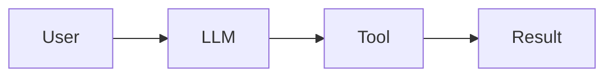

Look at how people usually draw an application that uses a language model. The diagram is a straight line, and it is easy to read past what it leaves out.

Last time we split the work between a model and deterministic systems. This post is about how you connect them, and the answer is a loop.

## The Straight Line



Ask of every arrow: what happens if the model is wrong here? Between the model and the tool, the answer is often *nothing*. The model's output goes straight into the action.

That is fine for a draft email. It stops being fine when the tool changes a database, runs a command or spends money.

## A Loop With Evidence in the Middle

A sturdier design puts deterministic engines in the middle and sends what they find back to the model.

```mermaid caption="Generation, deterministic checking, and evidence returning to the model"
flowchart TD
  accTitle: A feedback loop between AI reasoning and deterministic engines
  accDescr: Human intent goes to AI reasoning, which produces a candidate solution. Deterministic engines parse, validate, simulate, test and constrain it, then execute it against the real system. The observed result becomes evidence that returns to AI reasoning for correction.
  H[Human intent] --> A[AI reasoning]
  A --> C[Candidate solution]
  C --> D[Deterministic engines]
  D --> S[Real system state]
  S --> E[Evidence]
  E --> A
```

The engines in the middle do plain jobs: they parse, validate, simulate, test, apply constraints and run. The model proposes, the engines check and run, and what actually happened comes back as **evidence**.

The shape matters more than the parts. The model is no longer working only on language. It works on language **plus structured state plus real feedback**.

## Let the Model Query Reality

Picture a large codebase and the question: who calls this function? A model can read files and infer an answer, and the inference may be good. A deterministic code-intelligence tool does not infer. It computes the answer from the program's structure.

```mermaid caption="What a code-intelligence engine can report about one symbol"
flowchart LR
  accTitle: Facts a code engine computes about one symbol
  accDescr: One symbol in a codebase is linked to its callers, callees, imports, implementations, references, type and dependency relationships, and data flow, all computed from the program's structure rather than guessed from text.
  S[Symbol] --> A[Callers]
  S --> B[Callees]
  S --> C[Imports]
  S --> D[Implementations]
  S --> E[References]
  S --> F[Type and dependency links]
  S --> G[Data flow]
```

That changes the model's job from "**infer reality from text**" to "**query a representation of reality, then reason over the answer**". The idea reaches beyond code. The model asks a structured world model, reasons, proposes an action, a constraint engine checks it, the action runs, the model observes the real state and reasons again.

<Sidenote label="Going deeper">A *representation* is structure a tool can query: a syntax tree, a dependency graph, a schema. Building good ones is a large part of this field, and the model is only as grounded as the representations it can reach.</Sidenote>

## Verification Is Part of the Design

The usual flow ends with "generate, done". A flow with verification built in has more steps, and each one produces something the model can read.

<Scrolly tone="mint">
  <Beat stage="Generate" sub="step 1">The model writes a candidate: code, a query, a plan.</Beat>
  <Beat stage="Validate" sub="step 2">Parse it, type-check it, check it against policy before anything runs.</Beat>
  <Beat stage="Execute" sub="step 3">Run it inside a sandbox with limits, not against the real world.</Beat>
  <Beat stage="Observe" sub="step 4">Record what really happened: outputs, errors, state changes.</Beat>
  <Beat stage="Verify" sub="step 5">Compare what happened with what was required. Accept or reject, and feed the result back.</Beat>
</Scrolly>

The model should not receive "I think this works". It should receive a report like this one:

```text
Compilation:          PASS
Type checking:        PASS
Unit tests:           48 of 48
Integration tests:    PASS
Security scan:        PASS
Dependency policy:    PASS
Performance budget:   PASS
```

<Sidenote label="Mock data">This report shows the format only. No real project produced it.</Sidenote>

## A Failing Check Teaches What Reading Cannot

Here is a small example you can run. A model might write this to split a bill in cents between friends. It reads well, and it gives sensible answers for most inputs. The last two lines are a check that says what the function must always do: the shares add up to the total.

<CodeWalk steps={[
  { lines: "1-2", title: "The plausible code", text: "Integer division gives each person the same share. It looks right." },
  { lines: "4", title: "The call", text: "Ten dollars, three people." },
  { lines: "5", title: "The property", text: "The shares must add up to the total. That is a rule, so a machine can test it." },
]}>

```python
def split_bill(total_cents, people):
    return [total_cents // people] * people

shares = split_bill(1000, 3)
assert sum(shares) == 1000, f"lost {1000 - sum(shares)} cent(s): {shares}"
```

</CodeWalk>

I ran it. Python stops with:

```text
AssertionError: lost 1 cent(s): [333, 333, 333]
```

Reading the code, I could not see the lost cent. The check found it in one run. That message is exactly what goes back to the model, and the repair is short:

```python
def split_bill(total_cents, people):
    base, extra = divmod(total_cents, people)
    return [base + (1 if i < extra else 0) for i in range(people)]
```

I ran this version too. It returns `[334, 333, 333]`, and the check passes. This was one input on my own machine, and I did not test other inputs. A real system would test many, and that is the point: **evidence has a scope**, and you should know what it covers.

## Where Decision Models Fit

There is a related idea on this site. A [decision model](/from-llms-to-decision-models/) returns one answer from a list your application defined before the model ran, such as `PASS`, `FAIL` or `REVIEW`. That list is a small deterministic boundary around a probabilistic judgement. The model still does the fuzzy part. The application decides what answers are even possible.

## Six Kinds of Machinery

If you build around a model, you will need parts from these six groups. They are the middle of the loop, in the order a request meets them.

<Steps>
  <Step title="Representation">Turn messy reality into structure: syntax trees, graphs, schemas, dependency models.</Step>
  <Step title="Constraint">Define what is allowed: policy engines, type systems, authorisation, resource limits, architecture rules.</Step>
  <Step title="Verification">Check requirements: static analysis, formal methods, tests, security scanners, invariant checkers.</Step>
  <Step title="Simulation">Let the model experiment without touching reality: sandboxes, digital twins, dry runs.</Step>
  <Step title="Execution">Turn approved plans into controlled actions: runtimes, workflow engines, deploy systems.</Step>
  <Step title="Evaluation">Measure whether the world reached the wanted state, not whether the model produced an answer.</Step>
</Steps>

The last step is the one people skip. The question is not "did the model reply?" It is "**did the world end up in the state we wanted?**"

<Sidenote label="Try it">Draw your own AI feature as a straight line, then mark every arrow where a wrong output would do damage. Add one check on each marked arrow, and decide what the model gets back when the check fails.</Sidenote>

**A model that sees evidence can correct itself. A model that sees only its own words can only agree with itself.**
