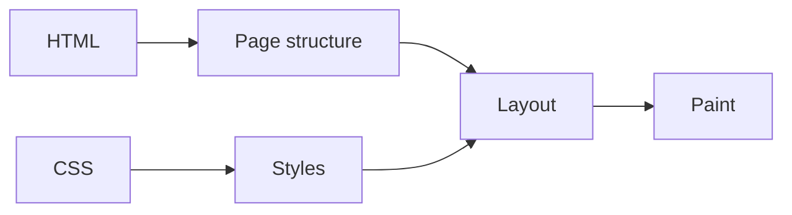

You tapped a link. Before the first word appeared, about a dozen things happened in a fraction of a second.

This post follows them in order. You can check each one on the page you are reading, using nothing but your browser's developer tools (press **F12**, or right-click and choose *Inspect*). Every stop ends with a small experiment to try.

<Scrolly tone="sky">
  <Beat stage="Address" sub="stop 1">Your browser turns a name into a place, and proves it reached the right one.</Beat>
  <Beat stage="Edge" sub="stop 2">A nearby server hands over a ready-made file, not a program.</Beat>
  <Beat stage="Render" sub="stop 3">The browser reads the file and draws the page.</Beat>
  <Beat stage="Policy" sub="stop 4">A rule list decides what the page is allowed to load.</Beat>
  <Beat stage="Adapt" sub="stop 5">The page adjusts to your screen, your theme and your needs.</Beat>
  <Beat stage="Wake" sub="stop 6">Only the interactive parts start running code.</Beat>
  <Beat stage="Remember" sub="stop 7">Small things are saved on your device, and your messages travel safely.</Beat>
  <Beat stage="Follow" sub="stop 8">A feed lets you come back without an account.</Beat>
</Scrolly>

## Stop 1: Your Browser Finds the Address

A web address like `blog.saranmahadev.in` is a name for people. Computers need a number. Your device asks a **DNS** (domain name system) server to translate the name into an IP address, the way you look a name up in a phone book.

Then comes the part behind the padlock. Your browser and the server run a short **handshake** called TLS. The server shows a certificate that says, in effect, "I am the real owner of this name", and the two sides agree on a secret key. From then on, everything between you and the server is encrypted.

<Steps>
  <Step title="Name to number">DNS translates the domain into an IP address.</Step>
  <Step title="Connect">Your browser opens a connection to that address.</Step>
  <Step title="Handshake">TLS checks the certificate and sets up encryption, so nobody in between can read or change the page.</Step>
</Steps>

The padlock proves you are talking privately to the owner of that name. It does not prove the site is honest. A site can also tell your browser to *always* use the secure version from now on, with a header called HSTS.

<Sidenote label="Try it">Open the Network tab and reload. Click the first request, then look at its Timing: you will see the DNS lookup, the connection and the secure handshake as separate bars.</Sidenote>

## Stop 2: A File Answers, Not a Program

A lot of websites build each page on demand: a program runs, looks things up and assembles HTML for every visitor. A **static** site does the work once, ahead of time, and stores the finished pages as plain files.

<Compare>
  <Side kind="before" label="Dynamic page">A server runs code for every visit. More moving parts, more to break, more to pay for.</Side>
  <Side label="Static page">The page already exists as a file. Serving it is just handing it over.</Side>
</Compare>

Files can be copied. A **CDN** (content delivery network) keeps copies in many places, so the one that answers you is close by. That is most of why static pages feel instant.

Copies create one problem: staleness. If the file changes but your browser or the CDN keeps the old copy, you see yesterday's page. The standard answer has two halves.

<CodeWalk steps={[
  { lines: "1", title: "The page", text: "Check with the server on every visit. If nothing changed, the answer is a tiny 'still current'." },
  { lines: "2", title: "Its scripts and styles", text: "Their file names contain a fingerprint of their content, so a changed file has a new name. The old one can be kept for a year." },
]}>

```http
Cache-Control: public, max-age=0, must-revalidate
Cache-Control: public, max-age=31536000, immutable
```

</CodeWalk>

On this page, HTML is re-checked on every visit and fingerprinted files are cached for a year, so you get fast loads and fresh content.

<Sidenote label="Try it">In the Network tab, click the page request and read the Response Headers for `cache-control`. Then click a file whose name has a random-looking part, like a script, and compare.</Sidenote>

## Stop 3: Your Browser Draws the Page

The browser reads the HTML and builds a tree of the page's parts. It reads the CSS and works out the size, colour and position of every part. Then it paints pixels. Anything the page needs along the way, such as a font, a script or an image, is another request that can delay the picture.

That is why a page made of text and a little CSS is fast. Every extra file is a cost: more bytes, more waiting, and often a jump in the layout when it finally arrives. An image also needs words written for people who cannot see it, and a dark-mode version if it has a white background. Type has none of those costs. It is already text, so it can be selected, searched, read aloud, and restyled for any theme.



That does not mean images are bad. A photograph is the right tool for a photograph. But a chart, a comparison or a sequence can usually be shown with type and layout, and this page does exactly that.

<Sidenote label="Try it">Open the Network tab, reload, and sort by size. Count how many requests it took to draw this page, and look for a photograph or an illustration among them. You will not find one.</Sidenote>

## Stop 4: The Bouncer Checks the Guest List

Your browser runs whatever code a page gives it. If an attacker ever manages to slip a script into a page, your browser would run that too. A **Content-Security-Policy** (CSP) is the defence: a list, sent with the page, of where code and files may come from. Anything not on the list is refused.

<CodeWalk steps={[
  { lines: "1", title: "Default", text: "Only load things from this same site." },
  { lines: "2", title: "No plugins", text: "Never allow old-style embedded objects." },
  { lines: "3", title: "Images", text: "From this site, or small data images only." },
]}>

```text
default-src 'self';
object-src 'none';
img-src 'self' data:;
```

</CodeWalk>

A policy can be short, and it is easy to get wrong in the tight direction. If a policy is too tight, something you wanted stops working, and the only sign is an error in the console. That is why a policy should be tested in a real browser, on real pages, before it goes live.

<Sidenote label="Try it">Open the Console and reload. No red "Refused to load" messages means the page follows its own policy. Then look at the page's head in the Elements tab for a tag with `http-equiv="content-security-policy"`.</Sidenote>

## Stop 5: The Page Adapts to You

Your device tells every page what it prefers: light or dark, less motion, a bigger font. A good page listens. It asks the browser whether you prefer dark colours, applies your choice **before the first paint** so you never see a flash of the wrong theme, and remembers it.

Adapting is also about contrast. The accessibility standard (WCAG) asks for a contrast ratio of at least **4.5 to 1** between normal text and its background, and 3 to 1 for large text. A colour pair that works on white can fail on black, so both themes need testing, not just one.

<Compare>
  <Side kind="before" label="Checked by eye">Someone flips the switch, looks, and decides it is fine.</Side>
  <Side label="Checked by a tool">An automated scan tests every page in both themes and fails the release if text is too faint.</Side>
</Compare>

The same attention covers the keyboard (every control reachable with Tab, with a visible focus), screen readers (controls with names, diagrams with descriptions) and motion (anything that animates should stand still if you ask for less motion).

<Sidenote label="Try it">Switch your system between light and dark and watch this page follow. Press Tab and see where the focus goes. Then turn on "reduce motion" in your system settings and look at the animated parts.</Sidenote>

## Stop 6: Small Programs Wake Up

Most of this page is plain text and needs no code at all. The few parts that do something, such as the search box, are small separate programs that load only when needed. This pattern is called **islands**: a sea of static HTML with small interactive islands in it.

Search is a good example. It looks as if it needs a server, but it doesn't. When the site is built, every word is mapped to the pages where it appears. This list, called an **index**, is split into small files. When you search, your browser downloads only the pieces for the letters you typed and does the matching itself.

<Steps>
  <Step title="Build time">Every page is read and an index of words is made, in small pieces.</Step>
  <Step title="You type">The browser fetches only the pieces it needs for what you typed.</Step>
  <Step title="Match">Your device finds the pages and shows highlighted excerpts. No search server is involved.</Step>
</Steps>

The trade-off: the index is only as fresh as the last build, and it suits sites that are mostly text. It will not search things that change by the minute.

<Sidenote label="Try it">Open the Network tab, press **/** on this page and type a word. Watch the small index files arrive as you type.</Sidenote>

## Stop 7: It Remembers You and Lets You Talk Back

A page can remember small things without asking a server every time. Your browser offers storage on your own device, and well-built pages use it first: they save your choice **at once**, then send it to the server a little later, in one batch. This is called **local-first**.

The tricky question is: what if you close the tab before the batch is sent? The answer is a ladder of fallbacks, and each rung only matters if the one above fails.

<Steps>
  <Step title="Save on your device">Immediately, so nothing is lost even if everything else fails.</Step>
  <Step title="Wait a moment">Changes made in a burst become one write.</Step>
  <Step title="Send as a batch">Written so that sending it twice does the same as sending it once.</Step>
  <Step title="If the tab is closing">The browser is asked to hand the data over on the way out (`sendBeacon`).</Step>
  <Step title="If that fails">Keep it queued, and send it on the next visit.</Step>
</Steps>

Talking back works the same way. A message you write waits a few seconds with an undo button, then travels to the server, which refuses spam by simple rules: how many links, how many repeated characters, how often. And a private conversation is private for a precise reason: the database has a rule that shows a thread only to the two people in it. It is not hidden in the page. It is **refused** to everyone else.

<Sidenote label="Try it">Open the Application tab (Storage in some browsers) and look at Local Storage for this site. Bookmark a post and watch a small entry appear.</Sidenote>

## Stop 8: Following Without an Account

Finally, how do you come back? Most sites want an email or an account. The web already has an older, simpler answer: a **feed**. It is a file that lists a site's latest posts. Your feed reader checks it for you and shows what is new, with no sign-up and no one deciding what you see.

Three formats are common: **RSS**, **Atom** and **JSON Feed**. A good feed contains the full text of each post, a permanent identifier so readers never show a post twice, the publication and update dates, the author and the categories. A page can advertise its feed with a small tag in its head, so a reader can find it from the address alone.

<Sidenote label="Try it">Open [/rss.xml](/rss.xml). Your browser shows it as a readable page. Copy the address into any feed reader and the posts arrive.</Sidenote>

## If You Build Your Own

The whole trace adds up to six habits for any small site.

<Steps>
  <Step title="Own your address">A domain you control, over HTTPS, so your readers and your links stay yours.</Step>
  <Step title="Ship files">Build pages ahead of time and cache them sensibly: re-check pages, keep fingerprinted files.</Step>
  <Step title="Set a policy">A short Content-Security-Policy, tested in a real browser.</Step>
  <Step title="Test both themes">Contrast and keyboard checks that fail a release, not a promise.</Step>
  <Step title="Keep readers' data small">Save on their device first, and store on a server only what you must.</Step>
  <Step title="Publish a feed">So people can follow you without a sign-up.</Step>
</Steps>

**A page is a conversation between your device and a server. The fewer surprises on either side, the better it reads.**
