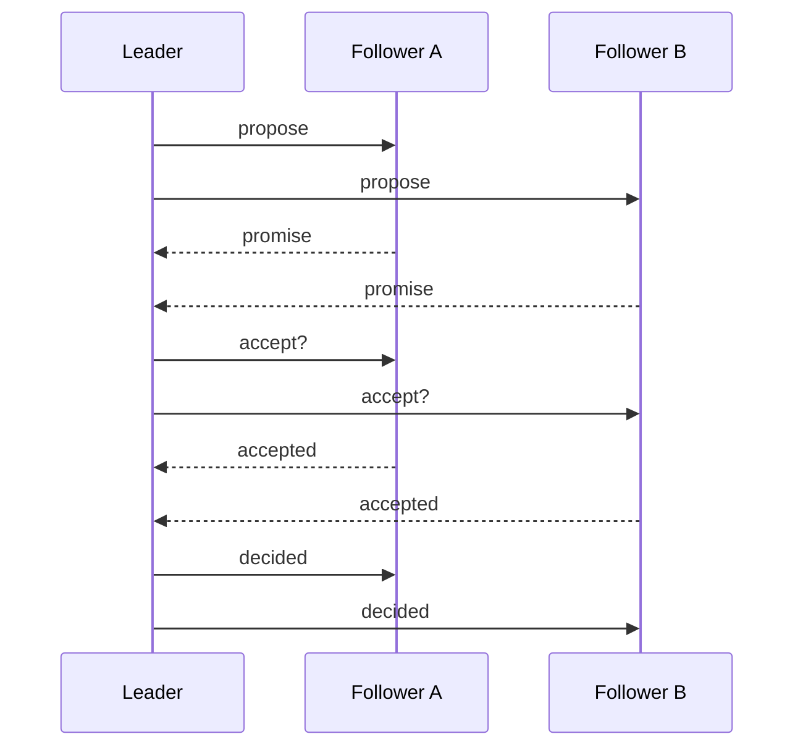

Consensus is the problem of getting several machines to agree on one value, even when some of them fail. Almost every database you use depends on a solution to it.

<Statement tone="lilac" align="center">Nobody decides **differently**. Everybody decides **eventually**.</Statement>

## One round, in four moments

<Timeline>
  <Event date="Step 1" title="Propose">A leader suggests a value to the group.</Event>
  <Event date="Step 2" title="Promise">Each machine promises to ignore older proposals.</Event>
  <Event date="Step 3" title="Accept">A majority accepts the value; the leader counts them.</Event>
  <Event date="Step 4" title="Learn">Everyone else is told what was decided.</Event>
</Timeline>

## Why a majority

Any two majorities overlap by at least one machine. That overlap is how a new leader learns what the old one decided.

<Sidenote label="Mock data">The bars below are illustrative, not measured.</Sidenote>

<Bars unit=" msgs" items={[
  { label: "3 machines", value: 6 },
  { label: "5 machines", value: 10 },
  { label: "7 machines", value: 14 },
]} />

More machines tolerate more failures, and they cost more messages in every round.
